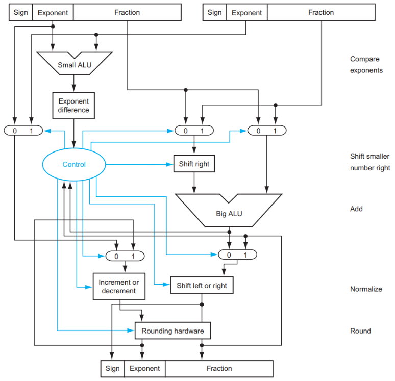

# 3 Arithmetic

## 3.1 一个基本的 ALU
**世界上不存在减法**。众所周知，减法就是加上相反数。所以这个世界上不存在减法。

**Overflow**。硬件规模是有限的，因此运算结果超过这个限制时，就会发生溢出。对于有符号加法，当正数和正数相加得到负数，或者负数和负数相加得到正数时，就可以判定溢出。对于无符号加法，如果结果小于二者中任意一个，也可以判定溢出。

**ALU, Arithmetic Logic Unit**，算术逻辑单元，执行一些算术运算或者逻辑运算。

### 3.1.1 1-bit ALU
> （下面这部分内容在课本附录 A.5 开始的地方）

在数字逻辑设计这门课程中，我们学过 AND, OR, XOR 这些 gates，以及 inverter 和 mux 这些东西，我们尝试用这些东西攒一个 ALU 出来。在这一节中，我们希望 ALU 具有加法、减法、与运算、或运算和比较的能力。

我们先考虑 1 bit ALU 的构造。我们学习过 1 bit Full Adder 的构造：

{width=300}

上左图是全加器的具体构造，右图是我们将其进行封装后的表示方式。

我们结合一个 mux，就可以构造一个支持与、或以及加法运算的 1 bit ALU：

{width=300}

其中`Operation`是用来指明 mux 采取哪个结果的信号，值为 00 01 10 分别对应与、或、加法运算。

### 3.1.2 加上减法和 NOR！
减法运算怎么办呢？众所周知，由于补码有 $x + \bar x = 111\dots111_2 = -1$，因此 $-x = \bar x + 1$，所以 $a - b = a + (-b) = a + \bar b + 1$。据此我们可以构造这样的结构：

{width=300}

其中`Binvert`用来指明是否需要将结果取反；在计算减法时，我们将`Binvert`设为`1`，然后将`CarryIn`也设为`1`，`Operation`设为`2`，这样我们的结果就是 $a + \bar b + 1$。

`NOR`运算：`a NOR b = NOT(a OR b) = (NOT a) AND (NOT b)`，因此`NOR`运算可以这样实现：

{width=300}

上右图是我们目前的 1 bit ALU 的抽象结构。

### 3.1.3 串联得到 64-bit ALU！
有了 1 bit 的 ALU，我们就可以构造出 RISC-V 所需的 64 bits 的 ALU 了：

{width=500}

可以看到，对于 64 位的加法、减法、AND, OR, NOR 运算，这样的 64 位 ALU 都可以完成。

同时也可以注意到，这里面除了我们熟悉的内容外，还多了`Less`, `Set`和`Overflow`这些位。它们是用来干什么的呢？

首先`Overflow`是容易理解的，它用来表示加法或减法有没有出现溢出的现象；显然这个判断只需要在 ALU63，即 Most Significant Bit 才需要进行。容易证明，如果 $C_{in} \oplus C_{out} = 1$，那么存在溢出；因此 ALU63 只需要添加一个额外的 XOR 门即可完成这一判断。

`Less`和`Set`共同使用，是为了实现`slt rd, rs1, rs2`这个操作的。这个操作的含义是，如果`rs1 < rs2`，那么将`rd`置为`1`，否则置为`0`。如何进行这一判断呢？很简单，如果`rs1 - rs2`的结果为负，也就是说如果`rs1 - rs2`结果的最高位是`1`，那么就说明`rs1 < rs2`。所以等价地，对于`slt`这个操作，我们只需要将 ALU63 中加法器的结果赋值给`Result0`，即运算结果的 Least Significant Bit，而将其他位的结果`Result1`~`Result63`都设成 0，就可以完成`slt`操作了。

所以可以看到，上图中，除了 ALU0 的`Less`来自 ALU63 的`Set`外，其他 ALU 的`Less`都是`0`。

结合上述讨论，上图中 ALU0 ~ ALU62 的结构如下左图所示，ALU63 的结构如下右图所示：

{width=500}

（注：右图中的 Overflow Detection 被复杂化了，实际上可以通过`CarryIn`和`CarryOut`的异或完成的。）

可以看到，`Operation`增加了`3`的取值，这个取值表示进行`slt`操作。

### 3.1.4 一点优化！
之前我们也讨论过，如果做减法或者`slt`的话，需要将`Binvert`和 ALU0 的`CarryIn`设成`1`，如果是加法的话这两个信号都是`0`；其他运算用不到这两个信号。因此这两个信号始终取值相等，我们可以将这两个信号合并为一个，称之为`Bnegate`。

另外，我们也有`beq`，`bne`这样的操作，结合 Common case fast 的设计思想，我们将判断结果是否为 0 的功能也直接加到 ALU 里。

结合上述两个思路，我们形成了最终的 64-bit ALU！

{width=500}

对于这样的一个 ALU，我们需要 4 bits 的 control lines，分别是`Ainvert`, `Bnegate`和`Operation`(2 bits)。ALU 的符号和 control lines 的含义如下：

{width=300}

### 3.1.5 更快的加法
上面的 64 位加法的实现方式是通过 1 位加法器串联实现的，这种方式势必需要等待前一个加法器算出结果后才能算后一个的。这种多位加法器的实现称为行波加法器 **Ripple Carry Adder, RCA**。显然，这种实现方式比较慢。

那么，如何加速呢？

#### 3.1.5.1 Carry Lookahead Adder, CLA
课本指出，RCA 缓慢的重要原因是后一个 adder 需要等前一个 adder 的 carry 结果；但我们不妨讨论出现 carry 的可能。第一种可能是，如果 $a$ 和 $b$ 都是 1，那么一定会**生成**一个 carry；另一种可能是，如果 $a$ 和 $b$ 中有且仅有一个是 1，那么如果传入的 carry 是 1，则这里也会 carry，即 carry 被 **传播** 了。

也就是说，$c_{out} = a \cdot b + (a + b)\cdot c_{in}$。我们记 **generate** $g = a\cdot b$，**propagate** $p = a + b$，则有 $c_{out} = g + p \cdot c_{in}$。所以，我们可以这样构造一个全加器：

{width=150}

所以，我们可以推导出如下关系：

{width=500}

利用这个关系，我们可以构造这样一个四位加法器：

{width=500}

上面的 PFA, Partial Fully Adder，就是前面我们构造的新全加器的一部分。可以看到，通过这样的方式，我们可以加速加法的运算；但是注意到越到高位，门的 fan-in 就越大，但是这不是可以一直增加的。所以对于更多位数的加法器，我们将上面这样构成的 4-bit CLA 再通过类似的方式串起来！

{width=500}

#### 3.1.5.2 Carry Skip Adder (马德先生没讲)

#### 3.1.5.3 Carry Select Adder, CSA
这个思路其实比较简单，就是把输入 carry 为 0 或者 1 的情况都算一遍，然后根据实际的情况从中选出正确的那种就好了：

{width=500}

{width=500}

## 3.2 乘法 暂时不想学了，听说考的不多
下面这样的硬件结构可以实现无符号乘法：

{width=500}

## 3.3 除法 暂时不想学了，听说考的不多

## 3.4 浮点运算

### 3.4.1 IEEE 754 浮点表示

我们将小数点左边只有 1 位数字的表示数的方法称为 **科学记数法, scientific notation**，而如果小数点左边的数字不是 0，我们称这个数的表示是一个 **规格化数, normalized number**。科学记数法能用来表示十进制数，当然也能用来表示二进制数。

IEEE 754 规定了一种浮点数标准：我们将浮点数表示为 $(-1)^S \times F \times 2^E$ 的形式，这里的 $F \times 2^E$ 是一个规格化数，而 $(-1)^S$ 用来表示符号位：$S$ 为 0 说明该浮点数为整数，为 1 则为负数；$F$ 和 $E$ 也用若干 bits 表示，分别表示尾数和指数，我们稍后讨论。也就是说，我们将其表示为 $1.\text{xxxxx}_2\times 2^{\text{yyyy}}$ 的形式（为什么小数点左边是 1 呢？因为二进制只有 0 和 1，而规格化要求小数点左边不能为 0）。我们通过科学记数法调整了小数点的位置使其满足规格化的要求，因此我们称这种数的表示方法为 **浮点, floating point**。

小数点的英文是 decimal point，但是我们这种表示方法不再是 decimal 的了，因此我们起个新名字：**二进制小数点, binary point**。

IEEE 754 规定了两种精度的浮点数格式，分别是 single precision 和 double precision（分别对应 C 语言中的`float`和`double`），RISC-V 这两种都支持：

{width=700}

{width=700}

可以看到，fraction 的位数越多，浮点数的精度就越高；而 exponent 的位数越多，浮点数能保存的范围就越大。

那么对于 $(-1)^S \times F \times 2^E$，$S$ 的二进制表示方法是显然的，仅需要一个 bit 就好了。那么 $F$ 和 $E$ 怎么表示呢？如我们之前所说，$F$ 就是 $1.\text{xxxxx}_2$ 的形式，这个 1 是固定的，因此 $F$ 只需要保存 \text{xxxxx}$ 的部分就可以了！那么 $E$ 怎么办呢？注意到这个指数可能是正整数、负整数或 0，因此我们使用一个偏移，对单精度浮点数偏移 127，双精度浮点数偏移 1023（刚好是表示范围的一半！），也就是说我们保存的 `exponent` 其实是 $E + bias$ 的二进制。也就是说，对于这样的一个表示，其值是：

$$(-1)^S\cdot (1 + \text{fraction}) \cdot 2 ^ {\text{exponent} - \text{bias}}$$

课本给出了一个例子：

聪明的小朋友可能会问，0 应该怎么保存呢？毕竟 0 没有前导 1。对于这样的特殊情形，IEEE 754 有特别规定，用特殊的值保存它们：

在上表中：

   - 第 1 条表示 0；
   - 第 2 条表示非规格化数，这种数主要是为了用来表示一些很小的数，它的取值为 $(-1)^S\cdot (\mathbf{0} + \text{fraction}) \cdot 2 ^ {- \text{bias}}$；但是并非所有机器都支持这种表示，有的机器会直接抛出一个 exception。我们不考虑非规格数的存在；
   - 第 3 条表示正常的浮点数；
   - 第 4 条表示无穷大或者无穷小，出现在 exponent overflow 或者浮点数运算中非 0 数除以 0 的情况；
   - 第 5 条表示非数，出现在 0/0, inf / inf, inf - inf, inf * 0 的情况

（如果数字过大不能表示，即 overflow，则结果置为 inf；如果数字过小不能表示，即 underflow，则结果置为 0。）

这两种表示法的范围和精度分别是多少呢？

   - 范围
      - 能表示值的 **绝对值** 的范围是 $1.0_2 \times 2^{1-\text{bias}} \sim 1.11\dots 11_2 \times 2^{11\dots 11_2-1-\text{bias}}$，即 $1\times 2^{1 - \text{bias}}\sim(2 - 2^\text{Fra#})\times 2^{(2^\text{Exp#} - 1) - 1 - \text{bias}}$，其中`Fra#`和`Exp#`分别表示 fraction 和 exponent 的位数；
      - 单精度浮点数：$\pm 1\times 2^{-126}\sim \pm(2 - 2^{23}) \times 2^{127}$
      - 双精度浮点数：$\pm 1\times 2^{-1022}\sim \pm(2 - 2^{52}) \times 2^{1023}$

   - 精度
      - $2^ \text{-Fra#}$
      - 单精度浮点数：$2^{-23}$
      - 双精度浮点数：$2^{-52}$

!!! info "18~19 Final"
    
{width=600}

    ??? info "答案"
        +inf, 0xBF800000

可以试一下 -32.6，结果可以自己在 [IEEE-754 Floating Point Converter](https://www.h-schmidt.net/FloatConverter/IEEE754.html) 里面找~

### 3.4.2 浮点加法
以 $1.000_2\times2^{-1}-1.110_2\times2^{-2}$ 为例， 浮点数的加减法分为以下几步：

1.  指数对齐，将小指数对齐到大指数：$-1.110_2\times2^{-2} = -0.111\times2^{-1}$
2.  Fraction 部分相加减：$1.000-0.111=0.001$
3.  将结果规格化：$0.001\times2^{-1}=1.000\times2^{-4}$；同时需要检查是否出现 overflow 或者 underflow，如果出现则触发 Exception
4.  将 Fraction 部分舍入到正确位数；舍入结果可能还需要规格化，此时回到步骤 3 继续运行

{width=400}

### 3.4.3 浮点乘法
分别处理符号位、exponent 和 fraction：

- Exponent 相加并 **减去 bias**，因为 bias 加了 2 次
- Fraction 部分相乘，并将其规格化；此时同样要考虑 overflow 和 underflow；然后舍入，如果还需要规格化则重复执行
- 根据两个操作数的符号决定结果的符号

{width=400}

### 3.4.4 精确算术
IEEE 754 规定了一些额外的舍入控制，用来保证舍入的精确性。

**Round modes**

{width=600}

Round to nearest even 只对 0.5 有效，别的都和四舍五入一样

一般的浮点数后面还会有 2 bits，分别称为 guard 和 round，其主要目的是让计算结果的舍入更加的精确： 

{width=150}

事实上加法只需要用到 guard，但是对于乘法，如果存在前导 0，需要将结果左移，这时候 round bit 就成了有效位，能避免精度的损失。

另外还有一个位叫 sticky bit，其定义是：只要 round 右边有非零位，就将 sticky 置 1，这一点可以用在加法的右移中，可以记住是否有 1 被移出，从而能够实现 "round to nearest even"。
