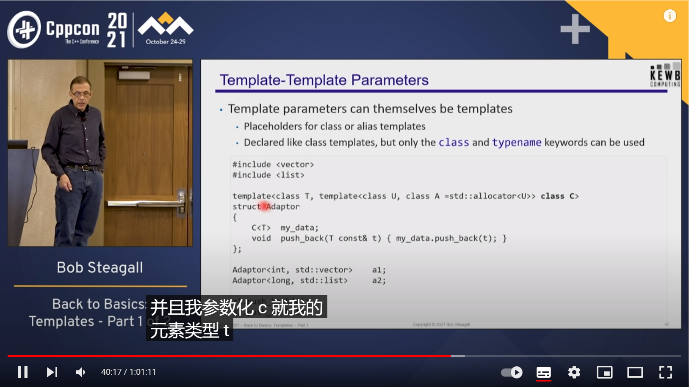

### 7.2.4 模板友元

看这个 https://isocpp.org/wiki/faq/templates#template-friends

## 7.3 将声明和实现分离？

.h 里放不会编译出任何二进制代码的东西，例如 extern 全局变量声明、没有 body 的函数声明、类定义和模板；
.cpp 里放会编译出二进制代码的东西，例如全局变量定义、函数定义、类成员定义。

类内完整定义的成员函数是 inline 的

### 7.3.1 显式实例化

我们也可以显式地实例化一个模板，例如：

```c++ linenums="1"
// template definition: abs is a function template
template<typename T> T abs(T x) { return x > 0 ? x : -x; }

// instantiates abs<int>(int)
template int abs<int>(int);     
// instantiates abs<double>(double), template argument deduced
template double abs<>(double);  
// instantiates abs<float>(float), template argument deduced
template float abs(float);      
```

这里，第 5 行显式地实例化了函数 `abs<int>`。也就是说，这一行告诉编译器：请帮我生成一个 `T` 为 `int` 的 `abs` 的实例。编译器就会产生这样的特化：

```c++
template<>
int abs<int>(int x)
{
    return x > 0 ? x : -x;
}
```

第 6 行类似，但是区别是 `template double abs<>(double);` 中函数名写了 `abs<>` 而非 `abs<double>`。例如，虽然

显式实例化是一个定义^[temp.explicit#2](https://timsong-cpp.github.io/cppwp/n4868/temp.explicit#2)^，除非它有 `extern` 关键字。

显式实例化一个类会实例化所有成员，这与隐式实例化不同。

同时，也可以只显式实例化成员函数，但是这很少使用。

显式实例化主要是用来显式指明实例化发生的位置，从而减少编译需要使用。

在 .h 中 extern

类的显式实例化的参数类型和返回类型可以是 private 成员。

## 默认模板参数

<center></center>

## 7.4 显式特化与偏特化

`typename`

例子：`min` for `char const *`

<center></center>

给定一组的模板参数，一个模板的显式实例化和显式特化不应同同时出现，除非它们的声明之间互不矛盾。当这条规定被违反时，编译器不必给出诊断信息^[temp.spec.general#5](https://timsong-cpp.github.io/cppwp/n4868/temp.spec.general#5)^。（由于对于类模板而言，相同的模板参数即代表相同的声明，因此

## 7.5 变量模板

## lambda 模板

## 7.6 重载解析

一个 **特化 (specialization)** 是一个类、变量、函数或者类成员，而且它来自以下一种^[temp.spec.general#4](https://timsong-cpp.github.io/cppwp/n4868/temp.spec.general#4)^：

- 按给定参数列表隐式实例化
- 按给定参数列表显式实例化
- 显式特化

<center></center>

## 7.7 非类型的模板参数

### 将模板作为参数

https://isocpp.org/wiki/faq/templates#template-proxies

大书 14.4.8

<center></center>

https://youtu.be/XN319NYEOcE?t=2492

### 7.7.1 参数包 

## 7.8 SFINAE 和 Concept

自「理解 STL」补充 3.2 引入，同时参考：

https://www.cppstories.com/2016/02/notes-on-c-sfinae/


## 模板元编程

---


## ▲ auto & return type deduction