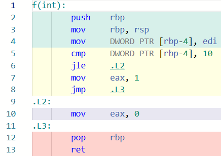
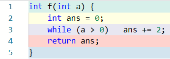
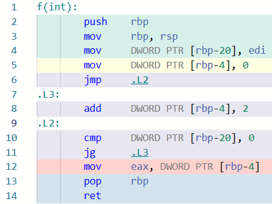
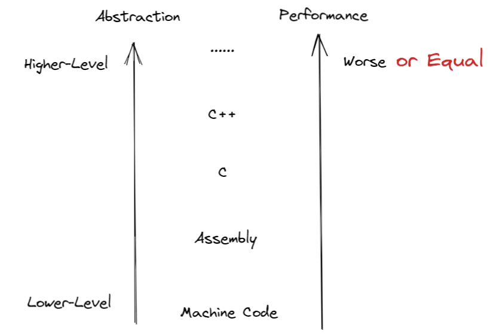

# 2 编程范式 | Programming Paradigm

!!! abstract "Takeaway"
    从汇编与 C/C++ 代码的对比中理解结构化编程，进而理解编程范式与抽象。

在上一节中，我们提到了 **类 (class)**。在编程语言的世界里，这个词来自于 **面向对象程序设计 (OOP, Object-Oriented Programming)**。OOP 是一种 **编程范式 (programming paradigm)**。在讨论 OOP 之前，我们先来聊聊编程范式。

!!! note inline end ""
    C++ 是一种多范式 (multi-paradigm) 的编程语言。也就是说，它包含了许多种编程范式的特性。

编程范式说明了编程语言的不同特点；分类依据包括语言的代码组织方式、运行时模型、语法风格等[^1]。我们提到的 OOP，就是按照「代码组织方式」分类的一种编程语言的特点。

[^1]: [Programming paradigm | Wikipedia](https://en.wikipedia.org/wiki/Programming_paradigm)

为了让大家更好地感受到何为「按代码组织方式分类」，我们简单回顾一下相关的历史。

我们知道，在通用计算机被发明时，代码都是用 机器码 (machine code) 编写的；在机器码中，指令由一堆 01 串来表示。为了方便阅读和调试，人们引入了 助记符 (mnemonics) 和 labels 等来以更易理解的方式表示机器指令，从而发明了 汇编语言 (assembly)。

汇编语言以及之后出现的 BASIC, Fortran 等编程语言的早期版本都是 **非结构化的 (non-structured)** 编程语言。这是什么意思呢？我们来看一看我们熟悉的分支和循环语句在汇编中是如何表示的：

<center>{width=200}</center>
<center>{width=300}</center>

上面两张图依次是 C++ 源码和编译出的汇编代码。可以看到：

- 如果 `a <= 10`：
    - 汇编代码的第 5 行 `cmp` (compare) 将 `DWORD PTR [rbp-4]`（前面的几行把传入参数 `a` 放到了这里）与 `10` 作比较
    - 第 6 行 `jle` (jump if less or equal) 根据上面比较的结果，在 `a <= 10` 的情形下 **跳转** 至 `.L2`，也就是第 10 行
    - 第 10 行 `mov` (move) 将 `0` 赋值给寄存器 `eax`，而 `eax` 就是函数的返回值
    - 第 12 和 13 行完成函数的返回
- 如果 `a > 10`：
    - 汇编代码的第 5 行 `cmp` (compare) 将 `DWORD PTR [rbp-4]`（传入参数 `a`）与 `10` 作比较
    - 第 6 行 `jle` 由于 `a > 10` 因此不生效，不进行跳转
    - 第 7 行 `mov` 将返回值 `eax` 赋值为 `1`
    - 第 8 行 `jmp` (jump) 跳转到 `.L3`，也就是第 12 行
    - 第 12 和 13 行完成函数的返回

也就是说，汇编中并不存在直接完成「分支」的语言结构，而是通过比较和跳转指令的组合来完成相应的效果的。

类似地，下面的两张图也是 C++ 源码和编译出的汇编代码。汇编代码完成循环操作的方式留做练习。

<center>{width=250}</center>
<center>{width=300}</center>

??? tips "提示"
    汇编代码的 2~4 行将 `DWORD PTR [rbp-20]` 的初始值设置为传入参数 `a`；第 5 行将表示局部变量 `ans` 的 `DWORD PTR [rbp-4]` 的初始值设置为 `0`。

    第 11 行的 `jg` 是 jump if greater 的意思。第 12 行将表示局部变量 `ans` 的 `DWORD PTR [rbp-4]` 赋值给寄存器 `eax`，即完成返回值的设置。13~14 行完成函数的返回。

可以看到，在汇编语言中，并不存在诸如分支、循环之类的语言结构；早期的 BASIC 等编程语言中即使存在表示类似含义的关键字，但是由于不存在代码块之类的结构，因此分支、循环之类的控制流仍然需要通过 `jmp` 或者 `goto` 等含义类似的语句来完成，例如 BASIC 可能有这样的代码：

```basic
10 let a = 6
20 let b = 7
30 if a < b goto 60
40 print(a)
50 goto 70
60 print(b)
70 end
```

可以看到，在上面的代码中，虽然有 `if`，但是为了完成分支的效果，仍然需要 `goto` 来帮助。也就是说，在这种语言中的代码是以 **单条代码** 为单位的，而不是像 C++ 中以 **语句块** 为单位的：

```c++ linenums="1"
a = 6;
b = 7;
if (a < b) {
    print(b);
} else {
    print(a);
}
```

请注意，上面这段 C++ 代码只有 3 条语句，因为 3~7 行是一个完整的语句 (selection-statement ^[stmt.select.general#1](https://timsong-cpp.github.io/cppwp/n4868/stmt.select.general#1)^)。

也就是说，我们熟悉的 C 和 C++ 等编程语言都是 **结构化编程语言 (structured programming languages)**，因为它们有诸如分支、循环、语句块、函数之类的语言结构。

当我们讨论从非结构化到结构化编程到底发生了什么改变时，我们很容易看到：编程语言从「更贴近计算机行为」向「更接近人类思维」的方向迈了一步。这就是我们所说的 **抽象 (abstraction)**。计算机的行为是具体的、与机器和环境高度相关的，而人类思维是更加普遍的、远离细节的；「抽象」的好处就是能够提升程序或者编程语言的通用性、易读性、易写性、可移植性，而坏处是可能会损失一些更加精细的控制，也有可能会影响到编译时或运行时的性能。

!!! info "回顾一下这张图吧！"
    <center>{width=500}</center>

结构化编程在上世纪 70 年代末 80 年代初被广泛认知；90 年代开始广泛认识 OOP。C++ 支持的 **泛型编程 (generic programming)** 也是一种编程范式，我们将在后面的章节里讨论这种编程范式。编程范式还有很多，例如著名的函数式编程等。感兴趣的同学可以自己看一看！

!!! info "相关链接"
    本节部分内容参考了翁恺老师 2021~2022 年的「程序设计方法学」课程。