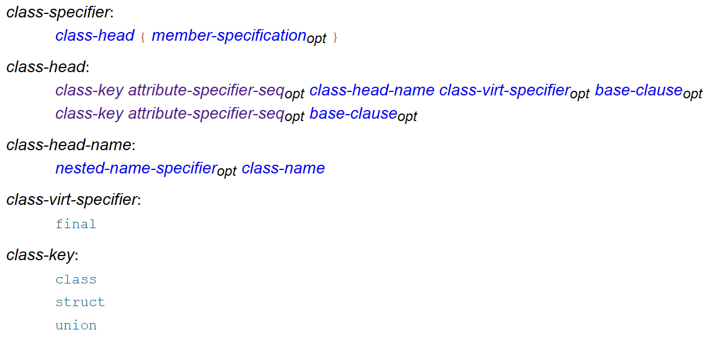
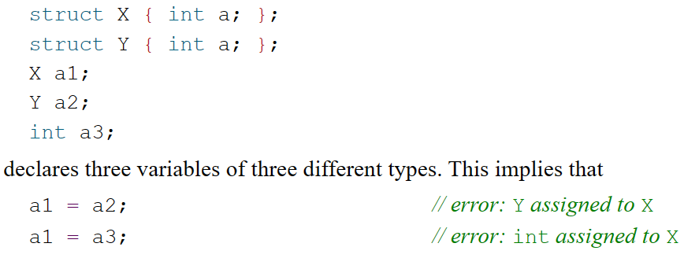

# 4 类 (I) - 定义、成员、构造、析构

!!! warning
    从本节开始，我们在部分内容会尝试直接使用 standard 的相应内容讲解[^std_version]。由于会涉及到一些尚未讨论的内容，因此这些内容我们会通过脚注的方式给出。初学者可以忽略这些脚注。

    因此，从本节开始，类似本节这样有比较大量的参考资料标注和脚注的文章，会提供下面的按钮来帮助提高阅读质量（文末也会有一份）：

    --8<-- "cpp/cpp_restart/toggle_visibility.md"

## 4.1 类的定义

我们在上一节已经看到了类的定义的一些具体例子，例如：

```c++ linenums="1"
class Textbox : public Shape {
public:
    char* text;
    int penwidth;

    void do_draw() {
        int old_penwidth = get_penwidth();
        set_penwidth(penwidth);
        // 画出文本框和文本内容
        set_penwidth(old_penwidth);
    }
}
```

在 C++ 中，每个类的定义 (class definition) 引入一个新的类型^[class.name#1](https://timsong-cpp.github.io/cppwp/n4868/class.name#1)^。因此，有了上面的定义，我们就可以用它来声明一个变量，如 `Textbox tb;` 声明并定义^[basic.def#2](https://timsong-cpp.github.io/cppwp/n4868/basic.def#2)^了一个类型为 `Textbox`，名为 `tb` 的变量。

!!! note
    在 C++ 中，用类来定义变量时，不必像 C 语言那样带有 `struct` 关键字。即，如果有 `class Foo` 或者 `struct Bar` 的定义，那么 `Foo x;`, `class Foo x;`, `Bar b;`, `struct Bar b;` 都是合法的声明语句。这是因为，从 C with Classes 设计之初就希望让用户定义的类型不是二等公民，而是能被与内置类型一样的方式使用。

    ??? tips "Elaborated type specifiers"
        带有 `struct` 或者 `class` 关键字的类型名 (如 `class Foo`) 叫做 Elaborated type specifiers^[dcl.type.elab](https://timsong-cpp.github.io/cppwp/n4868/dcl.type.elab)^。
        
        在 C 语言中，类似 `struct x {}; int x;` 是符合语法的：虽然这会使得名字 `x` 既表示一个结构体，又表示一个变量；但在 C 语言中这不会引起歧义，因为当 `x` 表示结构体时必须带上 `struct` 关键字。不过在 C++ 中，直接使用 `x` 就只能引用到变量 `x` 了，因为此时 `int x;` 的 `x` hides `struct x {};` 的 `x`^[basic.scope.hiding](https://timsong-cpp.github.io/cppwp/n4868/basic.scope.hiding)^。
        
        但是为了兼容 C，C++ 并没有禁止上述写法，而是规定可以通过 Elaborated type specifiers 显式地来使用结构体 `x`，即使用 `struct x`^[basic.lookup.elab#1](https://timsong-cpp.github.io/cppwp/n4868/basic.lookup.elab#1),[class.name#2](https://timsong-cpp.github.io/cppwp/n4868/class.name#2)^；对 `class` 也一样。

        Elaborated type specifiers 还在 forward declaration 以及 enum 中有用途。


具体来说，类的定义具有如下形式[^class-specifier]^[class.pre#1,2](https://timsong-cpp.github.io/cppwp/n4868/class.pre#1)^：

<center>{width=600}</center>

1. 这里的 opt 指明某个元素是可选的。例如，class-specifier: class-head { member-specification~opt~ } 说明 class-specifier 中可以没有 member-specification，例如 `class Foo {}` 或者 `class A : public B {}` 之类的。
2. 这里的 class-name 是一个 identifier[^class-name]，例如上面的 `Foo` 和 `A`。
3. 这里的 class-key 决定了类是否是一个 union，以及默认情况下成员是 public 的还是 private 的。union 一次最多保存一个数据成员的值。也就是说，在 C++ 中，struct, class, union 都是类。但是在本节的后续讨论中，我们暂时只讨论 struct 和 class。
4. 这里的 attribute-specifier-seq 和 class-virt-specifier 现在暂时不用管。
5. 这里的 base-clause 定义为 `base-clause : base-specifier-list`，是用来处理派生类的。例如 1 中的 `: public B`。
6. 这里的 nested-name-specifier 是 `::` 或者 `Foo::` 之类的东西，其意义可以看下面的例子[^refer_to_same][^nonzero_size]：  
```C++ linenums="1" title="https://godbolt.org/z/shjxaKhxc"
class Inner { };

class Outer {
public:
    class Inner { int x; };
    Outer::Inner i;
    Inner i2;
    ::Inner i3;     // global Inner
    struct A;       // declares struct Outer::A
};

struct Outer::A {}; // defines struct Outer::A

int main() {
    Outer o;
    Inner i4;
    Outer::Inner i5;
    printf("%d %d %d %d %d", sizeof o.i, sizeof o.i2, sizeof o.i3, sizeof i4, sizeof i5);
    // Possible output: 4 4 1 1 4
    return 0;
}
```
在 C++ 中，类的定义会引入新的作用域，其范围是 member-specification 等^[basic.scope.class#1](https://timsong-cpp.github.io/cppwp/basic.scope.class#1)^[^class-scope]。因此这里的 `Outer::Inner` 和外面的 `Inner` 可以同时存在[^redeclaration]。  
这里第 7 行访问到 `Outer::Inner` 是因为 Name Hiding^[basic.scope.hiding](https://timsong-cpp.github.io/cppwp/n4868/basic.scope.hiding)^，即我们熟悉的作用域屏蔽[^name_hiding]。

C 和 C++ 都是按名等价 (name equivalence) 而非按结构等价 (structural equivalence) 的[^structural]，例如^[class.name#1](https://timsong-cpp.github.io/cppwp/n4868/class.name#1)^：

<center>{width=600}</center>

[^std_version]: 本文所参考的 standard 版本是 N4868 (October 2020 pre-virtual-plenary working draft/C++20 plus editorial changes)，这并不是最新的版本。参考该版本的主要考量是防止可能的更新导致链接失效。
[^class-specifier]: class-specifier 在这里用到：[dcl.type.general#1](https://timsong-cpp.github.io/cppwp/n4868/dcl.type.general#1)
[^class-name]: class-name 还可能是一个 simple-template-id，即模板特化。
[^refer_to_same]: 如果将代码中 L7 提到 L5 之前，GCC 会出现报错。这是因为：[basic.scope.class#2](https://timsong-cpp.github.io/cppwp/n4868/basic.scope.class#2): A name N used in a class S shall refer to the same declaration in its context and when re-evaluated in the completed scope of S. No diagnostic is required for a violation of this rule.
[^nonzero_size]: 关于输出中的 1：[class.pre#6](https://timsong-cpp.github.io/cppwp/n4868/class.pre#6): Complete objects of class type have nonzero size. Base class subobjects and members declared with the no_­unique_­address attribute are not so constrained. 
[^structural]: 但 layout capability rules 允许了 low-level 的强转。
[^noexcept-specifier]: 还有 noexcept-specifier
[^scope]: 注意，作用域定义为「the largest part of the program in which that name is valid, that is, in which that name may be used as an **unqualified name** to refer to the same entity^[basic.scope.declarative#1](https://timsong-cpp.github.io/cppwp/n4868/basic.scope.declarative#1)^.」
[^redeclaration]: 见问题： [Which subclause of C++ standard prohibits redeclaration / redefinition in a same block?](https://stackoverflow.com/questions/75402077/which-subclause-of-c-standard-prohibits-redeclaration-redefinition-in-a-same)，已经解决。
[^class-scope]: 在 N4868 里，这里解释为：当一个名字在类内被定义后，类内的剩余部分^[basic.scope.pdecl#6](https://timsong-cpp.github.io/cppwp/n4868/basic.scope.pdecl#6)^及该类的成员函数的函数体、default argument 以及 default member initializer（后两者会在后面讲解）[^noexcept-specifier]^[class.mem.general#6](https://timsong-cpp.github.io/cppwp/n4868/class.mem.general#6)^成为其作用域[^scope]^[basic.scope.class#1](https://timsong-cpp.github.io/cppwp/n4868/basic.scope.class#1)^。在最新版（写本文时，为 2023-01-02）中，scope 的定义发生了较大更改。
[^name_hiding]: 在最新版本里，name hiding 一节也没有了。可以在 [basic.scope.pdecl#2](https://timsong-cpp.github.io/cppwp/basic.scope.pdecl#2) 找到相关描述。

??? tips "Forward Declaration"
    如果当前作用域没有名为 `identifier` 的类，那么形如 `class-key attr identifier ;` 的声明是一个 forward declaration^[class.name#2](https://timsong-cpp.github.io/cppwp/n4868/class.name#2)^。
    
    例如 `class Foo;`，它声明了一个叫 `Foo` 的类；但直到这个类被定义之前，它的类型是不完整的^[basic.types.general#5](https://timsong-cpp.github.io/cppwp/n4868/basic.types.general#5)^。

    不完整的类型有一些限制，但是也有一些可以完成的操作。例如不完整的类型不能用来定义变量（包括成员变量）、作为函数声明或定义的参数或者返回值类型等；但是可以定义指向它的指针。

    例如，常见的用途是，两个类可能会互相使用。这时就可以写出类似下面这样的代码：

    ```c++ linenums="1"
    struct X;
    struct Y {
        X* ptr;
        // X mem; // Error: field has incomplete type 'X'
        X* foo();
    };
    struct X {
        Y* ptr;
        Y* bar();
    };
    ```

    这时第 1 行是必须的，否则第 3 行的 `X` 就是一个未知的类型。

??? tips "Injected Class Name"
    C++ 规定，A class-name is inserted into the scope in which it is declared immediately after the class-name is seen. The class-name is also inserted into the scope of the class itself; this is known as the injected-class-name^[class.pre#2](https://timsong-cpp.github.io/cppwp/n4868/class.pre#2)^。这就是 `struct Node { Node* next; };` 能够使用 `Node` 的原因。

    但是，考虑内存布局容易理解，class `C` 内部不能有 non-static data member of type `C`。

## ▲ 声明与定义

--8<-- "cpp/cpp_restart/appendix/decl_and_def.md"

## 4.2 类的成员

member-specification 说明了类的成员。其结构如下^[class.mem.general](https://timsong-cpp.github.io/cppwp/n4868/class.mem.general)^：

<center>{width=400}</center>

其中 member-declaration 是成员的声明，而 access-specifier 是 `private`, `public`, `protected` 之一（前面两个我们讨论过了，第三个我们会在后文讨论）。成员可以包括成员变量、成员函数，也可以（嵌套的）类、枚举等，如本文前面代码中的 `Outer::Inner`，还可以包括声明类型的别名（如 `typedef` 和 `using`）等[^class_member]。

!!! note "Type alias"
    C++11 引入了 `using` 来声明类型别名，它的用途和 `typedef` 类似，如 `typedef struct arraylist_* arraylist;` 可以写成 `using arraylist = struct arraylist_ *;`。

    类型别名的声明也可以是类的成员，其作用域是类的作用域，同样受 access-specifier 的影响。例如：

    ```c++ linenums="1"
    struct Foo {
        using elem = int;
        elem x;     // OK, x has type int
        elem add(elem v) { x += v; return x; }
    private:
        using type = char;
        type c;     // OK, c has type char
    };

    // elem y;      // Error: unknown type name 'elem'
    Foo::elem z;    // OK, z has type int
    // Foo::type c; // Error: 'type' is a private member of 'Foo'   
    ```

    `using` 被引入是为了支持模板。我们在讲到模板的时候再来讨论这些问题。

类的成员函数可以在类内直接给出定义，也可以在类内只声明，在类外给出定义；这不影响成员函数的 access-specifier：

```C++
class Foo {
    int x = 0;
    void foo(int v) { x += v; }
    void bar(int v);
};

void Foo::bar(int v) { x += v; }

int main() {
    Foo f;
    f.bar(1);  // Error: 'bar' is a private member of 'Foo'
}
```

[^class_member]: 还能有 using-declarations, static_assert declarations, member template declarations, deduction guides (C++17), Using-enum-declarations (C++20)

## ▲ inline 函数

--8<-- "cpp/cpp_restart/appendix/inline_functions.md"

## 4.3 构造函数

构造函数 (constructor) 是一种特殊的成员函数，用于初始化该类的对象。

用 BS 的话说，构造函数的意义之一是「使程序员能够建立起某种保证，其他成员函数都能依赖这个保证」。例如：

```c++ linenums="1"
class Container {
    elem* val;
    // ...
public:
    Container() {
        val = nullptr;
    }
    // ...
};
```

在上面的程序中，第 5 行的 `Container()` 是构造函数。它和其他成员函数的区别是，它不写返回值类型，而且它的名字是类的名字。

第 6 行的 `val = nullptr;` 就是前面提到的「保证」，即 `val` 的值要么是 `nullptr`，要么是其他成员函数赋的值，而不会是个随机的值。

!!! note "nullptr"
    `nullptr` 是 C++11 引入的一个关键字，用来表示空指针。这与 C 中的 `NULL` 不同，虽然后者在 C++ 中也能使用。我们在稍后介绍 `nullptr` 为什么会被引入。

这样，就可以使用 `Container c = Container();` 构造一个对象了[^copy_ctor]。

`Container();` 会返回一个构造出的无名对象。不严谨地说，上面的语句将名字 `c` 绑定到了对应的无名对象上。为了代码更加简洁紧凑，C++ 允许更加简洁的写法：`Container c;`。

[^copy_ctor]: 部分对 C++ 有基础了解的读者可能会认为，用这里返回的临时对象来构造 `c1` 或者 `c2` 时有可能调用拷贝构造函数。这在早期 C++ 中是有可能的，但是自 C++17 强制 copy elision 之后拷贝构造函数的调用不会发生，而是必定等价于 `Container c1;` 和 `Container c2(64);`。我们会在讨论拷贝构造时讨论这个问题。

因此，当我们在用 `Container c;` 定义一个对象时，就会调用构造函数。例如：

<center>{width=700}</center>

???+ note "Container() 是调用构造函数吗？"
    不是！看下面的代码：

    ```c++
    Foo f = Foo();
    Foo f2 = Foo::Foo();
    ```

    第二行会有报错：

    <center></center>

    即，`Foo();` 的写法并不是对构造函数的调用，而是一个 "function-style cast"。

    这是什么东西呢？我们知道 C 语言中的类型转换 (cast) 表达式形如 `(int)3.2`（称为 C-style cast），而 C++ 引入了形如 `int(3.2)` 的 function-style cast。

像普通的函数一样，构造函数可以是有参数的。例如，下面的构造函数允许用户传递一个初始大小，然后直接开一个对应大小的空间：

```c++ linenums="1"
class Container {
    elem* val;
    // ...
public:
    Container(unsigned size) {
        val = (elem*)malloc(sizeof(elem) * size);
        // ...
    }
    // ...
};
```

这样，就可以使用 `Container c2 = Container(64);` 构造一个自定义大小的容器了。

同样地，C++ 允许更加简洁的写法：`Container c2(64);`。即，如果无参地构造，则不需要写出括号；如果有参构造，则将参数写在括号中。

也就是说，在 C++ 中，声明变量时的 **初始化器 (initializer)** 除了类似 `int a = 4;` 的 `= initializer-clause` 之外，还有类似 `int a(4);` 的 `( expression-list )`^[dcl.init.general#1](https://timsong-cpp.github.io/cppwp/n4868/dcl.init.general#1)^。[^initializer][^equal-initializer]

[^initializer]: 还有 braced-init-list。我们在后面讨论。
[^equal-initializer]: 关于类使用 `Foo f = expr;` 形式的初始化的行为，我们在讨论完拷贝构造函数和转换构造函数之后再讨论。

???+ notes "无参构造时为什么不用括号呢？"
    这个问题被称为 **most vexing parse**。如果它加了括号，变成了 `Container c1();`，会被理解成什么呢？

    我们来看这个东西：`int func();`，这显然是一个函数声明；而 `Container c1();` 的语法结构与其完全相同，因此这样的表述是有歧义的。

    因此，C++ 规定无参构造时不用带括号（准确地说，声明语句中要么没有 initializer，如果有 initalizer 且是括号的形式的话则括号里不能为空^[dcl.init.general#1](https://timsong-cpp.github.io/cppwp/n4868/dcl.init.general#1)^）。

    C++11 引入的 **brace initialization**（也被称为 **uniform initialization**）一定程度上解决了这个问题。我们在后面的章节讨论这个机制。

## ▲ 函数默认参数与函数重载

### 默认参数

这样的构造函数允许用户传递一个初始大小，然后直接开一个对应大小的空间：

```c++ linenums="1"
class Container {
    elem* val;
    // ...
public:
    Container(unsigned size) {
        val = (elem*)malloc(sizeof(elem) * size);
        // ...
    }
    // ...
};
```

那么，假如我们希望用户既可以给定大小，也能够在不知道要开多大的情况下使用一个默认大小，怎么办呢？C++ 在函数声明中支持 **默认参数 (default arguments)**，用来允许函数可以以省略末尾的若干参数的方式调用：

```c++
void point(int x = 3, int y = 4);
 
point(1, 2); // calls point(1, 2)
point(1);    // calls point(1, 4)
point();     // calls point(3, 4)
```

默认参数必须出现在末尾的若干个参数中。这个要求的合理性容易理解：假如没有这个要求，那么如果有 `void point(int x = 3, int y);`，则 `point(4);` 的含义是容易让人迷惑的。

因此，`Container` 类的构造函数可以写成：

```c++ linenums="1" hl_lines="5"
class Container {
    elem* val;
    // ...
public:
    Container(unsigned size = 512) {
        val = (elem*)malloc(sizeof(elem) * size);
        // ...
    }
    // ...
};
```

这样，就可以使用 `Container c1;` 构造一个默认大小 (512) 的容器，或者用 `Container c2(64);` 构造一个自定义大小的容器了。前者实际上调用 `Container(512)`，而后者调用 `Container(64)`。

??? info "补充"
    对于非模板函数，如果已声明的函数在 **同一作用域** 中重新声明（在内部作用域内的重新声明会出发作用域屏蔽），则可以向该函数添加默认参数。在函数调用时，默认值是该函数所有可见声明中提供的默认值的并集。对于默认值已经可见的参数，重新声明不能引入默认值（即使值相同）。

    ```c++
    void f(int, int);     // #1 
    void f(int, int = 7); // #2 OK: adds a default
    
    void h()
    {
        f(3); // #1 and #2 are in scope; makes a call to f(3,7)
        void f(int = 1, int); // Error: inner scope declarations don't acquire defaults
    }
    ```

    带默认参数的友元函数声明必须是一个定义，且 translation unit 中不能有其他声明。

    默认参数不允许使用局部变量，除非它们 not evaluated（比如 `sizeof n`，参见 std notes 6.3）。

    除了函数调用运算符 `operator()` 之外的运算符重载不能有默认参数。

### 函数重载

!!! note "nullptr"
    TODO

我们可能会发现，函数重载的作用已经足以覆盖默认参数的作用。事实上确实如此：默认参数机制在 C with Classes 时就存在了，其意义就是前面给出的构造函数中默认参数的例子；而一般的函数重载直到 Release 1.0 才被引入。默认参数机制是重载机制的前驱之一；重载机制的另一个前驱是 `operator =` 的重载，我们会在后面的章节看到它。

## 4.3 构造函数 (Cont.)

### default member initializer

default member initializer 只允许 `brace-or-equal-initializer` 即 `= something` 或者 `{ something }`，而不允许用括号的形式^[class.mem.general#nt:member-declarator](https://timsong-cpp.github.io/cppwp/n4868/class.mem.general#nt:member-declarator)^。

### member initializer lists

讨论 Delegating constructor

## 4.4 析构函数


--8<-- "cpp/cpp_restart/toggle_visibility.md"

*[BS]: Bjarne Stroustrup
*[SMFs]: Special Member Functions