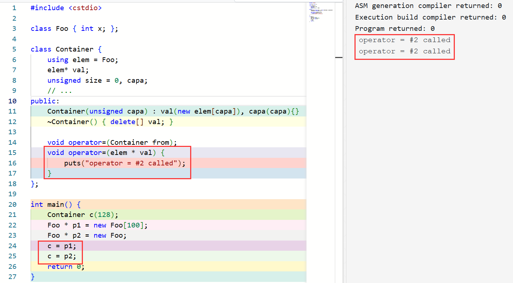

# 5 类 (II) - 拷贝赋值、运算符重载与引用

--8<-- "cpp/cpp_restart/toggle_visibility.md"

??? warning "本节使用的副本"
    本节引入的副本包括：

    - [运算符重载](../appendix/operator_overload)
        - [引用](../appendix/references)
        - [I/O stream](../appendix/iostream)
        - [隐式类型转换](../appendix/implicit_cast)

## 5.1 拷贝赋值运算符

在上一节中，我们创建了一个「容器」类：

```c++ linenums="1"
class Container {
    elem* val;
    // ...
};
```

我们考虑一个问题：假如有两个 `Container` 的实例 `c1` 和 `c2`，那么 `c1 = c2;` 会发生什么？

很容易理解，在这个赋值表达式完成后，`c1.val` 的值变得和 `c2.val` 一样了；也就是说，这两个容器现在指向同一块内存。

这样的结果会带来两个问题：

1. `c1` 原来的 `val` 也许指向了一块申请来的内存，但是它并没有被释放；
2. 这样的「赋值」实际上完成的是某种「共享」，而并非真正地建立一个副本。如果这并非本意，那么此后对 `c1.val` 的修改对于 `c2` 也可见，且两个对象的析构函数可能会重复析构这块内存，引发错误。

为了解决这个问题，C with Classes 开始就允许用户 **重载赋值运算符**。实现的方法是，在类内声明一个称为 `operator=` 的成员函数。例如：

```c++ linenums="1"
class Container {
    elem* val;
    unsigned size = 0, capa;
    // ...
public:
    Container(unsigned capa) : val(new elem[capa]), capa(capa){}
    ~Container() { delete[] val; }

    void operator=(Container from) {
        delete[] val;
        val = new elem[from->capa];
        for (unsigned i = 0; i < from->size; i++) {
            val[i] = from->val[i];
        }
        size = from->size;
        capa = from->capa;
    }
};
```

上面的实现演示了一个重载 `operator=` 的例子，它将 `from` 中指向的内容拷贝了一份，而非简单地拷贝指针。虽然还有一些问题。在讨论这些问题以及解决方案之前，我们先来看一看这样的运算符重载函数是如何被调用的。

在一个有运算符的表达式中，如果至少一个操作符是某个类的对象[^overload_op_enum]，则由重载解析查找对应的函数。例如 `x = y;` 就会被视为 `x.operator=(y);` 进行查找。

[^overload_op_enum]: class type OR enum type

上面的例子还有一些问题和改进空间：

如果我们写出了 `x = x;` 会发生什么事情呢？容易理解，这时 `this` 和 `from` 的 `val` 是同一个，因此 `delete[]` 在 `new[]` 之后事实上里面的数据已经丢失了。因此我们需要防范这种情况。

另一个问题是，如果 `capa` 和 `from->capa` 的值相同，那就没必要重新开一份空间了。

考虑上述问题，我们可以写出这样的代码：

```c++ linenums="1"
class Container {
    elem* val;
    unsigned size = 0, capa;
    // ...
public:
    Container(unsigned capa) : val(new elem[capa]), capa(capa){}
    ~Container() { delete[] val; }

    void operator=(Container from) {
        if (from->val != val) { // avoid self-assignment
            if (from->capa != capa) {
                delete[] val;
                val = new elem[from->capa];
            }
            for (unsigned i = 0; i < from->size; i++) {
                val[i] = from->val[i];
            }
            size = from->size;
            capa = from->capa;
        }
    }
};
```

结合函数重载，我们也容易理解，`operator=` 同样可以有重载。例如：

```c++ linenums="1"
class Container {
    elem* val;
    unsigned size = 0, capa;
    // ...
public:
    Container(unsigned capa) : val(new elem[capa]), capa(capa){}
    ~Container() { delete[] val; }

    void operator=(Container from);
    void operator=(elem * val) {
        this->val = val;
    }
};
```

虽然这个例子有点不太恰当（因为没有正确处理 `size` 和 `capa`），但是我们仍然能够从中理解：如果有 `Container` 的实例 `c` 和一个 `elem *` 类型的 `ptr`，那么 `c = ptr;` 是合法的，因为它实际上会被解释为 `c.operator=(ptr);`。

[这里](https://godbolt.org/z/jKvvsK8xP) 有一个具体的例子：

<center></center>

与之前的讨论类似，如果用户没显式地给出 `operator=`，那么编译器会生成一个 public 的默认拷贝赋值运算符的声明；如果它被使用，则编译器生成它的定义；它完成的内容即为将各个成员变量用它们的 `operator=` 拷贝一遍。例如：

<center></center>

用户也可以将 `operator=` 设置为 `= default;` 或者 `= delete;`。如果 `operator=` 在当前上下文不可见，那么 `a = b;` 这样的表达式非法：

```c++
class Foo { 
    void operator=(Foo){} // private operator=
    void foo() {
        Foo a, b;
        a = b;      // OK, private function available here
    }
};
struct Bar { 
    void operator=(Bar) = delete; // deleted operator=
    void foo() {
        Bar c, d;
        c = d;      // error: use of deleted function 
                    // 'void Bar::operator=(Bar)'
    }
};

void foo() {
    Foo a, b;
    a = b;      // error: 'void Foo::operator=(Foo)' 
                // is private within this context
    Bar c, d;
    c = d;      // error: use of deleted function 
                // 'void Bar::operator=(Bar)'
}
```

## ▲ 运算符重载

--8<-- "cpp/cpp_restart/appendix/operator_overload.md"

## 5.1 拷贝赋值运算符 (Cont.)

首先，如我们之前所说，当我们的类中的成员只需要逐个复制就能实现拷贝，而没有什么需要深入进去特殊处理的资源的话，我们直接什么都不用写，使用默认的拷贝赋值函数即可。

默认的拷贝赋值函数长这样：

`class-name & class-name::operator=(const class-name &);`

如果我们什么都不写的话，编译器会帮我们生成形如上面那样的函数，它做的事情就是将成员逐个拷贝，然后返回它自己。

为什么这个函数接收一个 `const class-name &` 呢？如我们之前所说，这样一方面能够防止不必要的拷贝，另一方面能够接受临时对象。

为什么这个函数又返回一个 `class-name &` (具体地，返回 `*this`) 呢？事实上，C 和 C++ 支持这样的表达式：

`a = b = 1;`

这是因为，C 和 C++ 中 `=` 是一个表达式，它的值是赋值的结果。赋值运算符都是 group right-to-left 的^[expr.ass#1](https://timsong-cpp.github.io/cppwp/n4868/expr.ass#1)^，因此它等价于 `b = 1; a = b;`。

因此，对于我们自定义的类型，我们没有理由不允许它做这样的事情。因此如果让 `operator =` 的返回值是 `*this`，就可以完成类似 `c1 = c2 = c3;` 的操作了。

因此，规范的拷贝赋值运算符一般写成这样[^copy_and_swap]：

```c++ linenums="1"
Container & operator=(const Container & from) {
    if (this == &from)      // avoid self-assignment
        return *this;
 
    if (from->capa != capa) {
        delete[] val;
        val = new elem[from->capa];
    }

    for (unsigned i = 0; i < from->size; i++) {
        val[i] = from->val[i];
    }
    size = from->size;
    capa = from->capa;

    return *this;
}
```

[^copy_and_swap]: 在后面，我们会看到关于 `operator=` 的另一种编写习惯，称为 copy-and-swap idiom。

---

--8<-- "cpp/cpp_restart/toggle_visibility.md"