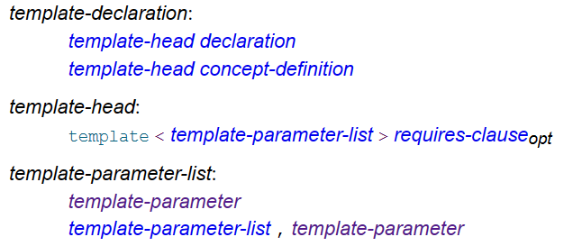
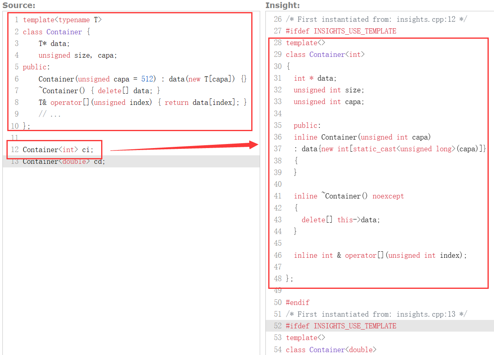
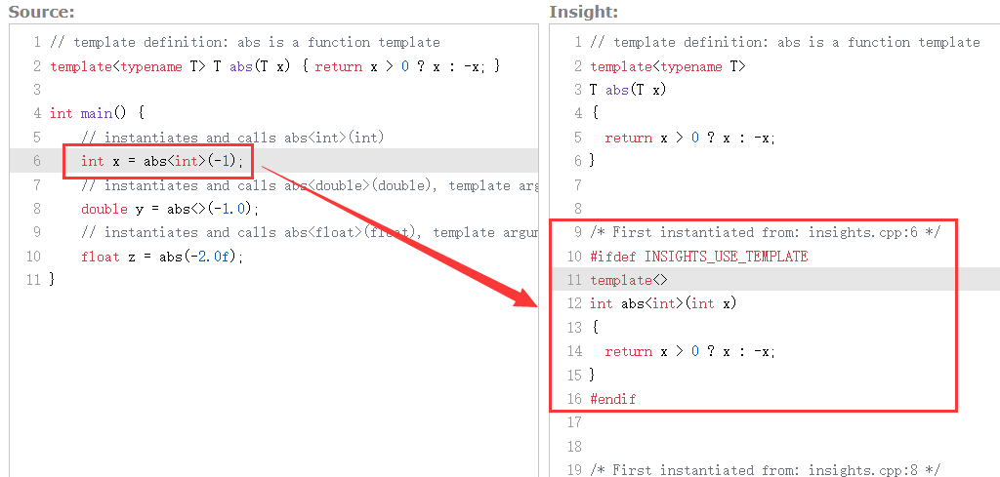
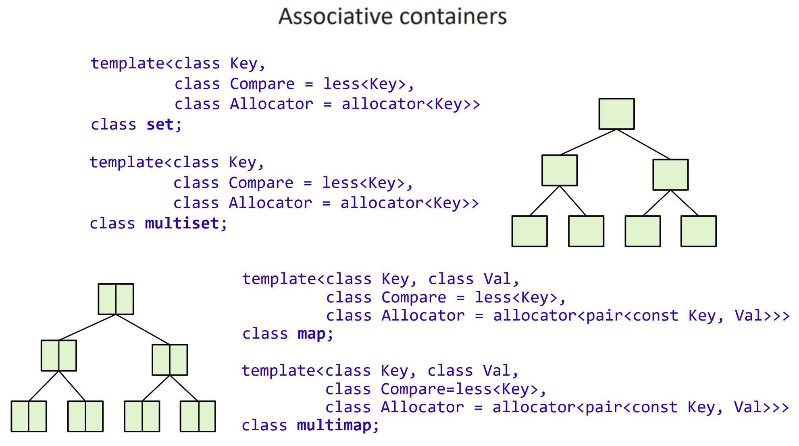
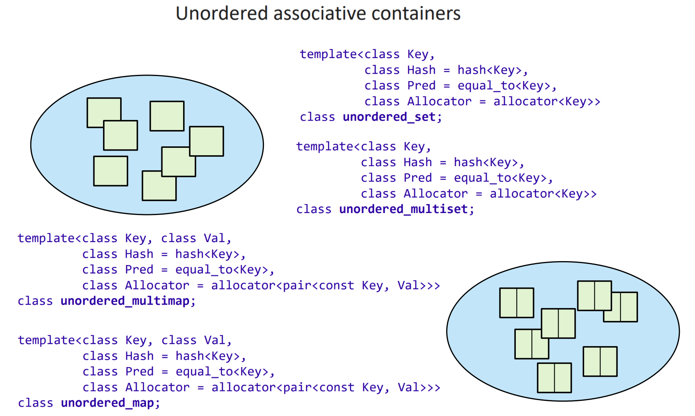
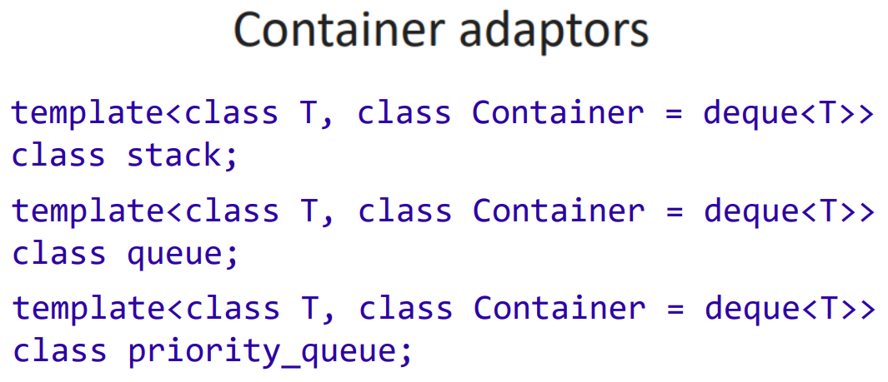

# 7 模板 (I) - 基本知识与 STL 使用

--8<-- "cpp/cpp_restart/toggle_visibility.md"

---

## 7.1 引入：泛型编程

在介绍 OOP 的章节中，我们讨论过一个链表的实现和使用，我们面临过这样的问题：

```c++ linenums="1"
#define elem Circle
#include "linkedlist.h"
#undef elem

#define elem Rectangle
#include "linkedlist.h"
#undef elem
```

<center>{width=500}</center>

我们当时的解决方案是，用一个 `Shape` 类作为它们的基类，然后 `using elem = Shape;` 即可。

不过，假如我们确实要维护两个不同类型的链表怎么办呢？比如需要分别维护一个 `int` 类型和 `double` 类型的链表。

这里，我们的需求实际上是：让我们的代码独立于具体的类型 (type-independently) 工作；我们写出一个适用于所有（可能需要满足一定条件的）类型的数据结构（类）或者算法（函数）；在真正需要使用时，生成一个适用于所需要类型的实例。这种编程范式称为 **泛型编程 (generic programming)**。也就是说，在泛型的代码中，我们编写的并不是一个具体的类 / 函数，而是函数 / 类的一个族 (family)；或者说，我们定义了一种生成类 / 函数的模式。

回到刚才的问题；我们如何能够完成这一任务呢？一种想法是，给这两个类型也找一个共同的基类——或者说，给所有类型找一个共同的基类；所有容器类（例如这里的 `linkedlist` 或者我们之前设计的 `Container`）都可以使用这个基类作为其 `elem`。这种组织方式叫做 **单根结构 (singly rooted hierarchy)**。很多面向对象的编程语言（如 Java）都使用单根结构，它们用一个叫做 `Object` 的类作为所有其他类的基类。不过，出于类型安全性和运行时效率的考量，C++ 并没有采用单根结构。我们会在继承相关章节中讨论单根结构的优劣。

那么，在 C++ 中，我们如何解决前面的问题呢？我们先考虑用 C 语言如何解决——毕竟如我们之前讨论的，在 C++ 的早期，C++ 的语法特性最终都要翻译到 C 来支持。作为一个简化，我们先看一个关于函数的例子：

```c++ title="abs.h"
TYPE abs(TYPE x) { return x > 0 ? x : -x; }
```

```c++ title="main.cpp"
#define TYPE int
#include "abs.h"
#undef TYPE

#define TYPE double
#include "abs.h"
#undef TYPE

int main() {
    int x = abs(-1);
    double y = abs(-1.0);
}
```

通过 `g++ main.cpp -E > main.i` 命令（`-E` 表示只完成预处理），我们得到下面的结果：

```c++ title="main.i"
# 0 "main.cpp"
# 0 "<built-in>"
# 0 "<command-line>"
# 1 "main.cpp"

# 1 "abs.h" 1
int abs(int x) { return x > 0 ? x : -x; }
# 3 "main.cpp" 2


# 1 "abs.h" 1
double abs(double x) { return x > 0 ? x : -x; }
# 7 "main.cpp" 2


int main() {
    int x = abs(-1);
    double y = abs(-1.0);
}
```

可以看到，和我们的预期一致，这里生成了 `abs` 两个版本的重载，分别对应 `int(int)` 和 `double(double)` 的版本。我们编写了一个函数的泛型，然后通过编译预处理生成了两份重载，从而完成了其实例化。

而面对类的问题，这个事情变得更加不优雅起来——因为类不能「重载」，即不允许同名的类有两个不同的定义。我们必须在类名中也加入 `TYPE` 元素：

```c++ title="container.h"
#if defined(TYPE)
#define JOIN_(a, b) a ## b
#define JOIN(a, b) JOIN_(a, b)
#define NAME JOIN(Container_, TYPE)

class NAME {
    TYPE * val;
};

#undef JOIN_
#undef JOIN
#undef NAME
#endif
```

（关于上面这段代码为什么要写的这么麻烦，可以参考 [这个回答](https://stackoverflow.com/a/51161267/14430730)。基本原因是，如果我们写 `Container_TYPE`，那么 `#define TYPE int` 不会导致这个名字被替换为 `Container_int`，因为宏替换只替换完整的 token，而不会替换其中的一部分） 

```c++ title="main.cpp"
#define TYPE int
#include "container.h"
#undef TYPE

#define TYPE double
#include "container.h"
#undef TYPE

int main() {
    Container_int ci;
    Container_double cd;
}
```

预处理完成后，得到（删除了不重要的内容）：

```c++ title="main.i"
class Container_int {
    int * val;
};
class Container_double {
    double * val;
};

int main() {
    Container_int ci;
    Container_double cd;
}
```

这样，我们就实现了 `Container` 类用于两种或者多种不同类型的目标了。

但是，显然这样的写法是丑陋的，以及容易出错。回顾之前 BS 说过的，希望 C++ 能够「允许用语言本身表达所有重要的东西，而不是在注释里或者通过宏这类黑客手段」。那么，C++ 如何支持这种让一个函数或类适配多种不同类型的目标呢？

在 Release 3.0 中，C++ 受 Ada （一种编程语言）的启发加入了 **模板 (template)** 机制来解决这一问题。事实上，BS 反思说这么晚才引入模板机制是一个错误，因为模板远比 Release 2.0 中引入的多继承之类的特性重要。的确，模板将 **泛型编程 (generic programming)** 和 **模板元编程 (template metaprogramming)** 这两个编程范式引入了 C++，它们在现在发挥着非常重要的作用。我们分别介绍这两种编程范式。

## 7.2 模板和隐式实例化

在 C++ 中，类模板（如字面意义：用来生成类的模板）和函数模板可以将类型作为参数；编写模板时，我们使用这些参数来代替实际的类型。例如：

```c++
template<typename T>
class Container {
    T* data;
    unsigned size, capa;
public:
    Container(unsigned capa = 512) : data(new T[capa]) {}
    ~Container() { delete[] data; }
    T& operator[](unsigned index) { return data[index]; }
    // ...
};
```

这里，`template< /* something */ >` 用来表示它后面的东西是个模板，其中尖括号 `<>` 中的内容是模板参数列表；例如上面的代码就定义了一个类模板；`typename T` 说明它接收一个类型作为参数，名字是 `T`。在模板的定义内部，我们可以使用到这个类型变量 `T`。

再看一个函数模板的例子：

```c++
template<typename T>
    T abs(T x) { return x > 0 ? x : -x; }
```

???+ note "`typename`"
    在最开始，类型参数 `typename T` 被写作 `class T`；但是后者容易被误解为「只能接受一个类」，虽然事实上内置类型也可以作为其实参。因此，`typename` 被引入。这里 `typename T` 和 `class T` 完全一致。

    关键字 `typename` 还有其他含义。

??? info "模板定义的形式"
    具体来说，模板定义有如下形式^[temp.pre#1](https://timsong-cpp.github.io/cppwp/n4868/temp.pre#1)^：

    <center>{width=500}</center>

    在一个 `template-declaration` 中有一个 `template-head` 和一个 `declaration`（我们暂时忽略 `concept-definition`）。`template-head` 即为 `template<参数列表>`，我们暂时忽略 `requires-clause`。而 `declaration` 可以是函数、类等的定义。

### 7.2.1 隐式实例化与模板参数推导

如我们之前所说，泛型的类或者说类模板独立于具体的类型，它定义的是一种根据给定的参数生成类的规则。显然，类模板本身不是一个类，仅包含模板定义的源文件不会生成任何代码。当我们要使用这样的模板时，我们应当指明其参数，编译器会根据参数和模板生成出一个实际的类（我们称这个类为对应模板的一个 **特化 (specialization)**；这个过程叫做模板的 **实例化 (instantiation)**（对函数模板而言也一样）^[temp.spec.general#1](https://timsong-cpp.github.io/cppwp/n4868/temp.spec.general#1)^。

例如，对于之前定义的模板 `Container`：

```c++
Container<int> ci;
Container<double> cd;
```

在上面的例子中，`Container` 是一个模板，而 `Container<int>` 是将 `int` 作为模板参数 `T` 实例化出的一个类（我们将形如 `Container<int>` 这样的模板特化的名字称为 `template-id`）。这时，编译器会帮我们按照 `Container` 中指出的规则生成一个特化：

<center></center>

回顾 7.1 节中 `container.h` 的例子，我们容易理解：其实模板和那里我们实现的方式差不多，只不过这些内容变得更加优雅，而且由编译器而非预处理器完成了。

也就是说，当我们需要使用一个完整类型时，隐式的实例化会发生，如上面的情况。不过，在构造指向某个类型的指针时，隐式实例化并不会发生，因为我们并不需要这个类型的完整信息：

```c++
Container<char>* p;     // nothing is instantiated here

void foo() {
    (*p)[2] = 'c';  // implicit instantiation of Container<char> 
                    // and Container<char>::operator[](unsigned) occurs here.
                    // Container<char>::~Container() is never needed
                    // so is never instantiated: it doesn't have to be defined
}
```

如上面的注释所示，类模板的成员也一样：当隐式实例化一个类时，除非该成员在程序中有使用，否则它不会被隐式实例化，也不需要定义。

再看一个函数模板的例子：

```c++
template<typename T>
    T abs(T x) { return x > 0 ? x : -x; }
```

当我们调用一个函数，或者在其他需要函数定义的场景下，隐式的实例化会发生。例如：

```c++ linenums="1"
// template definition: abs is a function template
template<typename T> T abs(T x) { return x > 0 ? x : -x; }

int main() {
    // instantiates and calls abs<int>(int)
    int x = abs<int>(-1);
    // instantiates and calls abs<double>(double), template argument deduced
    double y = abs<>(-1.0);
    // instantiates and calls abs<float>(float), template argument deduced
    float z = abs(-2.0f);
}
```

在第 6 行，我们使用了 `abs<int>`。`abs` 是一个模板，而 `abs<int>` 是把 `int` 作为模板参数而实例化出的一个函数。在此时，编译器会帮我们生成一个特化 `abs<int>`：

<center></center>

可以在 [C++ Insights](https://cppinsights.io/s/c7515c59) 里面玩一下！

而在第 8 行，我们写了 `abs<>(-1.0)` 而不是 `abs<double>(-1.0)`。这是合法的：虽然模板的实例化必须 **知道** 每个模板参数，但是这并不意味着每个参数都需要由调用者 **指定**。如果可能，编译器会从函数参数中推断出没有明确给出的模板参数。这一机制叫做 **模板参数推导 (template argument deduction)**。

在这里，我们并没有给出第一个模板参数 `T` 的实参，但是编译器知道参数 `-1.0` 是一个 `double` 类型的字面量，而 `abs` 接受一个 `T` 为参数，因此编译器推导出 `T` 是 `double`，因此实例化并调用了 `abs<double>`。

在第 10 行，我们写了 `abs(-2.0f)` 而不是 `abs<>(-2.0f)` 或者 `abs<float>(-2.0f)`，这意味着我们要求所有模板参数都由编译器推导。这种情况下，`<>` 是可以省略的。

### 7.2.2 函数模板参数推导

当然，也可以给出前几个参数，而后几个由编译器推导。例如：

```c++ linenums="1"
template<typename To, typename From>
To convert(From f);
 
void g(double d) 
{
    int i = convert<int>(d);    // calls convert<int, double>(double)
    char c = convert<char>(d);  // calls convert<char, double>(double)
    int(*ptr)(float) = convert; // instantiates convert<int, float>(float) 
                                // and stores its address in ptr
}
```

注意第 8 行，我们定义了一个函数指针 `ptr`，它指向的类型是 `int(float)`；编译器可以据此推断出 `To` 是 `int`，而 `From` 是 `float`，因此实例化出 `convert<int, float>(float)`。但是，在函数调用时，返回值的信息并不明确，因此编译器无法推断出返回值的类型。例如：

```c++
template<typename To, typename From>
To convert(From f);

void g(double d) {
    int i = convert(d);
}
```

此时，编译器会报错：`no matching function for call to 'convert'`，因为 `couldn't infer template argument 'To'`。

另外，`double y = abs<double>(1.0f);` 实际上完成的是：`double y = abs<double>(double(1.0f));`。这是合理的，因为我们显式指明了所使用的具体的函数 `abs<double>`，它接受一个 `double` 类型的变量，因此虽然传入参数是 `float` 类型字面量 `1.0f`，但是它仍会被隐式转换为 `double` 用于调用。

需要提示的另一个问题是，隐式类型转换发生在重载解析过程中，而模板参数推导发生在重载解析之前。因此，类型推导不考虑隐式转换：

```c++ linenums="1"
template<typename T> 
T greater(const T& lhs, const T& rhs) {
    return rhs > lhs ? rhs : lhs;
}

void foo(int a, double b) {
    // double x = greater(a, b); // error
    double x = greater<double>(a, b); // OK
}
```

上面代码中第 7 行，编译器看到参数列表是 `(int, double)`，会尝试推导 `T` 的类型。但是，根据第一个参数推导出的 `T` 是 `int`，而根据第二个参数推导出的是 `double`，因此 `T` 是有歧义的，推导失败。而第 8 行，我们显式给出了它使用的特化，就没有问题了。

模板参数推导还有很多值得讨论的问题，我们在后面的章节中具体讨论这些话题。

### 7.2.3 运算符模板

模板类型推导使得运算符模板成为可能。例如（可以在 [这里](https://godbolt.org/z/87fezqvb5) 玩一下）：

```c++ linenums="1"
template<typename T>
class Container {
    T* data;
    unsigned size = 0, capa;
public:
    Container(unsigned capa = 512) : data(new T[capa]), capa(capa) {}
    ~Container() { delete[] data; }

    T& operator[](unsigned index) { return data[index]; }
    const T& operator[](unsigned index) const { return data[index]; }

    unsigned getSize() const { return size; }
    unsigned getCapa() const { return capa; }

    Container & add(T val) { 
        /* if full, expand storage */
        data[size++] = val;
        return *this; 
    }
    // ...
};

#include <iostream>
using std::cout;
using std::ostream;

template<typename T>
ostream & operator<<(ostream& os, const Container<T>& c) {
    for (unsigned i = 0; i < c.getSize(); i++)
        os << c[i] << ' ';
    return os;
}

int main() {
    Container<int> c(10);
    c.add(1).add(2).add(3).add(5);
    cout << c;
}
```

???+ example "复习"
    作为复习，请读懂上面的代码，并回顾：
    
    1. 9 ~ 10 行为什么要有两个 `operator[]` 的重载？它们为什么能同时存在？
    2. 12 行的 `getSize()` 可以不是 `const` 的吗？为什么？
    3. 结合 36 行对 `add` 的使用，回答 15 行为什么要返回 `Container &` 类型？
    4. 27 ~ 32 行定义了 `operator<<` 的模板。理解这段代码，回答 `os << c[i] << ' '` 调用了哪些函数？写出它们的函数签名。

    ??? success "答案"
        1. 为了适配调用对象是和不是 `const` 的情况。`const` 说明 `this` 的不同类型。
        2. 不能，因为 29 行 `const Container<T>&` 调用了 `getSize()`。
        3. 支持链式的 `add`。
        4. `operator<<(operator<<(os, c.operator[](i)), ' ')`；从内到外依次是：
            - `const int & Container<int>::operator[](unsigned) const`
            - `std::ostream& operator<<(std::ostream&, int)`
            - `std::ostream& operator<<(std::ostream&, char)`


有了 `operator<<` 的模板和模板参数推导，`cout << c` 时就能自动推导出 `template<typename T> ostream & operator<<(ostream& os, const Container<T>& c)` 中的 `T` 是 `int`，从而实例化并调用 `ostream & operator<<(ostream&, const Container<int>&)`。

???+ example "练习"
    作为练习，请尝试理解下面的代码并写出其输出（可以在 [这里](https://godbolt.org/z/3845W6Wdf) 玩一下）：

    ```c++ linenums="1"
    template<typename T>
    class Container {
        T* data;
        unsigned size = 0, capa;
    public:
        Container(unsigned capa = 512) : data(new T[capa]), capa(capa) {}
        ~Container() { delete[] data; }
        Container(const Container &) = delete;
        Container & operator=(const Container &rhs) {
            if (this == &rhs)   return *this;
            if (capa != rhs.capa) {
                delete[] data;
                data = new T[rhs.capa];
            }
            for (unsigned i = 0; i < rhs.size; i++)
                data[i] = rhs[i];
            capa = rhs.capa;
            size = rhs.size;
            return *this;
        }

        T& operator[](unsigned index) { return data[index]; }
        const T& operator[](unsigned index) const { return data[index]; }

        unsigned getSize() const { return size; }
        unsigned getCapa() const { return capa; }

        Container & add(const T& val) { 
            /* if full, expand storage */
            data[size++] = val;
            return *this; 
        }
        // ...
    };

    #include <iostream>
    using std::cout;
    using std::ostream;

    template<typename T>
    ostream & operator<<(ostream& os, const Container<T>& c) {
        os << '[';
        for (unsigned i = 0; i + 1 < c.getSize(); i++)
            os << c[i] << ' ';
        if (c.getSize())
            os << c[c.getSize() - 1];
        return os << ']';
    }

    int main() {
        Container<Container<int>> c(10);
        c.add(Container<int>(10)).add(Container<int>(10)).add(Container<int>(10));
        c[0].add(1).add(2).add(3).add(5);
        c[1].add(4).add(5);
        cout << c;
    }
    ```

    另外，请思考：这段代码有什么性能问题？作为一个提示，请考虑 `Container<T>` 的构造函数被调用了多少次。

    我们会在后面的章节讨论这一问题的解决方案。

    !!! tips
        `Container<Container<int>>` 在 C++11 之前可能不得不写成 `Container< Container<int> >` 以避免最后的部分被理解为右移运算符 `>>`；不过自 C++11 开始这个问题被解决了。

### 7.2.4 默认模板参数

我们之前讨论过，函数参数可以有默认参数；事实上，模板参数也可以有默认参数。例如：

```c++
template<typename T, typename U = int> class Foo { /* ... */ };

Foo<int> x;         // Foo<int, int>
Foo<int, char> y;   // Foo<int, char>
// Foo<> z;  Foo w; // Error
```

与函数参数一样，类模板默认参数也只能存在于最后的若干参数中，即 `template<typename T = int, typename U> class Bar { /* ... */ };` 是非法的。

不过，由于函数模板通常有模板参数推导，因此函数模板的默认参数 **不必** 只能存在于最后的若干参数中，例如；

```c++
template<typename RT = void, typename T>    // OK
RT* address_of(T& value) { return (RT*)(&value); }

void foo(int x) {
    void * pv = address_of(x);		// address_of<void, int>
    int * pi = address_of<int>(x);	// address_of<int, int>
}
```

另外，如果模板参数既有默认参数也可以推导出来，则使用推导出来的结果（除非推导失败），例如：

```c++
template<typename T = int>  void foo(T x) {}

void bar(double x) {
    foo(x); // foo<double>
}
```

### 7.2.5 模板成员

我们之前看到了类模板，例如：

```c++
template<typename T> class Container {
    // ...
    Container & operator=(const Container &rhs);
};
```

需要注意的是，如果我们想在类外写这个成员函数的定义，我们需要这样写：

```c++
template<typename T>
Container<T> & Container<T>::operator=(const Container<T> &rhs) { /* ... */ }
```

原因很简单，`Container<T>` 是一个类，而 `Container` 不是。

值得提及的是，类也可以有模板成员。例如：

```c++
#include <iostream>

struct Printer {
    std::ostream& os;
    Printer(std::ostream& os) : os(os) {}
    template<typename T>
    void print(const T& obj) { os << obj << ' '; } // member template
};

int main() {
    Printer p(std::cout);
    p.print(1);   // instantiates and calls p.print<int>(1), prints 1
    p.print('a'); // instantiates and calls p.print<char>('a'), prints a
}
```

如果我们希望把 `Printer::print` 放到类外来定义，那么它会写成：

```c++
template<typename T>
void Printer::print(const T& obj) { /* ... */ }
```

那么，如果我们要在类模板中声明成员模板，并在类外给出定义应该怎么写呢？事实上，我们需要两个 `template<>`，分别说明其所在类的模板参数和对应成员模板的模板参数：

```c++
template<typename T> class Container {
    // ...

    template<typename U>
    Container & operator+=(const Container<U> & rhs);
};

template<typename T>    // for the enclosing class template
template<typename U>    // for the member template
Container<T> & Container<T>::operator+=(const Container<U> & rhs) {
    for (unsigned i = 0; i < size && i < rhs.getSize(); i++) {
        data[i] += rhs[i];
    }
    while (size < rhs.getSize()) {
        data[size] = rhs[size];
        size++;
    }
    return *this;
}
```

## 7.3 STL 及其基本使用

!!! note
    本节中部分图片取自 Bob Steagall 在 CppCon 2021 的演讲 Back to Basics: Classic STL；该演讲视频可以在 [YouTube](https://youtu.be/tXUXl_RzkAk) 找到，对应的 Slides 可以在 [GitHub](https://github.com/CppCon/CppCon2021/blob/main/Presentations/back_to_basics_classic_stl__bob_steagall__cppcon_2021_1.pdf) 找到。

**STL (Standard Template Library, 标准模板库)** 是 C++ 中的一套非常有用的工具，它在 C++ 的第一个标准化版本 C++98 中就被引入，并直到今天都在增加新的改进。如它的名字所示，这个库大量利用了模板提供的泛型思想；实现了很多常用的数据结构和算法。这些数据结构通过类模板实现，而算法通过函数模板实现。

在本节中，我们会讨论 STL 中一些容器（数据结构）和算法的基本使用；而在下一节中，我们会仔细讨论它们背后的 C++ 实现，从而给模板的使用带来一定回顾和启发。

### 7.3.1 为什么要用 STL

STL 提供了 **容器库 (Containers library)** 和 **算法库 (Algorithm library)**，这些库里包含了大量常见的数据结构和算法；程序员可以直接调用这些算法，而无需自己实现。我们可以看两个简单的例子：

#### 7.3.1.1 `std::vector`

STL 的第一个重要部分——容器库 (Containers library) 集合了一些类模板和算法，从而让程序员可以轻松地使用常见的数据结构，例如线性表、队列、栈、集合、字典等。

作为其中最常用的例子，我们介绍 `vector` 类模板，它封装了一个动态大小的的数组；即：我们使用时不必给它规定一个初始大小；当分配的空间用尽时，它会帮我们自动扩展空间。作为一个简单的例子：

```c++ linenums="1"
#include <iostream>
#include <vector>
 
int main()
{
    // Create a vector containing integers
    std::vector<int> v;
 
    // Add two integers to vector
    v.push_back(25);
    v.push_back(13);
 
    // Print out the vector
    std::cout << "v = { ";
    for (int n : v)
        std::cout << n << ", ";
    std::cout << "}; \n";
}
```

- 第 2 行 `#include <vector>` 引入了 `vector` 所在的头文件；
- 第 7 行 `std::vector<int> v;` 用默认构造函数定义（构造）了一个 `vector<int>` 对象 `v`；「默认构造函数」代表构造了一个目前为空数组。容易理解，`vector` 是一个类模板，因此 `<int>` 事实上说明了它的模板参数是 `int`。由于 `vector` 在 `std` 命名空间中，因此我们要写 `std::vector`（作为复习，我们有哪些使用 `using` 语句的方法来使得每一处 `std::vector` 都可以只写 `vector`？）；
- 第 10 和 11 行使用了成员函数 `push_back` 来在数组的尾部加入 2 个元素，分别是 25 和 13；
- 第 15~16 行遍历了 `v` 并输出其中的每一项。这是一个新的语法，在 C++11 中被引入，称为 **range-based for loop**；它实现的效果就是遍历这个容器的每一项并将其输出。作为一个替代，我们可以写 `for (int i = 0; i < v.size(); i++) std::cout << v[i] << ", ";`，这两种写法的效果是一致的。

我们稍微详细一点地介绍它提供的常用功能：

**构造**：

- 我们可以通过  `vector<int> v;` 的方式构造一个空的、每个元素的类型均为 `int` 的 vector，其名字为 `v`。
- 也可以通过类似 `vector<int> v = {1, 2, 3};` 的方式初始化，这种方式指明了 `v` 初始的元素个数和它们的值。
- 同时，可以通过 `vector<int> v(n);` 的方式构造一个包含 `n` 个元素的 vector。
- 可以通过 `vector<int> v(n, 1);` 的方式构造一个大小为 `n` 且每个元素的值都为 `1` 的 vector。

**获取长度**。可以通过 `v.size()` 获取 vector  `v` 中的元素个数。

**在末尾插入元素**。可以通过 `v.push_back(x)` 的方式将 `x` 插入到 vector  `v` 的末尾。

**访问（读取 / 修改）元素**。和数组一样，可以通过 `v[i]` 的方式访问 vector  `v` 的第 `i` 个元素，下标从 0 开始。注意，当 `i >= v.size()` 的时候，程序可能发生运行时错误。

#### 7.3.1.2 `std::sort`

`sort` 用于对数组或 vector 等可以随机访问且元素可比较的数据结构进行排序。平均和最差复杂度均为 $O(n\log n)$。例如：

```c++ linenums="1"
#include <algorithm>
#include <iostream>
#include <vector>

int main()
{
    using std::vector;
    using std::cout;
    using std::endl;

    int s[] = {5, 7, 4, 2, 8, 6, 1, 9, 0, 3};
    vector<int> v = {5, 7, 4, 2, 8, 6, 1, 9, 0, 3};
 
    std::sort(s, s + 10);
    for (int i : s) 
        cout << i << " ";
    cout << endl;
 
    std::sort(v.begin(), v.end(), std::greater<int>());
    for (int i : v) 
        cout << i << " ";
    cout << endl;
}
```

Output:

```
0 1 2 3 4 5 6 7 8 9 
9 8 7 6 5 4 3 2 1 0 
```

- 第 1 行中，我们 `#include <algorithm>`，这个头文件包含了许多通用的算法，这里的 `std::sort` 就是其中一种。
- 第 14 行中，我们对数组 `s` 的 `[s, s + 10)` 这段左闭右开区间（即整个数组）作了排序（没有特殊说明，所以是升序排序）；15~17 行进行了打印。可以看到，这种写法比 C 中的 `qsort` 要好用得多；另外也可以看到，range-based for loop 对于数组也是可以使用的。
- 第 19 行中，我们对 vector `v` 做了排序，`v.begin()` 是 `v` 的第一个元素，`v.end()` 是 `v` 最后一个元素的后一个位置 (past-the-last element，因为如 `s` 的例子所示，这两个参数表示的是一个左闭右开区间)，这说明我们正在对整个 `v` 做排序；在 `sort` 的第三个参数中，我们放进去了一个 `std::greater<int>()`，这用来表示我们正在做一个降序而非升序排序，即最大的放在最前面。 

我们还可以自定义比较函数。比较函数接收两个元素的引用，返回一个 bool 值表示前者是否应当在后者之前：

```cpp
bool cmp(const int& a, const int& b) { return a > b; }
vector<int> v = {3, 1, 4, -2, 5, 3};
sort(v.begin(), v.end(), cmp);
```

注意，比较函数逻辑上相当于 `a 严格在 b 前面` 。因此当两个元素相等时，比较函数总是应当返回 false。

自定义比较函数可以适用更复杂的排序，例如需要比较的元素本身并没有内置的比较运算符的时候。例如：

```cpp
bool cmp(const vector<int>& a, const vector<int>& b) {
    return a[0] == b[0] ? a[1] < b[1] : a[0] < b[0];
}

void foo(vector<vector<int>> & foo) {
    sort(foo.begin(), foo.end(), cmp);
}
```

如上面所示，这个比较函数可以用于 `vector<vector<int>>` 类型的排序。

### 7.3.2 STL 都有什么

如上面所示，STL 提供的容器和算法在性能、通用性和封装性上都比较好，而且它们是经过良好测试的；因此我们使用它们有助于让我们的代码具有更好的性能以及更高的可读性、可写性。所以，STL 都提供了哪些容器和算法呢？

!!! warning
    这里，我们只展示有哪些容器和算法，并不具体介绍它们的使用方法和使用场景。

    关于这里常用工具的简单的使用方法，参见 [快速入门 C++ 写题](../../cpp_for_contests)；但是，我们期望在第 8 节完成后，大家能够具备直接阅读 [CppReference](https://en.cppreference.com/w/cpp) 就可以理解 STL 中这些容器或算法使用方式的能力。在朋辈辅学的对应章节中，我们也会带领大家尝试阅读其中的例子。

    关于具体的使用场景，则需要大家在具体的做题或者编程过程中尝试发现。通常这些东西的使用是明确的：需要排序时使用 `sort`；需要在有序数组中查询内容使用 `upper_bound`, `lower_bound`, `binary_search` 等；需要去重时使用 `unique` 或者 `set` 或者 `unordered_set`；需要字典时使用 `map` 或者 `unordered_map` 等。CppReference 中也可以找到这些算法或者容器的各种操作的复杂度。「使用什么」的问题更多关于题目或者代码逻辑本身，并非本文的讨论重点。

[Containers library](https://en.cppreference.com/w/cpp/container) 中提供了若干种 container 和若干种 adaptors。

容器扮演的作用是提供一些数据结构，它们的大概类型如下面三张图所示（图片来源见 7.3 节开始的 note）：

**Sequence containers** 包含单向延伸的 `vector`、双向延伸的双端队列 `deque`、大小固定的数组 `array`、双向链表 `list` 和单向链表 `forward_list`；

<center>{width=400}</center>

**Associative containers** 中，`set` 是唯一、有序元素的集合；`map` 是键值对的集合（即字典），键唯一、有序；还有 `multiset` 和 `multimap` 分别是它们的可重版本，即键不唯一；它们通常用红黑树实现：

<center></center>

**Unordered associative containers** 是 associative containers 的无序版本；用哈希实现：

<center></center>

另外，**适配器 (adapters)** 利用容器（上述容器，或者用户自定义的容器）来提供一些接口，例如栈 `stack`、队列 `queue` 和优先队列 `priority_queue` 等：

<center>{width=400}</center>

而 [Algorithms library](https://en.cppreference.com/w/cpp/algorithm) 提供了更多的算法，其中常用的部分我们在 [快速入门 C++ 写题](../../cpp_for_contests) 有所介绍。大家也可以在阅读完第 8 节后，自行阅读网页中的内容，查阅这些算法。

另外，其中关于 C++20 引入的 `ranges` namespace 下的算法版本，我们会在后面的章节中具体介绍其背景和动机；大家可以暂时先行跳过。

---

!!! note
    除了 DnE 等在首页提及的资料，以及文中附有链接的资料外，本文还参考了如下资料：

    - [[History of C++] Templates: from C-style macros to concepts](https://belaycpp.com/2021/10/01/history-of-c-templates-from-c-style-macros-to-concepts)
    - [Generic Programming | Wikipedia](https://en.wikipedia.org/wiki/Generic_programming)

---

--8<-- "cpp/cpp_restart/toggle_visibility.md"