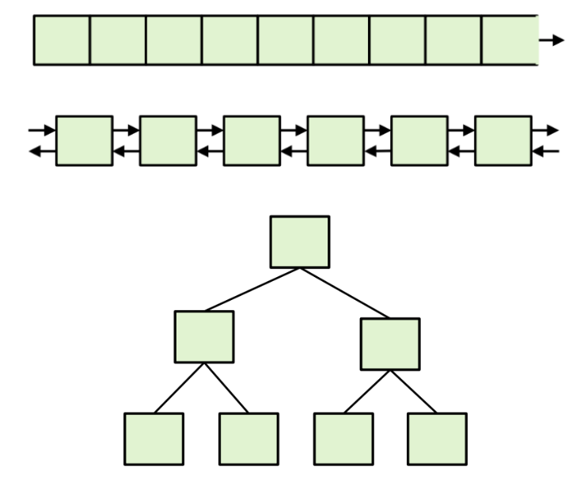
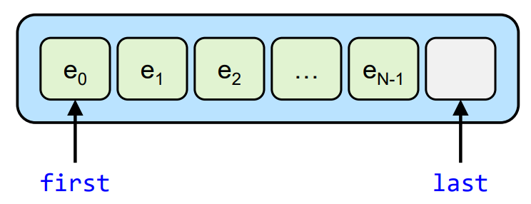
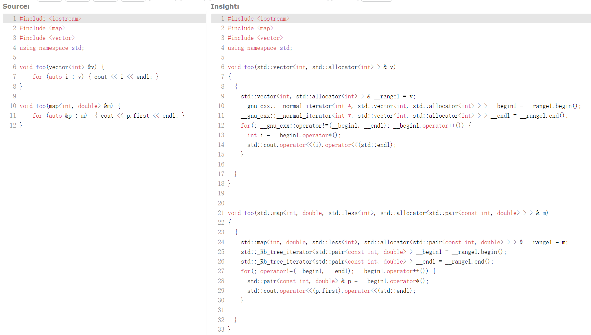
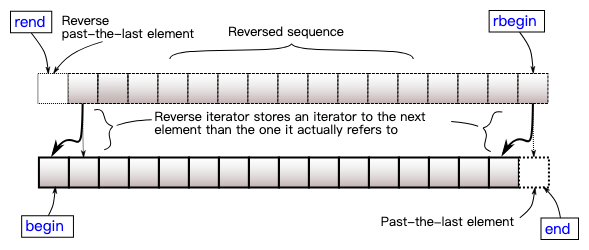
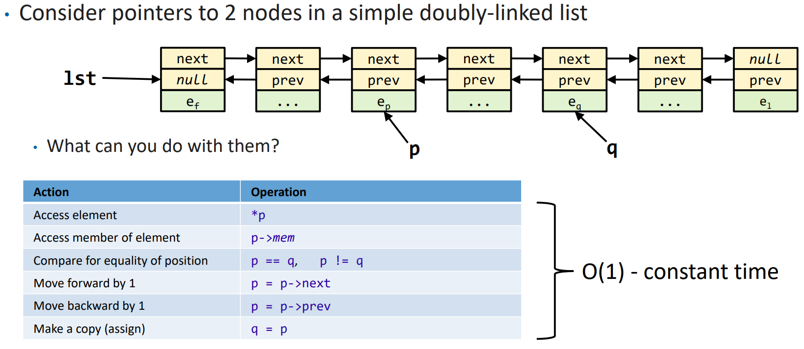
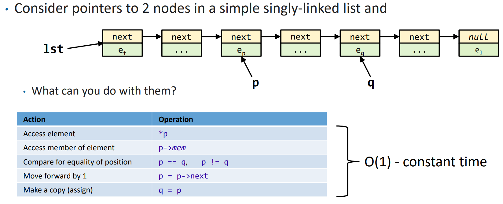

# 8 模板 (II) - 理解 STL：迭代器与函数对象

--8<-- "cpp/cpp_restart/toggle_visibility.md"

---

## 8.1 迭代器 | Iterators

在上一节中我们看到，STL 中有十余种容器，同时有上百种算法。但是，我们很容易理解的是，即使是相同的算法，它在不同的容器上的具体实现也是不同的。看下面一个例子：

```c++
#include <algorithm>
#include <iostream>
#include <vector>
#include <set>
#include <list>

int main() {
    std::vector<int> v = {0, 1, 2, 3, 4, 5, 6, 7, 8, 9};
    std::set<int> s = {2, 4, 1, 4, -1};
    std::list<int> l = {1, 5, 6, 2, 7};

    auto print = [](int i){ std::cout << i << ' '; };
    std::for_each(v.begin(), v.end(), print); 
    std::cout << '\n';
    std::for_each(s.begin(), s.end(), print); 
    std::cout << '\n';
    std::for_each(l.begin(), l.end(), print); 
    std::cout << '\n';
}

/* Output:
0 1 2 3 4 5 6 7 8 9 
-1 1 2 4 
1 5 6 2 7
*/
```

我们知道，`std::vector` 的底层数据结构是数组，`std::set` 的底层数据结构是红黑树，`std::list` 的底层数据是双向链表；`std::for_each` 对它们进行遍历的方式显然不同。

<center>{width=400}</center>

但是，对它们进行遍历的方式也有共通之处：对于 `for_each(c.begin(), c.end(), print);`，它需要做的事就是，从容器的 **开头** 开始，每次 **找到下一个元素**，**访问元素内容**，直到容器的 **末尾** 为止。即：`for (SomeType ptr = c.begin(); ptr != c.end(); go_to_next_node(ptr)) { print(get_value(ptr)); }`。

!!! inline end tips
    「迭代 (iteration)」的一个义项是 "One cycle of a set of instructions to be repeated"，即循环中的一次。在我们的语境中，我们的循环是为了遍历数据结构，迭代要做的事就是找到下一个元素和访问元素内容。

这里 `SomeType` 就是用来迭代 (iterate) 这个数据结构的变量的类型。显然，这个类型并不是数据结构中元素的类型，因为对于一个数组 `int a[10];`，我们需要通过一个 `int *` 才能找到下一个元素，而不是通过 `int`。即，这个循环形如 `for (int * ptr = a; ptr != a + N; ++ptr) { print(*ptr); }`。也就是说，这里的「开头」是 `a`，「末尾」是 `a + N`，「判断是否到达末尾」的方式是 `ptr != end()`，「找到下一个元素」的方式是 `++ptr`，「访问元素内容」的方式是 `*ptr`。

也就是说，我们通过指针能够完成「找到下一个元素」「访问元素内容」以及「比较」的功能，也就是迭代时所需的功能。因此我们将指针称为数组的 **迭代器 (iterator)**。迭代器并不是一个具体的数据类型，而是一类东西的统称。

???+ tips
    不过，数组的最后一个元素明明是 `a[N - 1]`，为什么要把 `a + N` 即 `&a[N]` 作为末尾？原因是，我们希望循环在 **越过** `a[N - 1]`，即 **到达但未访问** `a[N]` 时就停止，也就是说我们的「末尾」其实是 **one-past-the-end position**，如下图所示：

    <center>{width=500}</center>

然而，对于其他数据结构，就没有指针这样简单的方式来实现遍历了。不过，我们可以通过运算符重载的方式来为其他数据结构提供用于它们的「指针」，从而能够使用和数组的指针一样的方式来遍历容器，亦即：

```c++
class MyIterator {
    // 一些内部数据
public:
    // 构造函数
    MyIterator& operator++();   // 找到下一个元素
    bool operator!=();          // 判断是否到达末尾
    Elem& operator*();          // 访问元素内容
}
```

这样，我们就也可以通过 `for (MyIterator it = c.begin(); it != c.end(); ++it) { print(*it); }` 的方式来遍历容器 `c` 了。

作为一个具体的例子，我们考虑单链表：

```c++
template<typename T> struct Node {
    T data;
    Node * next = nullptr;
    Node(const T &data = T()) : data(data) {}
};

template<typename T> class MyLList {
    Node<T> * head = new Node<T>, *tail = head;
public:
    void insert_after(const T& value) {
        tail->next = new Node(value);
        tail = tail->next;
    }
};
```

我们可以为它写出如下的迭代器：

```c++
template<typename T> class MyLList {
    Node<T> * head = new Node<T>, *tail = head;
public:
    class MyIterator;
    using iterator = MyIterator;
    
    iterator begin() { return iterator(head->next); }
    iterator end()   { return iterator(nullptr); }

    void insert_after(const T& value) {
        tail->next = new Node(value);
        tail = tail->next;
    }
};

template<typename T> class MyLList<T>::MyIterator {
    Node<T> * val;
public:
    MyIterator(Node<T> * val) : val(val) {}
    MyIterator& operator++() { 
        val = val->next;
        return *this;
    }
    bool operator!=(const MyIterator &it) {
        return val != it.val;
    }
    T& operator*() { return val->data; }
};
```

这样，我们就可以方便地遍历 `MyLList` 了，例如下面代码所示：

```c++
#include <algorithm>
#include <iostream>

int main() {
    MyLList<int> list;
    list.insert_after(3);
    list.insert_after(4);
    list.insert_after(6);
    list.insert_after(5);
    
    using std::cout;
    for (auto i : list)    cout << i << ' ';
    cout << '\n';

    std::for_each(list.begin(), list.end(), [](int &x) { x *= 2; });
    for (auto i : list)    cout << i << ' ';

    return 0;
}
```

这段代码使用了上一节介绍的 range-based for loop、placeholder type specifier `auto` 以及 lambda 表达式，不记得了的话可以去前一节复习！

这段代码的运行结果可以在 [Complier Explorer](https://godbolt.org/z/P3d5bvf8Y) 看到！

从这个例子中，我们可以理解 **迭代器 (Iterator)** 解决的问题。我们知道，我们写程序的目的就是 **处理、查询、使用数据**，数据结构和算法是我们的工具。_在概念层面上_，各种容器或者数据结构的意义是以一定的方式或者性质 **容纳** 数据，但是它本身不具备处理数据的能力；而各种算法的意义是按一定的方法 **处理** 数据，它本身并不持有任何数据。而迭代器就是它们之间的桥梁——一个容器可能是一个数组、一棵二叉树、一个链表，或者其他任何可能的数据结构；一种算法需要对容器做遍历或者其他类型的访问；但是遍历一个数组和一棵二叉树的方式肯定是不同的——迭代器存在的意义就是通过运算符重载或者其他方式，来向算法隐藏容器的不同细节；算法只需要使用 `++` 就能获得下一个元素的迭代器，通过 `*` 就能访问当前迭代器指向的元素，它不需要关心到底是如何访问的；这其实上就是指针的抽象。通过这种方法，STL 保持了它的简洁性，提升了代码的复用。

???+ tip
    为什么说是 “在概念层面上” 呢？因为在实际的实现中，为了提高性能或者易用性，一些容器也将一些算法放到了自己的成员函数中，例如 `map` 和 `set` 的 `lower_bound` 等。但是从概念角度上，容器就仅仅是个包装好了的数据结构而已。

这样，我们其实也就知道了 `for (auto &a : c)` 是如何实现的了！事实上，对于有迭代器的容器（stack, queue, priority_queue 并没有迭代器，因为你不应当尝试去遍历或者以其他自由的形式访问这些容器中的元素），它的成员函数 `begin()` 和 `end()` 返回的都是某种迭代器；这些迭代器都重载了 `++` 运算符（事实上，对于这些容器，实现 `++` 运算符并不需要知道整个容器的结构；例如在红黑树中找到下一个节点不必知道根节点是什么。想一想为什么）。因此，对于这样包含成员函数 `begin()` 和 `end()` ，且其返回值类型支持运算符 `++` 、 `*` 和 `!=` 的类， `for (auto &a : c) {/* A */}` 的实现方法就类似于： `for (auto it = c.begin(); it != c.end(); ++it) {auto &a = *it; /* A */}` 。

???+ tip
    我们之前提到，对于 `std::vector<int> v;` ， `v.begin()` 的返回值类型是 `std::vector<int>::iterator`；而这和我们前面那段代码中所写的 `MyLList<T>::iterator` 一样，它其实是另一个类的别名，在我们之前的例子中，它实际上是 `MyLList<T>::MyIterator` 的别名。库的作者可以根据自己的喜好来定义迭代器类型实际的名称，而只需要设置好 `Container::iterator` 这个统一的别名即可。
    
    在实践中，取决于环境，`std::vector<int>::iterator` 可能是 `__gnu_cxx::__normal_iterator<int*, std::vector<int>>` ；对于 `std::map<int, double> m;` ， `m.begin()` 的返回值类型可能是 `std::_Rb_tree_iterator<std::pair<const int, double>>` 。感兴趣的小朋友可以自己在 [https://godbolt.org/z/6s5x66rdG](https://godbolt.org/z/6s5x66rdG) 尝试（这里也展示了一种查看表达式类型的小技巧）！

    同时，也可以使用 C++ Insights 来查看：[https://cppinsights.io/s/cd95e24b](https://cppinsights.io/s/cd95e24b) 

    

    不过，我们在真正使用到这些类型的时候，可以通过 `std::vector<int>::iterator` 来获得迭代器的类型；这是类的一个成员，声明了一个别名。

我们可以通过 [CppInsights](https://cppinsights.io/s/90d5fb67) 查看之前遍历 `MyLList` 的代码，从而验证上述知识。

???+ info "整活"
    我们之前提到，使用这种 range-based for loop，只需要类“包含成员函数 `begin()` 和 `end()` ，且其返回值类型支持运算符 `++` 、 `*` 和 `!=` ”，所以其实我们可以写出这样的代码 XD：

    

    感兴趣的小朋友可以来玩一玩：[https://godbolt.org/z/813b9e9Pd](https://godbolt.org/z/813b9e9Pd)

???+ tip
    另外，除了 `begin()` ，容器还会提供 `cbegin()` , `rbegin()` , `crbegin()` 这三种成员函数，提供不同的迭代器；也有对应的 `end()` 版本。这里 `c` 是指 const，即迭代器指向的变量是只读的； `r` 是指 reverse，即这种迭代器是逆序的，即：

    

## 8.2 迭代器的分类

我们在前一节中得知，`std::vector` 和 `std::unordered_set` 之类的容器都是有迭代器的，我们可以通过迭代器遍历它们。我们还知道，我们可以通过 `std::sort` 来对 `vector` 中的元素进行排序。请问：我们是否可以用 `sort` 来对 `unordered_set` 中的元素进行排序？如果不能，为什么？

??? tips "Unordered Associative Containers 的实现"
    作为一个提示，我们介绍 `unordered_set` 的实现思路。
    
    我们知道，Unordered Associative Containers 基于哈希表来实现，各个元素会根据给定的哈希函数计算出一个哈希值。每个哈希值对应一个链表，元素根据哈希值放到对应的链表 ("bucket") 中。当进行遍历时，实际上会遍历所有有元素的哈希值，并遍历其链表中的每一个元素。

    不过，我们考虑这样一个问题：如果有 $m = 10^6$ 个 bucket，但是只有 $n = 100$ 个元素，如果直接遍历 bucket 的话复杂度是 $O(m+n) >> O(n)$ 的。
    
    因此，实现中会额外用一个单向链表维护所有有元素的 bucket 列表，遍历时根据这个列表去找元素，复杂度就仅是 $O(n)$ 的了。
    
根据上述实现，我们很容易理解，这样的数据结构中并没有「排序」的余地。那假如我们就是尝试做这样的事，会发生什么呢？

我们写出这样的代码：

```c++
#include <unordered_set>
#include <algorithm>

void foo(std::unordered_set<int>& s) {
    std::sort(s.begin(), s.end());
}
```

得到了巨大报错！！

```
In file included from <source>:2:
In file included from /opt/compiler-explorer/gcc-12.2.0/lib/gcc/x86_64-linux-gnu/12.2.0/../../../../include/c++/12.2.0/algorithm:61:
/opt/compiler-explorer/gcc-12.2.0/lib/gcc/x86_64-linux-gnu/12.2.0/../../../../include/c++/12.2.0/bits/stl_algo.h:1938:22: error: invalid operands to binary expression ('std::__detail::_Node_iterator<int, true, false>' and 'std::__detail::_Node_iterator<int, true, false>')
                                std::__lg(__last - __first) * 2,
                                          ~~~~~~ ^ ~~~~~~~
/opt/compiler-explorer/gcc-12.2.0/lib/gcc/x86_64-linux-gnu/12.2.0/../../../../include/c++/12.2.0/bits/stl_algo.h:4820:12: note: in instantiation of function template specialization 'std::__sort<std::__detail::_Node_iterator<int, true, false>, __gnu_cxx::__ops::_Iter_less_iter>' requested here
      std::__sort(__first, __last, __gnu_cxx::__ops::__iter_less_iter());
           ^
<source>:5:10: note: in instantiation of function template specialization 'std::sort<std::__detail::_Node_iterator<int, true, false>>' requested here
    std::sort(s.begin(), s.end());
         ^
/opt/compiler-explorer/gcc-12.2.0/lib/gcc/x86_64-linux-gnu/12.2.0/../../../../include/c++/12.2.0/bits/stl_iterator.h:621:5: note: candidate template ignored: could not match 'reverse_iterator' against '_Node_iterator'
    operator-(const reverse_iterator<_IteratorL>& __x,
    ^
/opt/compiler-explorer/gcc-12.2.0/lib/gcc/x86_64-linux-gnu/12.2.0/../../../../include/c++/12.2.0/bits/stl_iterator.h:1778:5: note: candidate template ignored: could not match 'move_iterator' against '_Node_iterator'
    operator-(const move_iterator<_IteratorL>& __x,
    ^
In file included from <source>:2:
In file included from /opt/compiler-explorer/gcc-12.2.0/lib/gcc/x86_64-linux-gnu/12.2.0/../../../../include/c++/12.2.0/algorithm:61:
/opt/compiler-explorer/gcc-12.2.0/lib/gcc/x86_64-linux-gnu/12.2.0/../../../../include/c++/12.2.0/bits/stl_algo.h:1847:18: error: invalid operands to binary expression ('std::__detail::_Node_iterator<int, true, false>' and 'std::__detail::_Node_iterator<int, true, false>')
      if (__last - __first > int(_S_threshold))
          ~~~~~~ ^ ~~~~~~~
/opt/compiler-explorer/gcc-12.2.0/lib/gcc/x86_64-linux-gnu/12.2.0/../../../../include/c++/12.2.0/bits/stl_algo.h:1940:9: note: in instantiation of function template specialization 'std::__final_insertion_sort<std::__detail::_Node_iterator<int, true, false>, __gnu_cxx::__ops::_Iter_less_iter>' requested here
          std::__final_insertion_sort(__first, __last, __comp);
               ^
/opt/compiler-explorer/gcc-12.2.0/lib/gcc/x86_64-linux-gnu/12.2.0/../../../../include/c++/12.2.0/bits/stl_algo.h:4820:12: note: in instantiation of function template specialization 'std::__sort<std::__detail::_Node_iterator<int, true, false>, __gnu_cxx::__ops::_Iter_less_iter>' requested here
      std::__sort(__first, __last, __gnu_cxx::__ops::__iter_less_iter());
           ^
<source>:5:10: note: in instantiation of function template specialization 'std::sort<std::__detail::_Node_iterator<int, true, false>>' requested here
    std::sort(s.begin(), s.end());
         ^
/opt/compiler-explorer/gcc-12.2.0/lib/gcc/x86_64-linux-gnu/12.2.0/../../../../include/c++/12.2.0/bits/stl_iterator.h:621:5: note: candidate template ignored: could not match 'reverse_iterator' against '_Node_iterator'
    operator-(const reverse_iterator<_IteratorL>& __x,
    ^
/opt/compiler-explorer/gcc-12.2.0/lib/gcc/x86_64-linux-gnu/12.2.0/../../../../include/c++/12.2.0/bits/stl_iterator.h:1778:5: note: candidate template ignored: could not match 'move_iterator' against '_Node_iterator'
    operator-(const move_iterator<_IteratorL>& __x,
    ^
2 errors generated.
```

遇到这种情况时，不要怕，我们来找 **error** 到底是什么：


编译器告诉我们，`std::__detail::_Node_iterator<int, true, false>` 之间的二元运算 `-` 是非法的；即没有运算符重载定义了这个类型之间的 `-` 运算。

猜一猜，这个陌生的 `std::__detail::_Node_iterator<int, true, false>` 是什么东西呢？回顾前面的讨论我们不难猜出，它实际上就是 `std::unordered_set<int>::iterator`。也就是说，它对应的迭代器并不支持计算两个元素之间距离的功能。

众所周知，`sort` 的实现类似快速排序[^sort]；而快速排序本身是需要 **随机访问** 容器中的元素的，即能够以 $O(1)$ 的时间使用类似 `c[i]` 的方式访问到容器中的任意一个元素；同时也需要能够以 $O(1)$ 的时间计算两个元素之间的 **距离**。但是，`unordered_set` 本身显然不能够满足上述要求。

[^sort]: 实际上的实现可以参考 [这里](https://stackoverflow.com/a/22444975/14430730)。快速排序的 worst case 是 $O(n^2)$ 的，但是 `std::sort` 的 worst case 是 $O(n \log n)$ 的。

这也就告诉我们，迭代器的能力其实是有强有弱的。

考虑数组，我们有大量任务可以在常数时间内完成：


而如果是双向链表，能在常数时间内完成的任务就会少了许多，例如我们失去了随机访问和计算距离等能力：



对于单向链表，我们进一步失去了访问前序元素的能力：



而在阅读一个输入流的情况下，我们也许会进一步失去「从头开始再看一遍」的能力：


## 泛型编程与 OOP

自 1987 年左右，C++ 及其编程风格开发的重点转向了模板、static polymorphism、泛型编程和多范式编程。

泛型编程是基于「参数化 (parameterization)」的一种编程范式，我们可以将一个类型或者一个算法参数化，从而将一种数据结构或者算法一般化。

泛型编程相对 OOP 更加灵活，它并不依赖继承的结构。OOP 有时被描述为 "ad hoc polymorphism"，而泛型被称为 "parametric polymorphism"，泛型相较于 OOP 更加结构化（更加抽象）。

对于 C++ 而言，泛型编程的解析均发生在编译时（因此也被称为 static / compile-time polymorphism），并不需要运行时的 dispatch；因此对于那些对运行时性能要求较高的程序，泛型编程往往更受欢迎。

泛型编程也不是万能的，在一些继承结构明显的情况下使用 OOP 比泛型更加方便和自然。而且除了类似写库之类有参数化需求的情况以外，泛型编程可能也并不完全需要。

同时在 C++ 中，模板带来方便的同时，也带来了一些不尽人意的后果——错误检查滞后、出错信息非常糟糕。为了解决这个问题，C++20 引入了 concepts 以及配套的「新版 STL」—— ranges。我们将在后面的章节讨论它。

---

--8<-- "cpp/cpp_restart/toggle_visibility.md"
