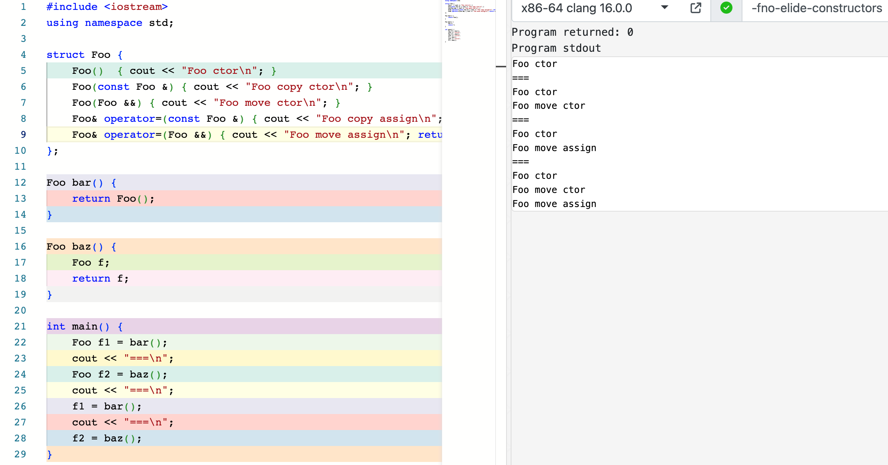
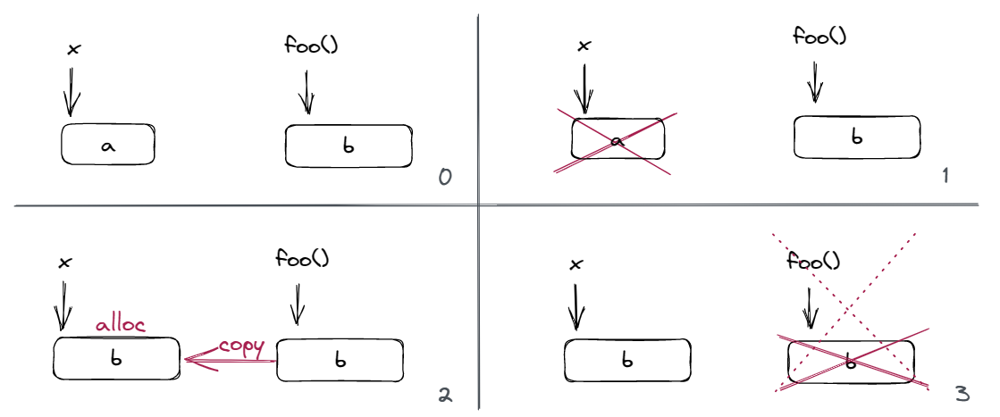
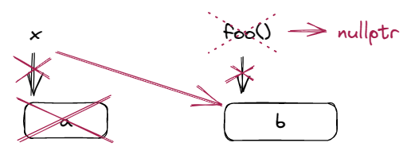

# 9 右值引用与移动语义

## 9.1 lvalue & rvalue

### 9.1.1 引入

假如有定义 `int n;`，为什么 `n = 1;` 是合法的，而 `1 = n;` 是非法的呢？这不是类型的原因，`n` 和 `1` 这两个表达式的类型都是 `int`。

事实上，对于后者，编译器会给出这样的报错：Expression `1` is not assignable。也就是说，`n` 是一个表达式，它指向一个对象；回顾上一节我们给出的对对象的定义，它表征着一块内存，其内容表示一个值。而 `1` 则不指向一个实在的对象，它是一个不与对象关联的值，因此它不必占据内存。

??? info "表达式和语句"
    以防有同学不清楚表达式和语句的概念，在这里再科普一下。

    **表达式 (expressions)** 是运算符和操作数的序列，用来指明一个计算。

    操作数也是表达式，因此任何操作符的操作数要么是 **primary expressions**，要么是其他表达式。顾名思义，primary expressions 是最基本的表达式。它们包括：

    - `this`
    - 字面量，例如 `2` 或者 `"Hello, world!"`
    - id-expressions，例如 `n` 或者 `std::cout`
    - lambda 表达式，例如 `[](int & n) { n *= 2; }`
    - fold-expressions
    - requires-expressions

    后两者我们目前还没有遇见过，大家可以先不管。

    **表达式可以产生值，并可能导致副作用。**例如：
    
    - `2 + 2` 这个表达式产生 `4` 这个值，没有副作用；
    - `x = y = 2` 这个表达式产生的值是 `2`，产生的副作用是把 `x` 和 `y` 赋值为 2；
    - 如果有 `void print(int x){ std::cout << x; }`，那么函数调用表达式 `print(1)` 没有产生值，但是有把 `1` 打印到标准输出的副作用。

    ---

    **语句 (statements)** 是按顺序执行的 C++ 程序片段。任何函数的函数体都是语句的一个序列。C++ 包含如下类型的语句：

    1. labeled statements       `EXIT: return 0;`
    2. expression statements    `n = 1;`
    3. compound statements      `{ n = i; i++; }`
    4. selection statements     `if (n == 1) break;`
    5. iteration statements     `while (n--);`
    6. jump statements          `break;`, `return 0;`, `goto EXIT;`
    7. declaration statements   `int n = 0;`
    8. try blocks               
    9. atomic and synchronized blocks (TM TS)

    事实上，我们在 [2 编程范式](../2_paradigm) 一节中简单提及过语句，以介绍结构化编程。


也就是说，虽然 `n` 和 `1` 都是表达式，但是它们具有不同的性质。

这一设计的原因是，让一些表达式的值不必占据内存有助于我们实现一些优化。如果我们规定所有表达式的值都是一个对象的话，那么字面量 `1` 也需要占据一块实际的内存，这会使得代码中的内存操作变得非常多。

???+ info "举个栗子"
    考虑 `n += 1` 这个表达式在汇编中的实现。如果我们要求 `1` 也需要占据实际内存的话，汇编会长这样：

    ```riscv
    la   t3, p
    lw   t0, 0(t3)      // t0 = p
    la   t4, one       
    lw   t1, 0(t4)      // t1 = one
    add  t0, t0, t1     // t0 += t1
    sw   t0, 0(t3)      // p = t0

    p:   .word 0
    one: .word 1
    ``` 

    不过如果 `1` 不必占内存，那么就会简单不少：

    ```riscv
    la   t3, p
    lw   t0, 0(t3)      // t0 = p
    addi t0, t0, 1      // t0 += 1
    sw   t0, 0(t3)      // p = t0

    p:   .word 0
    ```

    需要澄清的是，「不必占内存」不是「一定不占内存」的意思。前面那种稍微冗长的实现也是合法的，只是后者更加简练、自然和高效。


类似地，对于 `int m;`, `m + 1 = 2` 这个表达式也是非法的，因为 `m + 1` 这个表达式的值并不表征一个实际的对象。对于 `int foo();`, `foo() = 2` 也是非法的，因为 `foo()` 这个函数调用表达式的值也不表征一个实际的对象。

由此可见，每个表达式其实都有两个性质，一个是我们熟知的 **类型 (type)**，而另一个就是我们刚刚发现的「新区别」：**value category**。

我们将表征一个对象的表达式称为 **左值 (lvalue)**，因为它们可以出现在赋值表达式的左边；而将一个值不与对象关联的表达式称为 **右值 (rvalue)**，因为它们只能出现在赋值表达式的右边。

### 9.1.2 关于内存占用

**右值不一定不占用内存**，例如虽然 `n += 1;` 可以用一句汇编语句（如 `addi x1, x1, 1;`）实现，但是当字面量变得足够大时，一条语句可能装不下，这时右值会占据一定内存。

同时，左值表征的对象虽然 **从概念上说** 一定占据内存，但编译器有可能对其做一些优化从而使其 **实际上** 不占内存，而只是放在寄存器中或者直接在编译时完成相关的计算从而删除它。但是，**这只会发生在我们不会注意到的情况下**。例如，定义 `const int n = 2;` 有可能会使得所有对 `n` 的使用被替换成 `2`，从而左值 `n` 表征的对象在生成的程序中不再存在（因而不再占据内存），但是如果我们使用了 `std::cout << &n;`，那么 `n` 就一定会存在并占据内存以满足这一输出的要求。

???+ info "再举个例子"
    `n` 由于值必定是 1，因此这个函数直接被简化为了 `return 2;`，`n` 不再占据内存：

    

    但是，假如我们要使用 `n` 的地址，那么 `n` 就一定会占据内存来满足我们的需求：

    

因此，我们在后面的讨论中，始终从概念层面上认为 lvalue 会占用内存。编译器将这个内存优化掉是实践层面的事情，如前所述，并不会影响我们这样讨论的正确性。

### 9.1.3 lvalue

lvalue 用来表征一个对象，或者说一个位置。因此，lvalue 可以被取地址，以及用来初始化引用。

值得提及的是，不是所有左值都能出现在赋值表达式的左边，比如 `const char name [] = "Xuan";`，`name[0] = 'D';` 是非法的；虽然 `name[0]` 是个左值，但是它的类型是 `const char`。这样的左值被称为 non-modifiable lvalues。除此之外的左值，可以作为内置赋值操作符 (`=`) 或者复合赋值操作符 (`+=` 等) 的左侧操作数。

左值包括：

- **任何有名字的表达式** 都是左值，唯一的例外的枚举[^move-eligible]；
- **内置** 的 `++a`, `a = b`, `a += b`, `*p`, `p->m` 是 lvalue
- 如果 `a[n]` 的操作数之一是 array lvalue 或者 pointer，则是 lvalue
- 如果 `a` 是 lvalue，`m` 是成员变量，则 `a.m` 是 lvalue；如果 `m` 是成员变量，`p->m` 是 lvalue
- 返回值为引用类型的函数调用表达式是 lvalue，因为返回值表征的是一个对象
- 目标为引用的 cast expression 是 lvalue，如 `(int&)(x)`，这一操作可以理解为初始化一个引用
- 除了字符串字面量是 lvalue（因为字符串字面量的类型是 `const char[N]`^[lex.string#5](https://timsong-cpp.github.io/cppwp/n4868/lex.string#5)^）以外，其他字面量都是 rvalue。（用户自定义字面量不一定，我们会在后面讨论这个话题。）

???+ info "lvalue-to-rvalue conversion"
    左值表征一个对象，而右值则是一个值。当我们将一个左值放在赋值表达式的右边时，如 `n = m;`，则会发生 **lvalue-to-rvalue conversion**，因为此时我们关注的是 `m` 这个对象中的值，而不是 `m` 这个对象本身。

### 9.1.4 rvalue

rvalue 并不表征一个对象，非左值的表达式是右值。

右值表达式通常被用来完成以下两件事之一：

- 计算内置运算符的一个操作数
    - 例如 `1 + 2 + 3` 中（假设从左到右计算），`1` 和 `2` 是 rvalue，作为第一个 `+` 的操作数；`1 + 2` 也是 rvalue，作为第二个 `+` 的操作数
- 初始化一个对象
    - 初始化出的对象称为这个表达式的 result object
    - 例如 `int i = 1 + 2;`，或者 `void f(int x);`, `f(1)`。

右值包括：

- 枚举数 (enumerator) 和除了字符串字面量以外的字面量是 rvalue
- 内置的 `a++`, `a + b`, `a || b`, `a < b`, `&a` 等表达式是 rvalue
- 返回值不是引用类型的函数调用表达式是 rvalue
- 目标为非引用类型的 cast expression 是 rvalue，如 `int(3.0)`
- `this` 是 rvalue
- lambda 表达式是 rvalue

### 9.1.5 小结

简而言之：

lvalue 是 locator，它计算出一个对象（的位置）

而 rvalue 计算出的结果用于初始化对象 (result object)，或者执行进一步的计算

## 9.2 prvalue & xvalue

### 9.2.1 引入

上面的定义在大多数情况下工作良好，不过 C++ 中的两个东西会给上面的内容带来一些疑惑。

!!! info "问题 1：访问类右值的成员"

    假如我有一个类 `struct Foo { int x, y, z; };`，有一个对象 `Foo f;`，那么我是如何访问到 `f.y` 的呢？

    事实上，访问它的方式是 base + offset，也就是我们会根据 `f` 的地址以及 `y` 在 `Foo` 中的偏移位置来找到 `f.y`。假设 `sizeof(int) == 4`，那么访问 `f.y` 的方式其实是 `*(f_addr + 4)`。

    那么问题来了！假如我有这样一个函数 `Foo func();`，如我们之前所说，`func()` 这个函数调用表达式是一个 `Foo` 类型的 rvalue。那么假如我们有 `int tmp = func().y;`，会发生什么？

    根据我们之前的讨论，这时其实我们会找 `*(ret_val_addr + 4)`。也就是说，虽然此时 `func()` 是一个 rvalue，且它的生命周期确实在这个声明语句结束后就结束了，但是此时它必须占内存，才能用来访问字段 `y`。也就是说，此时 `func()` 必须要表征一个对象了。
    
!!! info "问题 2：把右值绑定给 const 引用"
    我们说过引用的实现类似于常指针，而指针必须指向一个 lvalue，因此引用也只能引用一个 lvalue。如 `int * pi = &3;` 和 `int & ri = 3;` 是非法的。

    不过我们讲过，「可以将一个临时对象绑定给一个 const 引用，这个临时对象的生命周期被延长以匹配这个 const 引用的生命周期」。一个例子是，`const int & cr = 1;` 是合法的。不过这里有一个问题没有解释清楚，那就是，`1` 是个 rvalue，它并不表征一个对象；而我们把一个临时对象绑定给了 `cr`，这个临时对象是哪来的？

    唯一的答案是，此时我们需要使用 `1` 这个 rvalue 来初始化一个临时对象，用来绑定引用；临时对象本应在这个声明完成后结束，但生命周期被延长了。

    我们刚才说「rvalue 用来初始化对象」——当它用来绑定 const ref 时，事实上就是用来初始化了这个「临时对象」。
    
上面两个例子对我们之前的 value category 体系产生了一些动摇。我们用一个表格说明发生了什么：对于「是否临时」和「是否占内存」，左值和右值给出了相反的答案；但是刚才看到的两个问题产生了一种新的情况：

| value category | 是否是临时的 | 是否占内存 |
| :-: | :-: | :-: |
| **lvalue** (left / locator value) | 否 | 是 |
| **rvalue** (right value) | 是 | 否 |
| **?** | 是 | 是 |

因此，C++ 给出了新的分类。它将我们之前讨论的 rvalue 更名为了 prvalue (pure rvalue)，而将新情况命名为 xvalue (expiring value)：

| value category | 是否是临时的 | 是否占内存 |
| :-: | :-: | :-: |
| **lvalue** (left / locator value) | 否 | 是 |
| **prvalue** (**pure** right value) | 是 | 否 |
| **xvalue** (**eXpiring** value) | 是 | 是 |

我们来详细介绍一下 C++ 的 value category 结构。

### 9.2.2 prvalue

prvalue，如我们 9.1.4 中介绍的一样，用来完成这两种事情中的一种：

- 计算内置运算符的一个操作数
- 初始化一个对象
    - `int i = 1;`
    - `Foo func();`, `Foo f = func();`
        - 此时会发生 [copy elision](../6_class_3/#copy-elision)，我们在本章后面也会再次讲解
    - `const int & r = 1;`
        - 此时，prvalue 转为 xvalue

??? info "关于 copy elision"
    自 C++17 开始，在以下两种情况下，对拷贝的省略是强制的：

    **Case 1**. 返回一个与返回值类型相同的 **prvalue**：

    ```c++
    T f()
    {
        return T();
    }
    
    f(); // only one call to default constructor of T
    ```

    **Case 2**. 初始化表达式是相同类型的 **prvalue**：

    ```c++
    T x = T(T(f())); // only one call to default constructor of T, to initialize x
    ```

    https://godbolt.org/z/vKhvxre7d

    

    这里，我们使用编译器选项禁用了 NRVO。`bar` 和 `baz` 的区别在于前者的返回值是 prvalue，而后者不是；其类型都与返回值类型匹配。因此，根据 copy elision 的规则，前者是强制的 copy elision (Case 1)，而后者可以发生 NRVO，但被我们禁用了。我们观察并解释这 4 条语句的过程：

    - 首先，我们刻画函数返回值的过程。首先，`return` 语句的表达式被求值，然后这个值被返回给函数调用表达式，我们记函数调用表达式的值为 `__call_expr`。我们用两个下划线的前缀来表征它实际上是 prvalue，起名字只是便于我们理解。
    - 对于 `Foo f1 = bar();`，由于 copy elision (Case 1) 的存在，`Foo()` 直接会构造在 `__call_expr` 上，亦即 `Foo __call_expr = Foo();` (ctor here)，`Foo f1 = __call_expr;`（这里的 `__call_expr` 实际上是个 prvalue，因此发生 copy elision (Case 2)），因此只有一次构造函数被调用。
    - 对于 `Foo f2 = baz();`，由于没有 NRVO，构造出的 `Foo f = Foo();` (ctor here) 被返回。在 `return f;` 时，由于编译器首先尝试以移动的方式返回[^ret_move]，因此返回过程等价于 `Foo __call_expr = std::move(f);` (move ctor here)，然后发生 `Foo f2 = __call_expr;`（这里的 `__call_expr` 实际上是个 prvalue，因此发生 copy elision (Case 2)），因此共有 1 次构造和 1 次移动构造。
    - 对于 `f1 = bar();`，由于 copy elision (Case 1) 的存在，`Foo()` 直接会构造在 `__call_expr` 上，亦即 `Foo __call_expr = Foo();` (ctor here)，然后 `f1 = __call_expr;`（这里的 `__call_expr` 实际上是个 prvalue，因此 move assign here），因此发生 1 次构造函数和 1 次移动赋值。
    - 对于 `f2 = baz();`，过程是：`Foo f = Foo();` (ctor here), `Foo __call_expr = std::move(f);` (move ctor here), `f2 = __call_expr;` (move assign here)，因此发生 1 次构造函数、1 次移动构造和 1 次移动赋值。

    [^ret_move]: 如果 `return` 语句中的表达式是函数体中的一个 implicitly movable entity[^imp_mov_ent]，则编译器首先尝试以移动的方式返回，即尝试先将表达式视为 rvalue；如果重载解析失败，再将表达式视为 lvalue 尝试以拷贝的方式返回。如果仍然失败，则编译错误。
    [^imp_mov_ent]: Implicitly movable entity：具有 automatic storage duration 的一个 non-volatile object 或者 non-volatile object 的一个右值引用。

### 9.2.3 xvalue 的产生：Temporary materialization

任一完整类型 `T` 的 prvalue 都可以转换为 `T` 的 xvalue，这一转换称为 **temporary materialization**。这一转化用 prvalue 初始化一个临时对象，产生表示这个临时对象的 xvalue。

temporary materialization 发生在如下情形中：

- 将引用绑定到 prvalue，如 `const int & r = 1;`
- 对类 prvalue 进行成员访问，如 `foo().x;`（此时 `x` 也是 xvalue）
- 对于一个数组 prvalue `a`，对其进行 subscript `a[1]` 或者 array-to-pointer convsersion `f(a)` 时
- 当 prvalue 是一个 discarded-value expression 时

??? info "discarded-value expression"
    这样的表达式只为其副作用而使用，其值本身没有被使用。这样的表达式如果是 prvalue，那么它会被 temporary materialization。例如（以下 `a`, `b` 均为 `int`）：

    - `a = 1;`
    - `cout << endl;`
    - `void(x);`
    - `a++, b++;` 中的 `a++`

### 9.2.4 小结

现在，我们就能看懂这张经典的 C++ value category 结构图了：


我们将原来表示「临时」的 rvalue 拆分成了 prvalue 和 xvalue 两种；将表示「占内存」的 lvalue 和 xvalue 统称为 **glvalue (generalized lvalue)**。

lvalue, xvalue 和 prvalue 是 **primary categories**，表达式属于且仅属于其中之一；rvalue 和 glvalue 是 **mixed categories**，通常用于简便的表达。

我们能够总结出这三种 primary categories 所具备的主要性质：

| Property | lvalue | xvalue | prvalue |
| :-: | :-: | :-: | :-: |
| **取地址** | 是 | 否* | 否 |
| **被赋值** | 是，如果 modifiable | 否 | 否 |
| **初始化引用** | 是 | 仅能初始化 const & | materialize 为 xvalue |

值得一提的是，理论上，xvalue 占内存因此可以被允许取地址，但是由于其生命周期通常即将在所在完整表达式结束时结束，因此获取它的地址在大多数情况下会引发错误。因此，C++ 并不允许对 xvalue 取地址。也是类似的原因，xvalue 也并不允许被赋值。

## 9.3 移动语义与右值引用

### 9.3.1 移动语义 | moving semantics

我们刚刚给出了这样的表格：

| value category | 是否是临时的 | 是否占内存 |
| :-: | :-: | :-: |
| **lvalue** | 否 | 是 |
| **prvalue** | 是 | 否 |
| **xvalue** | 是 | 是 |

可以看到，我们特别关注一个表达式是不是临时的。那么，「临时」到底有什么意义？

回顾我们之前写出来的 `Container` 类模板：

```c++
template<typename T>
class Container {
    T* data;
    unsigned size = 0, capa;
public:
    Container(unsigned capa = 512) : data(new T[capa]), capa(capa) {}
    ~Container() { delete[] data; }
    Container(const Container &) = delete;
    Container & operator=(const Container &rhs) {
        if (this == &rhs)   return *this;
        if (capa != rhs.capa) {
            delete[] data;
            data = new T[rhs.capa];
        }
        for (unsigned i = 0; i < rhs.size; i++)
            data[i] = rhs[i];
        capa = rhs.capa;
        size = rhs.size;
        return *this;
    }

    T& operator[](unsigned index) { return data[index]; }
    const T& operator[](unsigned index) const { return data[index]; }

    unsigned getSize() const { return size; }
    unsigned getCapa() const { return capa; }

    Container & add(const T& val) { 
        /* if full, expand storage */
        data[size++] = val;
        return *this; 
    }
    // ...
};
```

考虑下面的代码会发生什么：

```c++
Container<int> foo() {
    Container<int> c;
    // perhaps use c in various ways
    return c;
}

void bar() {
    Container<int> x;
    // perhaps use x in various ways
    x = foo();
}
```

我们关注 `x = foo()` 这个表达式。我们之前说过，[NRVO](../6_class_3/#copy-elision) 并不是强制的，因此我们不妨假设这里不会发生 NRVO。因此，这里 `Container<int>::operator=` 会被调用。这个函数的实现如下：

```c++
Container & operator=(const Container &rhs) {
    // ...
    delete[] data;
    data = new T[rhs.capa];
    // copy ...
    return *this;
}
```

我用一张图画出来了这里发生了什么：



明眼人都能看出，我们拷贝了一份 `b` 之后反手就把原来的 `b` 给释放了，这听起来有点蠢。假如我们能让 `x` 把 `foo()` 的 `b`「偷」过来，同时让 `foo()` 析构的时候不要释放 `b`，不就能省一份拷贝的时间了吗？也就是说我们希望：



用代码来说就是：

```c++
template<typename T>
Container<T> & Container<T>::operator=(/* some type */ rhs) {
    delete[] data;
    data = rhs.data;
    rhs.data = nullptr; // delete nullptr is safe
    // ...
    return *this;
}
```

更干净优雅一点的做法是，既然 `x` 的 `b` 要被析构，那我们不妨直接把 `x` 和 `foo()` 的 `b` 交换一下：


```c++
template<typename T>
Container<T> & Container<T>::operator=(/* some type */ rhs) {
    swap(data, rhs.data);
    swap(size, rhs.size);
    swap(capa, rhs.capa);
    return *this;
}
```

而这其实就是「移动语义 (moving semantics)」的精髓：用资源的移动代替拷贝。

不过，我们离移动语义还差临门一脚，那就是，上面代码中的 `/* some type */` 到底是什么？我们熟悉的类型似乎都走不通：

- `Container<T> &`?
    - rvalue 不能绑定给 non-const ref
- `const Container<T> &`?
    - 无法修改成员
- `Container<T> *`?
    - rvalue 不能取地址

因此，为了实现移动语义，C++11 引入了 **右值引用**。

### 9.3.2 右值引用 | rvalue reference

对于任何类型 `X`，`X&&` 被称为「对 `X` 的右值引用」。为了与此区分，`X&` 现在也被称为「对 `X` 的左值引用」。

右值引用只能绑定右值：

```c++
int z = 1;
int && y = z; // Error: rvalue reference to type 'int' cannot bind to lvalue of type 'int'

int && x = 1; // OK
x = 2;        // OK, rvalue reference can be modified
```

在 `int && x = 1;` 时，实际上完成了 temporary materialization conversion，即虽然 `1` 本身是个 prvalue，但是它被用来初始化一个右值引用，因此它需要实际地占用一块内存（虽然这块内存在实际实现中仍然有可能被优化掉），因此我们创建了一个临时对象并用 `x` 绑定。

左值引用和右值引用在「能做什么事」的方面没有区别，其区别是什么值可以绑定给这个引用。也就是说，右值引用是可以赋值的，赋值修改的其实就是 temporary materialization 出来的那个对象。

#### 移动构造与移动赋值

这样，我们就可以实现之前的 `operator=` 了：

```c++
template<typename T>
Container<T> & Container<T>::operator=(Container<T>&& rhs) {
    swap(data, rhs.data);
    swap(size, rhs.size);
    swap(capa, rhs.capa);
    return *this;
}
```

由于这样的赋值运算符实现移动语义，因此它也被称为 **移动赋值运算符 (moving assignment operator)** 。

与移动赋值类似，移动构造函数完成通过移动语义构造一个对象。例如：

```c++
template<typename T>
Container<T>::Container(Container<T>&& rhs) :
    data(rhs.data), size(rhs.size), capa(rhs.capa) {
        rhs.data = nullptr;
    }
```

注意：由于 C++17 的强制 copy elision，现在移动构造函数只会在用 xvalue 构造时被调用；用 prvalue 构造时，移动构造不会发生。

这样，我们就能回答之前的问题了：「临时」意味着可以利用移动语义窃取（重用）其资源，从而避免不必要的拷贝。

```c++
Container<int> foo();

void bar() {
    Container<int> x, y;
    // perhaps use x and y in various ways
    x = foo();  // move assignment (if no copy elision)
    y = x;      // copy assignment
}
```

| value category | 是否可以复用资源 | 是否占内存 |
| :-: | :-: | :-: |
| **lvalue** | 否 | 是 |
| **prvalue** | 是 (materialize) | 否 |
| **xvalue** | 是 | 是 |

这样，我们就可以总结各个 value category 的分类依据了：

| | Has identity (**glvalue**) | Doesn't have identity |
| :-: | :-: | :-: |
| Can't be moved from | lvalue | - |
| Can be moved from (**rvalue**) | xvalue | prvalue's materalization |

### 9.3.3 `std::move`

现在，考虑这样一个例子：

```c++ linenums="1"
template<class T>
void swap(T& a, T& b) 
{ 
    T tmp(a);
    a = b; 
    b = tmp; 
} 

Container<int> a, b;
swap(a, b);
```

这里，第 4 行用到的是拷贝构造而非移动构造；第 5 行和第 6 行用到的都是拷贝复制而非移动复制，因为 `a` 和 `b` 是左值而非右值。

<center></center>

但是这是不好的——显然，在第 4 行之后，我们不再关心 `a` 的成员，因为在第 5 行我们即将将其覆盖；对 `b` 来说也是一样的。也就是说，如果这里我们采用移动语义，可以将 3 次拷贝变成 3 次移动，这能显著提高程序的性能。

这几处使用拷贝语义而非移动语义的原因是，`a`, `b`, `tmp` 是个左值。如果我们希望使用移动语义，就需要将它们变成右值。我们如何将一个左值变为一个右值呢？事实上，C++ 中有以下规定：

!!! note
    对于一个函数调用表达式：

    - 如果函数返回值类型不是引用，则该表达式是 prvalue
    - 如果函数返回值类型是左值引用，则该表达式是 lvalue
    - 如果函数返回值类型是对象的右值引用，则该表达式是 xvalue[^cast_to_rvalue_ref]

    类似地，对于一个 cast 表达式：

    - 如果目标不是引用，则该表达式是 prvalue
    - 如果目标是左值引用，则该表达式是 lvalue
    - 如果目标是对象的右值引用，则该表达式是 xvalue[^cast_to_rvalue_ref]

    [^cast_to_rvalue_ref]: 特别地，cast 到一个函数的右值引用，这个表达式是左值。

!!! danger "TODO"
    为什么？

也就是说，我们可以通过将 `a`, `b`, `tmp` cast 到右值引用的方式实现将 lvalue 变为 xvalue，而 xvalue 是 rvalue 的一种。即：

```c++
template<class T>
void swap(T& a, T& b) 
{ 
    T tmp((T&&)(a));
    a = (T&&)(b); 
    b = (T&&)(tmp); 
} 

Container<int> a, b;
swap(a, b);
```

或者用更 C++ 的方式，使用 C++ style cast 而非 function style cast：

```c++
template<class T>
void swap(T& a, T& b) 
{ 
    T tmp(static_cast<T&&>(a));
    a = static_cast<T&&>(b); 
    b = static_cast<T&&>(tmp); 
} 

Container<int> a, b;
swap(a, b);
```

事实上，C++ 提供了函数 `std::move` 帮我们完成「将参数转换为右值」这个事情；我们稍后再讨论 `std::move` 是如何实现的：

```c++ linenums="1"
template<class T>
void swap(T& a, T& b) 
{ 
    T tmp(std::move(a));
    a = std::move(b); 
    b = std::move(tmp); 
} 

Container<int> a, b;
swap(a, b);
```

如我们所愿，这种情况下会发生移动构造和移动赋值，而非拷贝；这在 `T` 需要 non-trivial copy（即 copy 不仅仅需要拷贝字段，还需要完成更多操作）的情况下会有性能提升：

<center></center>

也就是说，虽然 `T foo(bar);` 这样的构造在 `bar` 是左值的时候会使用拷贝构造，但如果我们 **明知** `bar` 此后不会被用到，且通过 `std::move(bar)` **明确告知** 编译器这一点，那么我们就可以通过 `T foo(std::move(bar));` 的方式来实现移动构造。对于赋值也是类似。

???+ note
    看到这个例子后，我们能够意识到：`a = std::move(b);` 这样的移动赋值实际上就是交换了 `a` 和 `b` 的资源——双方都没有被析构。虽然 `a` 持有的资源会在 `b` 的生命周期结束时被销毁，但这和拷贝赋值对比，`a` 所持有资源的销毁时机变得不那么确定了。在没有什么副作用的情况下，这不会带来什么问题；但是假如这个销毁有外部可见的副作用，时机的不确定就会带来隐患。因此，对于移动赋值运算符，我们仍然需要处理析构过程中那些对外可见的副作用。一个例子是，假如每个对象构造时申请了一个锁，则在移动赋值运算符中，也应当将锁释放掉。

???+ note "既然可以 `static_cast<T&&>`，为什么还要 `std::move` 呢？"
    因为这样可以提高代码的可读性，同时便于查找。一个 cast 并不能显而易见地让人理解这里是要将 lvalue 转为 xvalue，而 `std::move` 则很容易表现这一点。另外，假如我们希望找到代码中所有这样的转换，我们就可以直接查找 `std::move` 的出现了。

#### 右值引用本身是一个左值

考虑这段代码的输出：

```c++
void foo(int && x) {
    cout << "int &&\n";
}
void foo(int & x) {
    cout << "int &\n";
}

int main() {
    int i = 1;
    int & lr = i;
    int && rr = 2;

    foo(1);
    foo(i);
    foo(lr);
    foo(rr);

    return 0;
}
```


容易看到，右值引用本身是一个左值，否则我们就没有办法完成诸如修改它的值之类的「对左值的」操作。为什么这样设计呢？

一方面，右值引用和左值引用的区别不在于能做什么事，而只是在于什么值可以绑定给这个引用。

另一方面，移动语义最开始的场景 `x = foo();` 是在「不影响结果的地方」使用，因为这样一定不会带来问题；而我们后来讨论的 `std::move` 的含义则是「程序员明确知道这里使用移动不影响结果」，程序员对这样的移动语义负责。但是，假如右值引用被视为一个右值，则可能会出现一些混乱的情况：

```c++
template<typename T>
void foo(Container<T> && x) {
    Container<T> y = x;
    // ...
}
```

如果右值引用被视为右值，则上面的 `y` 是被移动构造的；此时，`x` 的 `data` 变成了 `nullptr`，因此如果我们再尝试对 `x` 做操作就可能会发生问题，这是我们不希望的。移动语义最开始的场景 `x = foo();` 是在「不影响结果的地方」使用，因为这样一定不会带来问题；而 `std::move` 的含义则是「程序员明确知道这里使用移动不影响结果」，程序员对这样的移动语义负责。但是，如果右值引用被视为右值，上面的例子显示了移动语义可能会在程序员可能不明确了解且有可能影响后续结果的情况下发生；这是语言设计者不希望的。这也是右值引用被视为左值的另一个原因。

同时，这也不违反我们「有名字的表达式是左值」的说法。

<a name="return_std_move"></a>

#### 为什么不要 `return std::move(x)`

[^move-eligible]: 在 C++23，这句话添加了一个新的反例，参见 [为什么不要 `return std::move(x)`](#return_std_move)

### 9.3.4 member functions with ref-qualifier

非静态成员函数可以有 ref-qualifier，用来在重载解析阶段根据调用者的值类型选择不同的重载：

```c++
struct S {
    void f() &  { std::cout << "lvalue\n"; }
    void f() && { std::cout << "rvalue\n"; }
};
 
int main() {
    S s;
    s.f();            // prints "lvalue"
    std::move(s).f(); // prints "rvalue"
    S().f();          // prints "rvalue"
}
```

与 cv-qualification 不同，ref-qualification 不改变 `this` 指针的属性：在 rvalue ref-qualified function 中，`*this` 仍然是 lvalue。

感兴趣的同学可以在 https://andreasfertig.blog/2022/07/the-power-of-ref-qualifiers/ 这篇文章中了解到 ref-qualifier 的详细用途。

## 9.4 移动构造函数与移动赋值运算符


## 9.5 完美转发 | Perfect forwarding

!!! note
    有 `struct Foo {}; struct Bar : Foo {};`，那么 `Foo f = Bar();` 发生了什么？

    - 首先，`Bar()` 是一个 cast，得到一个 `Bar` 类型的 prvalue；
    - 我们要用这个 prvalue 构造 `f`，这时会用到 `Foo` 类隐式生成的移动构造函数 `Foo::Foo(Foo &&);`
    - 为了将这个 prvalue 传递给 `Foo &&`，会发生一次 materialization
    - 即，实际发生的是 `Foo f = Foo(static_cast<Foo &&>(Bar()));`


## 参考资料

本文参考：

- [**C++ Rvalue References Explained**](http://thbecker.net/articles/rvalue_references/section_01.html)
- **value categories**
    - [Back to Basics: Understanding Value Categories - Ben Saks - CppCon 2019](https://youtu.be/XS2JddPq7GQ)
    - [A Taxonomy of Expression Value Categories](http://www.open-std.org/jtc1/sc22/wg21/docs/papers/2010/n3055.pdf)
    - [Value Categories](https://oneraynyday.github.io/dev/2020/07/03/Value-Categories)
    - ["New" Value Terminology by Bjarne Stroustrup, 2010.](http://www.stroustrup.com/terminology.pdf)
- **C++17 copy elision 和 value categories**
    - https://www.open-std.org/jtc1/sc22/wg21/docs/papers/2015/p0135r0.html
    - https://www.open-std.org/jtc1/sc22/wg21/docs/papers/2016/p0135r1.html
- **Perfect Forwarding & `std::forward`**
    - [std forward implementation and reference collapsing](https://stackoverflow.com/questions/42947358/std-forward-implementation-and-reference-collapsing)
    - [Why is template argument deduction disabled with std::forward?](https://stackoverflow.com/questions/7779900/why-is-template-argument-deduction-disabled-with-stdforward/7780006#7780006)
    - [Universal References in C++11](https://isocpp.org/blog/2012/11/universal-references-in-c11-scott-meyers)
    - [Perfect Forwarding](https://www.modernescpp.com/index.php/perfect-forwarding)
    - [Why use `std::forward<T>` instead of `static_cast<T&&>`](https://stackoverflow.com/questions/53257824/why-use-stdforwardt-instead-of-static-castt)
