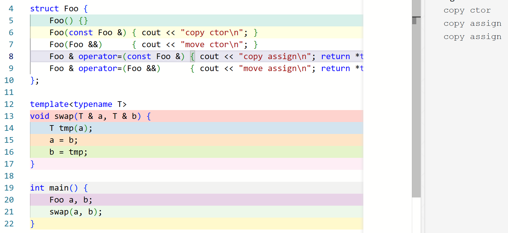
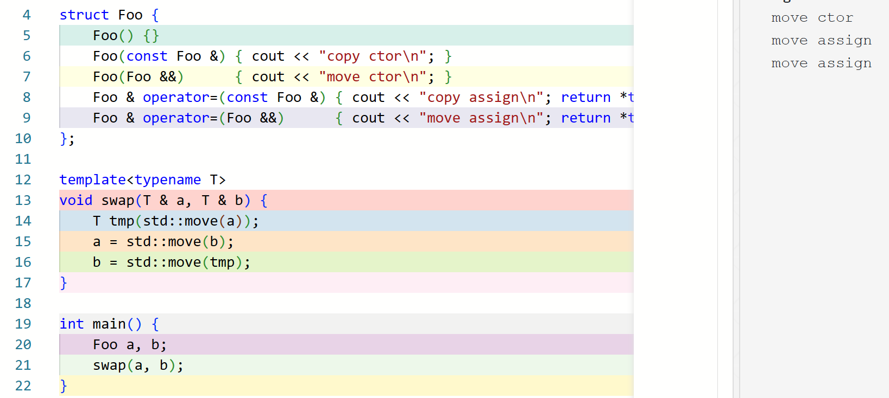

# 9 右值引用与移动语义

!!! danger
    本文未完成，以下仅为学习笔记。

## Back to Basics: Understanding Value Categories - Ben Saks - CppCon 2019

下面的讨论暂时不考虑类。

假如有定义 `int n;`，为什么 `n = 1;` 是合法的，而 `1 = n;` 是非法的呢？这不是类型的原因，`n` 和 `1` 这两个表达式的类型都是 `int`。其原因是，`n` 是一个表达式，它指向一个对象；回顾上一节我们给出的对对象的定义，它表征着一块内存，其内容表示一个值。而 `1` 则不指向一个实在的对象，它是一个不与对象关联的值，因此它不必占据内存。

也就是说，虽然 `n` 和 `1` 都是表达式，但是它们具有不同的性质。这一设计的原因是，让一些表达式的值不必占据内存有助于我们实现一些优化。如果我们规定所有表达式的值都是一个对象的话，那么字面量 `1` 也需要占据一块实际的内存，这会使得代码中的内存操作变得非常多。

我们将指向一个对象的表达式称为 **左值 (lvalue)**，因为它们可以出现在赋值表达式的左边；而将一个值不与对象关联的表达式称为 **右值 (rvalue)**，因为它们只能出现在赋值表达式的右边。

左值表征一个对象，而右值则是一个值。当我们将一个左值放在赋值表达式的右边时，如 `n = m;`，则会发生 lvalue-to-rvalue conversion，因为此时我们关注的是 `m` 这个对象中的值，而不是 `m` 这个对象本身。

右值不一定不占用内存，例如虽然 `n += 1;` 可以用一句汇编语句（如 `addi x1, x1, 1;`）实现，但是当字面量变得足够大时，一条语句可能装不下，这时右值会占据一定内存。

同时，左值表征的对象虽然从概念上说一定占据内存，但编译器有可能对其做一些优化从而使其实际上不占内存，而只是放在寄存器中或者直接在编译时完成相关的计算从而删除它。但是，这只会发生在我们不会注意到的情况下。例如，定义 `const int n = 2;` 有可能会使得所有对 `n` 的使用被替换成 `2`，从而左值 `n` 表征的对象在生成的程序中不再存在（因而不再占据内存），但是如果我们使用了 `std::cout << &n;`，那么 `n` 就一定会存在并占据内存以满足这一输出的要求。

除了字符串字面量是 lvalue（因为字符串字面量的类型是 `const char[N]`^[lex.string#5](https://timsong-cpp.github.io/cppwp/n4868/lex.string#5)^）以外，其他字面量都是 rvalue。（用户自定义字面量不一定）

在 C++ 中，这一切有所不同。

类类型的右值会占据内存，例如 `int i = foo().y;`，需要用 base + offset 的方式得到 `y` 的值。

不是所有左值都能出现在赋值表达式的左边，比如 `const char name [] = "Xuan";`，`name[0] = 'D';` 是非法的，虽然 `name[0]` 是个左值。这样的左值被称为 non-modifiable lvalues。

我们说过引用的实现类似于常指针，而指针必须指向一个 lvalue，因此引用也只能引用一个 lvalue。如 `int * pi = &3;` 和 `int & ri = 3;` 是非法的。

不过例外是，当将一个 rvalue 绑定到一个 const & 时，会创建出一个 temporary object。这个 temporary object 仍然不能被赋值，因为它是个 reference to const。这个创建的过程称为 **temporary materialization conversion**，具体来说，从一个 prvalue 转到一个 xvalue。

也就是说，内置的类型 rvalue 不占内存，但如果创建了 temp object 则占内存。因此，我们将 rvalue 分成两种：不占内存的 pure rvalue 和占内存的 expiring rvalue。

当把一个 prvalue 绑定给一个 rvalue reference 时，materialization 也发生。

有名字的表达式就是 lvalue。（为数不多的例外是：枚举有名字，但是右值。类、命名空间、类模板有名字，但不是表达式，因此不是右值。）

## C++ Rvalue References Explained

```c++ linenums="1"
template<typename T>
class Container {
    T* data;
    unsigned size = 0, capa;
public:
    Container(unsigned capa = 512) : data(new T[capa]), capa(capa) {}
    ~Container() { delete[] data; }
    Container(const Container &) = delete;
    Container & operator=(const Container &rhs) {
        if (this == &rhs)   return *this;
        if (capa != rhs.capa) {
            delete[] data;
            data = new T[rhs.capa];
        }
        for (unsigned i = 0; i < rhs.size; i++)
            data[i] = rhs[i];
        capa = rhs.capa;
        size = rhs.size;
        return *this;
    }

    T& operator[](unsigned index) { return data[index]; }
    const T& operator[](unsigned index) const { return data[index]; }

    unsigned getSize() const { return size; }
    unsigned getCapa() const { return capa; }

    Container & add(const T& val) { 
        /* if full, expand storage */
        data[size++] = val;
        return *this; 
    }
    // ...
};
```

```c++
Container<int> x;
// perhaps use x in various ways
x = foo();
```

在赋值运算符右侧是右值的特殊情况下，我们希望赋值运算符能够简单地将 `this` 和 `rhs` 的 `data` 交换，然后让编译器销毁 `rhs` 时将 `this` 本来的 `data` 释放，这样可以避免不必要的新建内存和拷贝。

这被称为 **移动语义 (moving semantics)** 这可以通过函数重载来完成：

```c++
template<typename T>
Container<T> & Container<T>::operator=(/* some type */ rhs) {
    swap(data, rhs.data);
    swap(size, rhs.size);
    swap(capa, rhs.capa);
    return *this;
}
```

这里的参数类型是什么呢？首先它肯定是个引用，否则交换没有意义，那样 `this` 原先持有的数据无人释放，而现在持有的数据已经被释放了，这会导致严重的问题。

但是，它不能是个 `Container<T> &`，因为右值不能绑定给 non-const 引用；而它也不能是个 `const Container<T> &`，因为这样就无法修改。因此，事实上在 C++11 之前这个事情无法简单地完成。不过，在 C++11，**右值引用 (rvalue reference)** 被引入，解决了这个问题。上面的函数被实现为：

```c++
template<typename T>
Container<T> & Container<T>::operator=(Container<T>&& rhs) {
    swap(data, rhs.data);
    swap(size, rhs.size);
    swap(capa, rhs.capa);
    return *this;
}
```

由于这样的赋值运算符实现移动语义，因此它也被称为 **移动赋值运算符**。

对于任何类型 `X`，`X&&` 被称为「对 `X` 的右值引用」。为了与此区分，`X&` 现在也被称为「对 `X` 的左值引用」。

右值引用只能绑定右值：

```c++
int z = 1;
int && y = z; // Error: rvalue reference to type 'int' cannot bind to lvalue of type 'int'

int && x = 1; // OK
```

在 `int && x = 1;` 时，实际上完成了 temporary materialization conversion，即虽然 `1` 本身是个 prvalue，但是它被用来初始化一个右值引用，因此它需要实际地占用一块内存（虽然这块内存在实际实现中仍然有可能被优化掉），因此我们创建了一个临时对象并用 `x` 绑定。

与移动赋值类似，移动构造函数完成通过移动语义构造一个对象。例如：

```c++
template<typename T>
Container<T>::Container(Container<T>&& rhs) :
    data(rhs.data), size(rhs.size), capa(rhs.capa) {
        rhs.data = nullptr;
    }
```

现在，考虑这样一个例子：

```c++ linenums="1"
template<class T>
void swap(T& a, T& b) 
{ 
    T tmp(a);
    a = b; 
    b = tmp; 
} 

Container<int> a, b;
swap(a, b);
```

这里，第 4 行用到的是拷贝构造而非移动构造；第 5 行和第 6 行用到的都是拷贝复制而非移动复制，因为 `a` 和 `b` 是左值而非右值。

<center></center>

但是这是不好的——显然，在第 4 行之后，我们不再关心 `a` 的成员，因为在第 5 行我们即将将其覆盖；对 `b` 来说也是一样的。也就是说，如果这里我们采用移动语义，可以将 3 次拷贝变成 3 次移动，这能显著提高程序的性能。

这几处使用拷贝语义而非移动语义的原因是，`a`, `b`, `tmp` 是个左值。如果我们希望使用移动语义，就需要将它们变成右值。事实上，C++ 提供了函数 `std::move` 帮我们完成「将参数转换为右值」这个事情：

```c++ linenums="1"
template<class T>
void swap(T& a, T& b) 
{ 
    T tmp(std::move(a));
    a = std::move(b); 
    b = std::move(tmp); 
} 

Container<int> a, b;
swap(a, b);
```

<center></center>

??? note
    看到这个例子后，我们能够意识到：`a = std::move(b);` 这样的移动赋值实际上就是交换了 `a` 和 `b` 的资源——双方都没有被析构。虽然 `a` 持有的资源会在 `b` 的生命周期结束时被销毁，但这和拷贝赋值对比，`a` 所持有资源的销毁时机变得不那么确定了。在没有什么副作用的情况下，这不会带来什么问题；但是假如这个销毁有外部可见的副作用，时机的不确定就会带来隐患。因此，对于移动赋值运算符，我们仍然需要处理析构过程中那些对外可见的副作用。一个例子是，假如每个对象构造时申请了一个锁，则在移动赋值运算符中，也应当将锁释放掉。

右值引用本身是一个左值，否则我们就没有办法完成诸如修改它的值之类的「对左值的」操作。右值引用和左值引用的区别不在于能做什么事，而只是在于什么值可以绑定给这个引用。

```c++
int && x = 1; // OK
int && r = x; // Error: rvalue reference to type 'int' cannot bind to lvalue of type 'int'
```


另一方面，假如右值引用被视为一个右值，则可能会出现一些混乱的情况：

```c++
template<typename T>
void foo(Container<T> && x) {
    Container<T> y = x;
    // ...
}
```

如果右值引用被视为右值，则上面的 `y` 是被移动构造的；此时，`x` 的 `data` 变成了 `nullptr`，因此如果我们再尝试对 `x` 做操作就可能会发生问题，这是我们不希望的。移动语义最开始的场景 `x = foo();` 是在「不影响结果的地方」使用，因为这样一定不会带来问题；而 `std::move` 的含义则是「程序员明确知道这里使用移动不影响结果」，程序员对这样的移动语义负责。但是，如果右值引用被视为右值，上面的例子显示了移动语义可能会在程序员可能不明确了解且有可能影响后续结果的情况下发生；这是语言设计者不希望的。这也是右值引用被视为左值的另一个原因。

同时，这也不违反我们「有名字的表达式是左值」的说法。


!!! note
    有 `struct Foo {}; struct Bar : Foo {};`，那么 `Foo f = Bar();` 发生了什么？

    - 首先，`Bar()` 是一个 cast，得到一个 `Bar` 类型的 prvalue；
    - 我们要用这个 prvalue 构造 `f`，这时会用到 `Foo` 类隐式生成的移动构造函数 `Foo::Foo(Foo &&);`
    - 为了将这个 prvalue 传递给 `Foo &&`，会发生一次 materialization
    - 即，实际发生的是 `Foo f = Foo(static_cast<Foo &&>(Bar()));`

### 关于 copy elision

自 C++17 开始，在以下两种情况下，对拷贝的省略是强制的：

**Case 1**. 返回一个与返回值类型相同的 **prvalue**：

```c++
T f()
{
    return T();
}
 
f(); // only one call to default constructor of T
```

**Case 2**. 初始化表达式是相同类型的 **prvalue**：

```c++
T x = T(T(f())); // only one call to default constructor of T, to initialize x
```

https://godbolt.org/z/vKhvxre7d


这里，我们使用编译器选项禁用了 NRVO。`bar` 和 `baz` 的区别在于前者的返回值是 prvalue，而后者不是；其类型都与返回值类型匹配。因此，根据 copy elision 的规则，前者是强制的 copy elision (Case 1)，而后者可以发生 NRVO，但被我们禁用了。我们观察并解释这 4 条语句的过程：

- 首先，我们刻画函数返回值的过程。首先，`return` 语句的表达式被求值，然后这个值被返回给函数调用表达式，我们记函数调用表达式的值为 `__call_expr`。我们用两个下划线的前缀来表征它实际上是 prvalue，起名字只是便于我们理解。
- 对于 `Foo f1 = bar();`，由于 copy elision (Case 1) 的存在，`Foo()` 直接会构造在 `__call_expr` 上，亦即 `Foo __call_expr = Foo();` (ctor here)，`Foo f1 = __call_expr;`（这里的 `__call_expr` 实际上是个 prvalue，因此发生 copy elision (Case 2)），因此只有一次构造函数被调用。
- 对于 `Foo f2 = baz();`，由于没有 NRVO，构造出的 `Foo f = Foo();` (ctor here) 被返回。在 `return f;` 时，由于编译器首先尝试以移动的方式返回[^ret_move]，因此返回过程等价于 `Foo __call_expr = std::move(f);` (move ctor here)，然后发生 `Foo f2 = __call_expr;`（这里的 `__call_expr` 实际上是个 prvalue，因此发生 copy elision (Case 2)），因此共有 1 次构造和 1 次移动构造。
- 对于 `f1 = bar();`，由于 copy elision (Case 1) 的存在，`Foo()` 直接会构造在 `__call_expr` 上，亦即 `Foo __call_expr = Foo();` (ctor here)，然后 `f1 = __call_expr;`（这里的 `__call_expr` 实际上是个 prvalue，因此 move assign here），因此发生 1 次构造函数和 1 次移动赋值。
- 对于 `f2 = baz();`，过程是：`Foo f = Foo();` (ctor here), `Foo __call_expr = std::move(f);` (move ctor here), `f2 = __call_expr;` (move assign here)，因此发生 1 次构造函数、1 次移动构造和 1 次移动赋值。

[^ret_move]: 如果 `return` 语句中的表达式是函数体中的一个 implicitly movable entity[^imp_mov_ent]，则编译器首先尝试以移动的方式返回，即尝试先将表达式视为 rvalue；如果重载解析失败，再将表达式视为 lvalue 尝试以拷贝的方式返回。如果仍然失败，则编译错误。
[^imp_mov_ent]: Implicitly movable entity：具有 automatic storage duration 的一个 non-volatile object 或者 non-volatile object 的一个右值引用。

本文参考：

- [**C++ Rvalue References Explained**](http://thbecker.net/articles/rvalue_references/section_01.html)
- **value categories**
    - [Back to Basics: Understanding Value Categories - Ben Saks - CppCon 2019](https://youtu.be/XS2JddPq7GQ)
    - [A Taxonomy of Expression Value Categories](http://www.open-std.org/jtc1/sc22/wg21/docs/papers/2010/n3055.pdf)
    - [Value Categories](https://oneraynyday.github.io/dev/2020/07/03/Value-Categories)
    - ["New" Value Terminology by Bjarne Stroustrup, 2010.](http://www.stroustrup.com/terminology.pdf)
- **C++17 copy elision 和 value categories**
    - https://www.open-std.org/jtc1/sc22/wg21/docs/papers/2015/p0135r0.html
    - https://www.open-std.org/jtc1/sc22/wg21/docs/papers/2016/p0135r1.html
- **Perfect Forwarding & `std::forward`**
    - [std forward implementation and reference collapsing](https://stackoverflow.com/questions/42947358/std-forward-implementation-and-reference-collapsing)
    - [Why is template argument deduction disabled with std::forward?](https://stackoverflow.com/questions/7779900/why-is-template-argument-deduction-disabled-with-stdforward/7780006#7780006)
    - [Universal References in C++11](https://isocpp.org/blog/2012/11/universal-references-in-c11-scott-meyers)
    - [Perfect Forwarding](https://www.modernescpp.com/index.php/perfect-forwarding)
    - [Why use `std::forward<T>` instead of `static_cast<T&&>`](https://stackoverflow.com/questions/53257824/why-use-stdforwardt-instead-of-static-castt)
