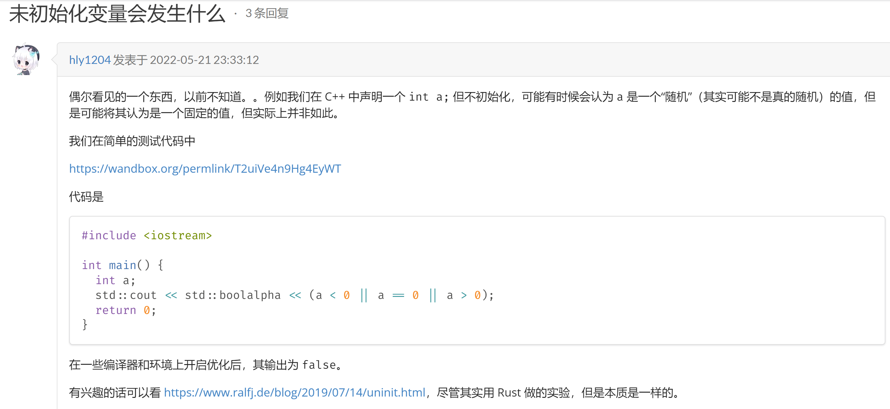
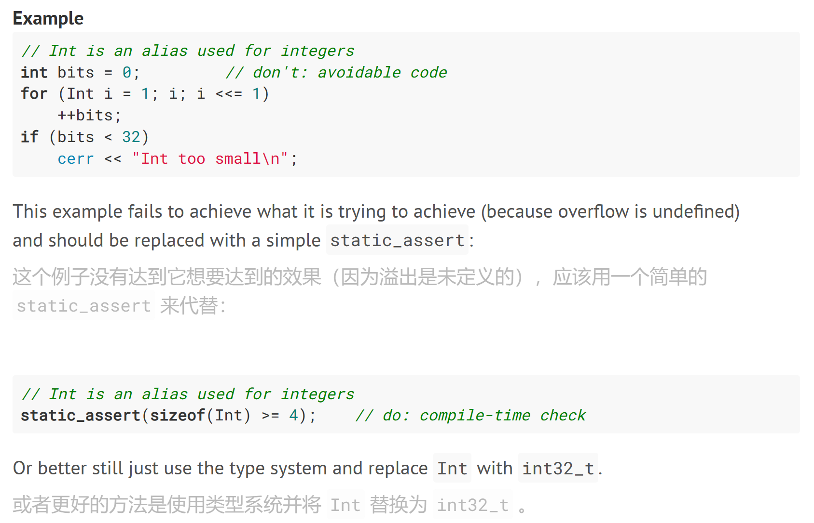

# C++ 零散内容记录

!!! abstract
    看到的一些讨论、知识，或者需要学的一些内容。

## TODO

- [ ] 初始化 看这个：[Is C++11 Uniform Initialization a replacement for the old style syntax?](https://softwareengineering.stackexchange.com/questions/133688/is-c11-uniform-initialization-a-replacement-for-the-old-style-syntax)；[Initialization in C++ is bonkers](https://blog.tartanllama.xyz/initialization-is-bonkers/)；[dcl.init#general](https://timsong-cpp.github.io/cppwp/n4868/dcl.init#general)
- [ ] value category
- [ ] 右值引用、移动语义
- [ ] placement new
- [ ] 模板
- [ ] POD
- [ ] 常量构造
- [ ] inline
- [ ] stream

## 关于 UB 和指针等的大讨论

{width=800}

- [原帖](https://loj.ac/d/3679)
- [我的尝试](https://godbolt.org/z/3Thssx941)
- [下面的作者给的例子](https://godbolt.org/z/TWrvcq)
- [Pointers Are Complicated, or: What's in a Byte?](https://www.ralfj.de/blog/2018/07/24/pointers-and-bytes.html) 本文还有后续
- ["What The Hardware Does" is not What Your Program Does: Uninitialized Memory](https://www.ralfj.de/blog/2019/07/14/uninit.html)
- [With Undefined Behavior, Anything is Possible](https://raphlinus.github.io/programming/rust/2018/08/17/undefined-behavior.html)
- [A Guide to Undefined Behavior in C and C++](https://blog.regehr.org/archives/213)
- 引文 [Taming Undefined Behavior in LLVM](https://www.cs.utah.edu/~regehr/papers/undef-pldi17.pdf)
- 引文 [Reconciling High-Level Optimizations and Low-Level Code in LLVM](https://sf.snu.ac.kr/publications/llvmtwin.pdf)

### 为什么要有 UB

{width=800}

Src: https://www.ralfj.de/blog/2018/07/24/pointers-and-bytes.html

!!! note "一个例子"
    https://isocpp.github.io/CppCoreGuidelines/CppCoreGuidelines#p5-prefer-compile-time-checking-to-run-time-checking

    
{width=700}

## 零散内容

- RTTI 
    - overhead: https://stackoverflow.com/a/5408269/14430730，就是在 vtable 里多了一项
    - 不过如果不用typeid或者dynamic_cast也需要创造这个项，所以好像没什么 overhead
- dereference 这个词已经没用了，现在都叫 indirection [[n3362](https://www.open-std.org/jtc1/sc22/wg21/docs/papers/2012/n3362.html)]
- 关于用空指针调用成员函数是不是 UB
    - [SO 问题](https://stackoverflow.com/questions/2474018/when-does-invoking-a-member-function-on-a-null-instance-result-in-undefined-beha)
    - 调用静态成员函数不是 UB，见 [Closed 315](https://www.open-std.org/jtc1/sc22/wg21/docs/cwg_closed.html#315)
    - 但非静态成员仍然是 [Active](https://www.open-std.org/jtc1/sc22/wg21/docs/cwg_active.html#232) 的
- `Attribute [[assume]]`：C++23，告诉编译器可以依据哪些额外的信息进行优化；但是很容易引发 UB；TODO；`std::unreachable()~
- struct 的比较：`std::tie`, https://en.cppreference.com/w/cpp/language/operators#Comparison_operators

## 要看的

[c++faq](https://isocpp.org/wiki/faq)

[CppCon](https://cppcon.org/)

## const 系列

`const` 指明一个变量是不可变的；