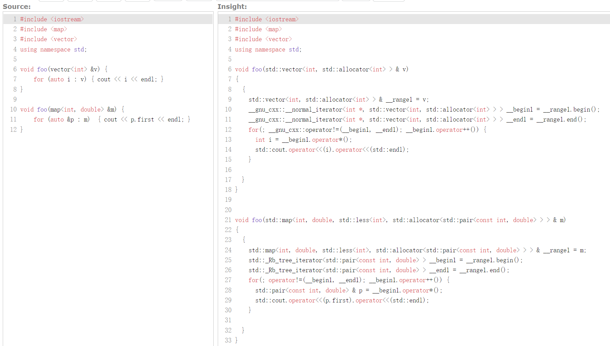
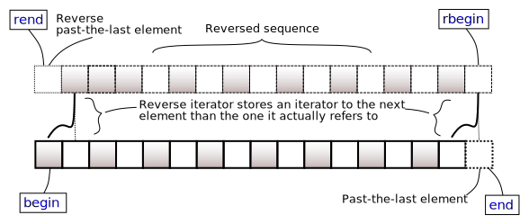
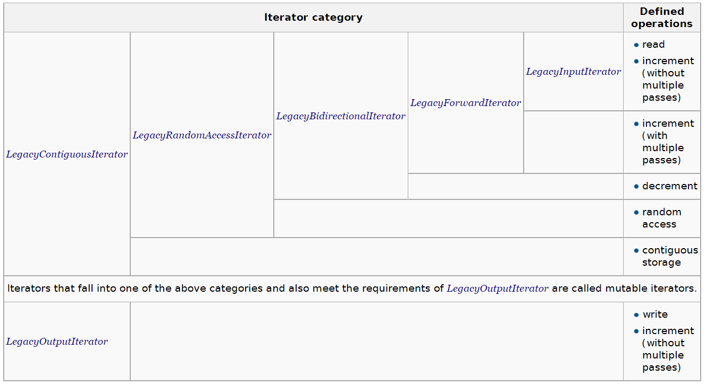
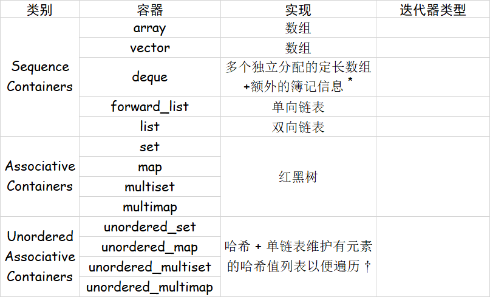
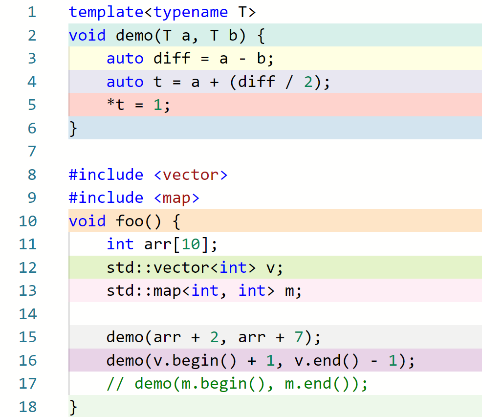
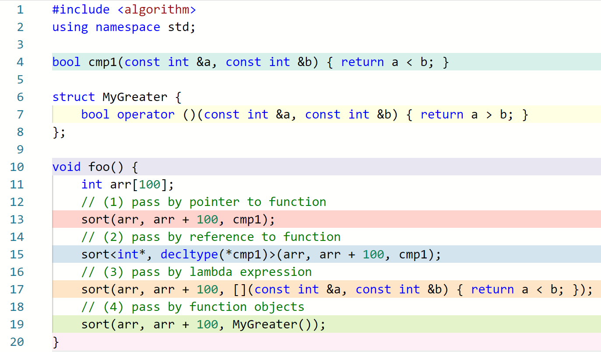
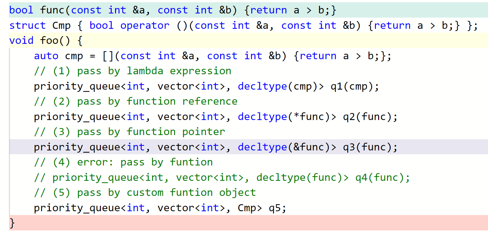

# 理解 STL - 迭代器与函数对象

!!! abstract
    **本文所需预备知识：** C / C++ 基础，C++ 模板基础；

    **建议预备知识：** 数据结构和算法基础
    

    在 [快速入门 C++ 写题！](../cpp_for_contests/)中，我们介绍的内容大多数（除了 1.1, 1.3 和 2.5）都属于 STL (Standard Template Library)。虽然掌握一些接口就足够我们用它们来做算法题，但是好奇的小朋友们可能也会对一些具体的实现感兴趣。本文中，我们将从 **语言** 层面（而非算法层面）对 STL 的这部分实现展开一些讨论和介绍。
    
    感谢 [白金猫猫](https://www.yuque.com/u27109237?view=doc_embed)、[27rabbit](https://www.yuque.com/27rabbit?view=doc_embed) 对本文的审校和建议！
    
    由于作者能力有限，文中难免有错漏之处。恳请大家批评指正QWQ

!!! tips
    本文中这样的段落属于补充说明，读者可以选读
    
!!! info
    本文中这样的段落属于整活，读者可以不读

由于本文介绍的是 STL，因此若无特殊说明，我们默认 `using namespace std;` 。

STL 由 4 部分组成：容器 (Containers)、迭代器 (Iterators)、算法 (Algorithms) 和函数对象 (Function objects)。我们已经对 vector, map 等各种容器有了一些基本的认识，同时对 sort, lower_bound 等各种算法也有了一些了解。那么， **迭代器** 和 **函数对象** 是什么东西呢？


### 0 Quiz 时间！

在开始之前，我们先抛出若干问题供大家思考；这其中的问题甚至包括我在面试中遇到的原题喔！（你如果知道这些问题的答案，那么就可以不用看这篇文章了 XD）

1. 我们可以通过 `for (auto &a : c)` 的方式遍历诸如 vector, set, unordered_set 等的容器。这是怎么实现的？
2. 我们知道 map 是能够用上述方式遍历的。对于 `map<int, int> m;` ，我们使用 `sort(m.begin(), m.end());` 可以吗？
3. `sort` 的函数签名是什么样的？即， `template <`_`-1-`_`> std::sort(`_`-2-`_`)` 的 _-1-_ 和 _-2-_ 两处是什么？具体而言：
    1. 为什么它既能对 vector 这样的容器进行排序，也可以对传统的数组进行排序？
    2. 自定义比较函数是怎么实现的？如何适配有和没有自定义比较函数的两种情况的？
4. 有一个比较函数 `bool cmp(const int& a, const int& b) { return a > b; }` ，我们可以写 `sort(v.begin(), v.end(), cmp);` 来用 `cmp` 进行排序。那么，如果我们希望用 `cmp` 作为 priority_queue 等容器的自定义比较函数应该怎么做呢？


### 1 Why 迭代器

我们先来看看第 1 个问题：为什么 `for (auto &a : c)` 可以遍历诸如 vector, set, unordered_set 等的容器呢？遍历 vector 的方法其实非常容易理解，类似于 `for (int i = 0; i < c.size(); i++)` 。但是我们知道，set 是用红黑树实现的，红黑树是一种二叉搜索树；遍历这样一棵二叉搜索树的方法和遍历一个数组的方法肯定是不一样的。这怎么办呢？

其实，我们也可以通过类似的方法实现： `for (auto i = c.begin(); i != c.end(); c.go_to_next_node(i))` ；其中 `c.begin()` 和 `c.end()` 可以是指针，分别指向容器里 第一个 和 最后一个元素的下一个的位置，即最小和最大的元素；而 `c.go_to_next_node(i)` 实现根据这个指针找到其下一个元素（学过二叉搜索树的小朋友们应该能够想到这个是怎么实现的；不知道也没关系，这并不是我们今天的重点）。这样，我们就可以实现对一个 set 的遍历了。

<br/>

这时回头看看我们对 vector 的遍历，我们会发现，似乎 vector 也能写成后面这种形式，即 `for (auto i = c.begin(); i != c.end(); c.go_to_next_node(i))` ： `c.begin()` 和 `c.end()` 仍然分别指向容器里 第一个 和 最后一个元素的下一个的位置，而 `c.go_to_next_node(i)` 干的事情只是指针的 `++` 而已。

聪明的小朋友一定能发现，这种遍历的关键只有 3 点：从哪里开始、到哪里结束、怎么走到下一个元素；这实际上就对应着两个指针以及我们熟悉的指针的 `++` 运算符。聪明的小朋友们可能就想到了：我们可以把这样的指针包装成一个类，并重载它的 `++` 运算符（这里指前置的 `++` ，下同），这样不同的容器就可以使用同样的方法遍历或者做其他操作了！

事实上，这就是 **迭代器 (Iterator)** 解决的问题。我们知道，我们写程序的目的就是 **处理、查询、使用数据**，数据结构和算法是我们的工具。_在概念层面上_，各种容器或者数据结构的意义是以一定的方式或者性质 **容纳** 数据，但是它本身不具备处理数据的能力；而各种算法的意义是按一定的方法 **处理** 数据，它本身并不持有任何数据。而迭代器就是它们之间的桥梁——一个容器可能是一个数组、一棵二叉树、一个链表，或者其他任何可能的数据结构；一种算法需要对容器做遍历或者其他类型的访问；但是遍历一个数组和一棵二叉树的方式肯定是不同的——迭代器存在的意义就是通过运算符重载或者其他方式，来向算法隐藏容器的不同细节；算法只需要使用 `++` 就能获得下一个元素的迭代器，通过 `*` 就能访问当前迭代器指向的元素，它不需要关心到底是如何访问的；这其实上就是指针的抽象。通过这种方法，STL 保持了它的简洁性，提升了代码的复用。

!!! tip "补充 1.1"
    为什么说是 “在概念层面上” 呢？因为在实际的实现中，为了提高性能或者易用性，一些容器也将一些算法放到了自己的成员函数中，例如 `map` 和 `set` 的 `lower_bound` 等。但是从概念角度上，容器就仅仅是个包装好了的数据结构而已。

<br/>

这样，我们其实也就知道了 `for (auto &a : c)` 是如何实现的了！事实上，对于有迭代器的容器（stack, queue, priority_queue 并没有迭代器，因为你不应当尝试去遍历或者以其他自由的形式访问这些容器中的元素），它的成员函数 `begin()` 和 `end()` 返回的都是某种迭代器；这些迭代器都重载了 `++` 运算符（事实上，对于这些容器，实现 `++` 运算符并不需要知道整个容器的结构；例如在红黑树中找到下一个节点不必知道根节点是什么。想一想为什么）。因此，对于这样包含成员函数 `begin()` 和 `end()` ，且其返回值类型支持运算符 `++` 、 `*` 和 `!=` 的类， `for (auto &a : c) {/* A */}` 的实现方法就类似于： `for (auto it = c.begin(); it != c.end(); ++it) {auto &a = *it; /* A */}` 。可以看到，这其实和我们刚刚的想法非常相似！

!!! tip "补充 1.2"
    具体来说，对于 `std::vector<int> v;` ， `v.begin()` 的返回值类型可能是 `__gnu_cxx::__normal_iterator<int*, std::vector<int>>` ；对于 `std::map<int, double> m;` ， `m.begin()` 的返回值类型可能是 `std::_Rb_tree_iterator<std::pair<const int, double>>` 。感兴趣的小朋友可以自己在 [https://godbolt.org/z/6s5x66rdG](https://godbolt.org/z/6s5x66rdG) 尝试（这里也展示了一种查看表达式类型的小技巧）！


    同时，也可以使用 C++ Insights 来查看：[https://cppinsights.io/s/cd95e24b](https://cppinsights.io/s/cd95e24b) 

    


!!! info "整活 1.3"
    我们之前提到，使用这种 range-based for loop，只需要类“包含成员函数 `begin()` 和 `end()` ，且其返回值类型支持运算符 `++` 、 `*` 和 `!=` ”，所以其实我们可以写出这样的代码 XD：

    

    感兴趣的小朋友可以来玩一玩：[https://godbolt.org/z/813b9e9Pd](https://godbolt.org/z/813b9e9Pd)

!!! tip "补充 1.4"
    另外，除了 `begin()` ，容器还会提供 `cbegin()` , `rbegin()` , `crbegin()` 这三种成员函数，提供不同的迭代器；也有对应的 `end()` 版本。这里 `c` 是指 const，即迭代器指向的变量是只读的； `r` 是指 reverse，即这种迭代器是逆序的，即：

    


<br/>

### 2 迭代器的分类

我们下面再来看第 2 个问题：已知 map 可以遍历，也就是说它是有对应的迭代器的；那么我们可以用 sort 对 map 进行排序吗？

众所周知，sort 的实现本质上是快速排序（实际上不完全是，具体的实现可以参考 [这里](https://stackoverflow.com/a/22444975/14430730)）；而快速排序本身是需要 **随机访问** 容器中的元素的，即能够以 $O(1)$ 的时间使用类似 `c[i]` 的方式访问到容器中的任意一个元素；同时也需要能够以 $O(1)$ 的时间计算两个元素之间的 **距离**。但是，map 本身并不能够满足上述要求。

所以，如果大家尝试写用 sort 对 map 排序的代码就会发现这样的报错：


它告诉我们， `std::_Rb_tree_iterator<...>` 之间的 `-` 运算符并没有被定义；即 map 对应的迭代器并不支持计算两个元素之间距离的功能。

事实上，C++ 对迭代器作了若干分类（确切地说，是 **具名要求 named requirements**），不同的算法也对所需的迭代器的分类做了不同的要求。我们较为通俗地概括各类迭代器所支持的功能（可能存在不够完整和严谨的地方，但是理解为主）：

1. _Legacy_**_Input_**_Iterator_ - 能够用来标识、 **遍历** 一个容器中的元素，能够从所指的元素中 **读取** 值。

    - 注：_LegacyInputIterator_ 只需要保证 **单趟** 算法的有效性：一旦一个 _LegacyInputIterator_ `it` 被 `++` 后，它之前所指的值及其所有拷贝都不再需要保证有效性

    ??? note "具体要求"
        满足这种要求的类型的 `It` 需要支持：

        - `++it` （返回 `It &` ）
        - `*it` （返回一个引用，且能转化为 `value_type` ）
        - `it1 != it2` （返回值能转化为 `bool` ，且如果 `==` 有定义，与 `!(it1 == it2)` 值相同）
        - `it->m` （等价于 `(*it).m` ）
        - `it++` （返回值能转化为 `const It&` ）
        - `*it++` （即 `*(it++)` ，返回值能转化为 `value_type` ）

2. _Legacy_**_Forward_**_Iterator_ - 在 _LegacyInputIterator_  的基础上，能够支持 **多趟** 算法。

    ??? note "具体要求"
        满足这种要求的类型 `It` 需要：

        - 满足 _LegacyInputIterator_ 
        - 如果 `it1 == it2` ，那么要么它们都没有指向一个有效的对象（例如 `nullptr` 或者类似 `c.end()` 的迭代器，我们称它们是 **不可解引用的 undereferenceable**），要么它们指向的是同一个元素。
        - 如果 `*it1` 和 `*it2` 引用同一个元素，那么 `it1 == it2` 
        - `it` 被 `++` 后，再次读取其原来指向对象的值，结果不应发生变化
        - 如果 `it1 == it2` ，那么 `++it1 == ++it2` 

3. _Legacy_**_Bidirectional_**_Iterator_ - 在 _LegacyForwardIterator_ 的基础上，能够 **双向移动** 。

    ??? note "具体要求"
        满足这种要求的类型 `It` 需要：

        - 满足 _LegacyForwardIterator_ 
        - 支持 `--it` , `it--` , `*it--` ，返回值类型与前述 `++` 相同，且：
        - `--(++it) == it` 
        - 如果 `--it1 == --it2` ，那么 `it1 == it2` 

4. _Legacy_**_RandomAccess_**_Iterator_ - 在 _LegacyBidirectionalIterator_ 的基础上，能够在 **常数** 时间内移动从而指向 **任一** 元素。

    ??? note "具体要求"
        满足这种要求的类型 `It` 需要：

        - 满足 _LegacyBidirectionalIterator_ 
        - 支持 `it += n` , `it -= n` , `it + n` , `it - n` , `n + it` , `it[n]` , `it1 < it2` , `it1 > it2` , `it1 <= it2` , `it1 >= it2` （比较运算符需要在自反、交换、传递下有正确表现）, `it1 - it2` （计算两个迭代器指向元素的距离） ，含义略，但复杂度须是 $O(1)$ 的

5. `C++17` _Legacy_**_Contiguous_**_Iterator_- 在 _LegacyRandomAccessIterator_ 的基础上，逻辑上相邻的元素在内存里 **物理上也相邻**。

    - 注：指向数组中元素的 **指针** 满足 _LegacyContiguousIterator_ 的所有要求。

另外，还有一种 _Legacy_**_Output_**_Iterator_，它和 _LegacyInputIterator_ 类似，需要能够用来标识、 **遍历** 一个容器中的元素，能够向所指的元素中 **写入** 值；同样不需要保证多趟算法的有效性。

可以看到，_LegacyOutputIterator_ 和前述 5 个具名要求是相互独立的。因此，我们称满足前述 5 个具名要求中某一个的同时还满足 _LegacyOutputIterator_  的迭代器为 **_mutable_** 的。

这张表格概括了上述内容：




<br/>

#### 又是 Quiz 时间！

那么，请大家根据自己的理解，结合对应容器的实现方式，写出它们提供满足什么要求的迭代器！



!!! Note "图注"
    **\***  对于 deque，例如每个定长数组长度为 100，那么访问 `q[514]` 其实就是访问 `a[5][14]` ，也就是第 6 个数组里的第 15 个元素。

    $\dagger$ 上表中 Unordered Associative Containers 的实现考虑了这样一个问题：如果有 $m = 10^6$ 个 bucket，但是只有 $n = 100$ 个元素，如果直接遍历 bucket 的话复杂度是 $O(m+n) >> O(n)$ 的；因此实现中额外用一个单向链表维护所有有元素的 bucket 列表，遍历时根据这个列表去找元素，复杂度就仅是 $O(n)$ 的了。


答案来咯！


!!! Note "图注"
    **#**  特别地， `vector<bool>` 是 `vector` 的一个特化，标准希望实现者可以考虑用更节省空间的方式保存 `vector<bool>` ，但是具体实现方法是 implementation defined 的（标准不指明实现方式，但是具体的实现者需要给出说明）；因此 `vector<bool>` 提供的迭代器满足的具名要求也是 implementation defined 的。


回顾我们提到的算法， `sort` 需要传入的迭代器满足 _LegacyRandomAccessIterator_；这一限制的实现方式其实就是， `sort` 的实现中会包含 `it1 - it2` ， `it + n` 之类的运算，如果不支持这些运算就无法通过编译。

同时， `lower_bound` 和 `upper_bound` 只需要传入的迭代器满足 _LegacyForwardIterator_；但是如果还满足 _LegacyRandomAccessIterator_，那么复杂度是 $O(\log n)$ 的；否则是 $O(n)$ 的。因此，对于 `set` , `map` , `multiset` 和 `multimap` ，它们提供的迭代器不满足 _LegacyRandomAccessIterator_，但是它们本身类内提供了自己的 `lower_bound` 函数，因此此时应该用类内的这些函数。

!!! tip "补充 2.1"
    这种在满足和不满足 _LegacyRandomAccessIterator_ 时有不同复杂度的实现方式是，每个 iterator `It` 都需要有一个对应的 `iterator_traits<It>` ，其中包含了一个 `iterator_category` ，它用来标识这个迭代器满足哪种要求。对于指向对象的指针类型， `iterator_traits` 有对应的特化，其 `iterator_category` 为 `random_access_iterator_tag` 。

    
    在 `lower_bound` 中，使用 `it + n` 这样的操作可能是通过 `std::advance(it, n)` 的方式实现的，这个函数对于不同的 `iterator_traits` 有不同的重载；对于支持随机访问的，就会通过 `it + n` 的方式实现，而如果不支持，则通过循环实现。

<br/>

### 3 迭代器何必是迭代器

我们来看第 3 个问题！ `sort` 的函数签名是什么样的？即， `template <`_`-1-`_`> std::sort(`_`-2-`_`)` 的 _-1-_ 和 _-2-_ 两处是什么？具体而言：

a. 为什么它既能对 vector 这样的容器进行排序，也可以对传统的数组进行排序？<br/>
b. 自定义比较函数是怎么实现的？如何适配有和没有自定义比较函数的两种情况的？

我们先来讨论 a 问题。

前一节中我们讨论过， `sort` 要求传入的迭代器满足 _LegacyRandomAccessIterator_，这一要求是因为 `sort` 的实现中会包含类似 `end - begin` , `it + n` , `*it` 之类的操作。我们在前一节也讨论过了，满足 _LegacyRandomAccessIterator_ 的迭代器需要支持上述操作；而同时，指针类型也支持这样的操作。

和 **整活 1.3** 中的例子类似，其实只要我们传入的类型支持上述操作就可以了。而如果类型并不支持上述操作，则会编译错误，例如第 2 节开头演示用 sort 对 map 的 begin 和 end 排序其实报的错就是“并没有这两个迭代器之间的 `-` 运算”：


为了进一步解释，我们可以写一个小的 demo：



（可以在 [https://godbolt.org/z/Peh17Ye5o](https://godbolt.org/z/Peh17Ye5o) 里玩一下）

可以看到，我们的 `demo` 用到了前述三种操作，而 15 和 16 行用指针和 vector 的迭代器调用它的时候都可以正常编译通过；但是 17 行就会出现编译错误：


所以说， `sort` 既适用于传统数组，也适用于 vector 等容器是自然的：指针和满足 _LegacyRandomAccessIterator_ 的迭代器都支持 `sort` 函数里用到的各种运算，因此自然就能通过编译。

也就是说，我们要求 `sort` 传入的类型满足 _LegacyRandomAccessIterator_ 并不是一个前提，而是一个 **结果** —— 我们把 `sort` 以及和它类似的函数，对传入参数类型“能够在 **常数** 时间内移动从而指向 **任一** 元素的函数”的要求起了个名字，叫做 _LegacyRandomAccessIterator_。而这种要求在语言中的体现，也并不是使用专门的 tag 来标记某个迭代器符合什么样的具名要求，而只是不符合这种要求的类型自然无法通过编译，因为对应函数中使用了要求所说明的一些操作。

!!! tip "补充 3.1"
    这其实就再次向我们展现了 template 所支持的泛型编程的意义——面向对象编程允许我们写一个支持某一类型（基类）以及属于这一类型的其他类型（子类）的函数；而泛型编程则允许我们写一个支持满足某一条件（拥有某些特定成员）的所有类型的函数。

    也就是说，在面向对象编程中，我们通过继承和多态来将不同的类型抽象起来，用“子类对象是一个父类对象”的逻辑来在需要时把子类对象当做父类对象使用，从而提高代码的简洁性和重用度；而在泛型编程中，我们通过类似上文中 `sort` 的方式，将不同类型共同具有的一些函数或字段作为要求。即，面向对象的函数所提出的要求是 "is"，而泛型编程的函数所提出的要求是 "has"。这也是泛型编程相比面向对象编程来说更加自然以及自由之处。

!!! tip "补充 3.2"
    聪明的小朋友可能又要问了——泛型编程的逻辑是 "has"，而在前文中 `sort` 的例子里，如果对应类型并不 "has" 那些运算符，就会出现编译错误。如果我们希望分开 "has" 和 "不 has" 两种情况，使它们分别调用不同的函数重载，怎么办捏？这时就需要介绍伟大的 SFINAE (Substitution Fail Is Not An Error) 技术了。这并不是本文的重点，我们以后有机会的话可能会展开讨论这个问题。好奇的小朋友们可以自行阅读一些相关的资料：

    - [https://en.cppreference.com/w/cpp/language/sfinae](https://en.cppreference.com/w/cpp/language/sfinae)
    - [https://stackoverflow.com/questions/982808/c-sfinae-examples](https://stackoverflow.com/questions/982808/c-sfinae-examples)


下面我们来讨论 b 问题，这个问题相对简单。

首先讨论我们给 sort 传入的是一个自定义函数的指针的情形，我们采用 [快速入门 C++ 写题！](../cpp_for_contests/) 中的例子：

```cpp
bool cmp(const int& a, const int& b) { return a > b; }
vector<int> v = {3, 1, 4, -2, 5, 3};
sort(v.begin(), v.end(), cmp);
```

在 `sort` 中，我们传入的 `cmp` 被怎样使用了呢？我们知道一个函数指针 `fp` 可以通过 `fp(args...)` 的方式直接调用：


那么，其实 `sort` 中直接调用 `cmp(*it1, *it2)` 就可以实现对两个元素的比较了！所以， `sort` 的函数签名可以是：

```cpp
template<typename Iterator, typename CompFuncPtr> 
bool sort(Iterator begin, Iterator end, CompFuncPtr cmp)
```

这里的模板参数 `Iterator` 用来适配不同的迭代器类型（包括指针）；而 `CompFuncPtr` 用来适配不同的比较函数指针，因为比较函数指针的类型因其参数类型的不同而不同。

不过，事情还没结束！（让我们直接进入下一节——）

<br/>

### 4 函数又何必是函数

[快速入门 C++ 写题！](../cpp_for_contests/) 中给出了 `sort` 的另一种使用示例：

```cpp
vector<int> v = {3, 1, 4, -2, 5, 3};
sort(v.begin(), v.end(), greater<int>());
```

这种写法可以实现升序排列。那么这个 `greater<int>()` 是什么呢？一种可能的实现长这样：

```cpp
template<typename T>
struct greater {
    bool operator ()(const T &lhs, const T &rhs) {
        return lhs > rhs;
    }
};
```

我们可以看到， `greater` 其实是个结构体，或者说是个类；它里面有一个对运算符 `()` 的重载。[标准](https://en.cppreference.com/w/cpp/language/operators) 中指出，如果 `a` 是一个对象，那么 `a(b...)` 其实等同于 `(a).operator()(b...)` ，其实就是将 `b...` 作为参数列表，调用了 `()` 运算符。我们把 `()` 运算符称为函数调用运算符 (function call operator)，顾名思义，这个运算符表示函数调用。也就是说，如果我们有一个 `greater<T>` 类的对象 `cmp` ，那么我们就可以通过 `cmp(a, b)` 来调用 `(cmp).operator()(a, b)` ，从而返回比较的结果。

再回到 `sort(v.begin(), v.end(), greater<int>());` 中来。聪明的小朋友可以看出， `greater<int>()` 其实就是调用 `greater<int>` 的默认构造函数，构造了一个 `greater<int>` 类型的对象传递给 `sort` 。不妨设对应形参名为 `cmp` ，那么在 `sort` 中，我们就仍然可以通过 `cmp(a, b)` 来调用 `greater<int>` 中的 `operator ()` 来实现比较。

我们回顾第 3 节中写出的函数签名，我们可以发现，这个函数签名竟仍然适配 `greater<int>()` 这样的参数！

```cpp
template<typename Iterator, typename CompFuncPtr> 
void sort(Iterator begin, Iterator end, CompFuncPtr cmp)
```

这里的 `CompFuncPtr` 现在并不是一个 `bool (*)(const T &, const T &)` 的函数指针了，而是 `greater<int>` 类型，而 `cmp` 则是该类型的一个对象。在 `sort` 的实现中，仍然可以像函数指针一样通过 `cmp(a, b)` 的方式来实现比较。当然， `CompFuncPtr` 这个名字就不太妥当了，因为比较器不一定是个函数。我们可以改名为 `Comparator` 。

那么，我们也可以直接写 `sort(v.begin(), v.end());` 来实现升序排序。这又是怎么实现的呢？其实非常简单，只需要一个函数重载即可：

```cpp
template<typename Iterator>
void sort(Iterator begin, Iterator end)
```

而这个函数的实现其实可以直接使用 **类似** `sort(begin, end, less<decltype(*begin)>());` 的写法，即使用 `less<T>()` 来作为比较器。

!!! tip "补充 4.1"
    实际的代码中，这里并不是 `less<decltype(*begin)>()` 这样的写法，而是类似 `less<typename iterator_traits<Iterator>::value_type>()` 的写法。即，每个迭代器都有一个对应的 traits，其中保存了迭代器对应的值类型。本文并不想引入 traits 的概念，感兴趣的同学可以自行查阅资料。


综上所述，我们可以给出第 3 个问题的答案： `sort` 的函数签名可以是：

```cpp
template<typename Iterator>
void sort(Iterator begin, Iterator end);

template<typename Iterator, typename Comparator> 
bool sort(Iterator begin, Iterator end, Comparator cmp);
```

!!! tip "补充 4.2"
    实际上，查阅[标准](https://en.cppreference.com/w/cpp/algorithm/sort)可以看到，C++17 还引入了两个包含 `ExecutionPolicy` 的版本。这个和本文的主题无关（主要是我也不会），所以我们先行略过。

    	

<br/>

#### 函数对象 (Function Object / Functor)

在讨论函数对象是什么之前，我们先来回顾一下什么是 **对象 (object)** 。对象要有值、类型、size、生命周期等属性，描述的是一块内存上的数据及其含义。下列常见的实体不是对象：

- struct / class，包含其模板及特化，它用来 **描述** 一类对象的内存安排（虽然它们可能包含虚函数表）；
- struct / class 的非 static 成员变量；
- function，包含其模板及特化，它是一段代码；
- reference，它只是已有对象或函数的别名，编译器不必为它们分配内存（因此不存在引用数组、引用的引用和指向引用的指针）；等。

> 上述内容更严谨的表述参见 [https://en.cppreference.com/w/cpp/language/object](https://en.cppreference.com/w/cpp/language/object)。

!!! note ""
    **请注意**：上述“对象”的概念和 OOP 中“对象”的概念并不一致。在 C++ 的上述定义中， `int` 和 `int*` 是对象。


上面的内容中，我们只需要知道一件事——函数不是对象。但是，在上述对问题 3 的讨论中，我们已经看到了 2 种能够被当成函数使用的对象：函数指针，以及重载了 function call operator `operator ()` 的类的对象。事实上，C++ 将任何定义了 function call operator 的对象统称为 **函数对象 (Function Object)** 。具体来说，函数对象包括：

- 函数指针；
- 任何能够转化到函数指针的类的值（如无状态，即没有捕获任何东西的 lambda 表达式）；
- 任何重载了 function call operator 的类的值（如 lambda 表达式）。


!!! tip "补充 4.3"
    很多人将函数对象称为 **仿函数 (Functor)**，但是事实上直至 C++20，这个名称在标准中 **从未出现过**。所以请不要使用这个名称。


因此，我们使用函数调用语句 `E(A...)` 时， `E` 可以是函数、函数引用、函数对象，或者其他值为函数引用或函数对象的表达式。函数用来赋值或者作为参数被传递时，如果接收方不是引用，则会发生 function-to-pointer 的隐式类型转换，即被隐式转换成函数指针。因此当函数作为参数被传递时，接收方要么接收到一个引用，要么接收到一个指针。

知道了这些内容，我们就有了很多种给 `sort` 之类的函数传递函数的方式了！




!!! tip "补充 4.4"
    聪明的小朋友可能会问了——第 15 行传递引用为什么那么麻烦呀！其实可以看到，如果不显示给出模板参数，那么就会像 13 行一样被解释成函数指针而不是函数引用。这是因为并不存在 funtion-to-reference 的隐式转换。因此如果我们真的想要让它是一个引用，那就只能显式地写出其类型；如果写 `decltype(cmp1)` 的话，虽然模板参数是一个引用类型，但是传进去的其实还是个函数指针而不是引用，因为函数本身不是对象，我们不能定义一个函数类型的变量。但是如果写 `decltype(*cmp1)` 的话，这就是一个引用类型，所以传进去的就是一个引用了。

    当然，这里也可以直接写 `bool (&)(const int &, const int &)` 。
    
    <br/>
    
    聪明的小朋友可能又会问了——为什么第 15 行传递引用写 `cmp1` 而不是 `*cmp1` 呀！其实写 `*cmp1` 也行，但是 `cmp1` 更自然。 `*cmp1` 是什么意思呢？显然我们不能对一个函数解引用，因此此时 `cmp1` 会被隐式转换成函数指针，解引用之后得到指向 `cmp1` 的一个左值；也就是说 `*cmp1` 和 `cmp1` 其实还是一个东西。也是同样的原理我们甚至可以写 `*********cmp1` ，其实就是反复触发 function-to-pointer 和解引用。例如：


!!! tip "补充 4.5"
    函数对象除了能够用来将函数当做参数传递以外，还可以用来构造闭包 (closure)。闭包在函数之外，还能够通过成员变量保存一些状态；且不同于函数内部 static 变量的是，拥有统一函数体的不同函数对象，也可以保存不同的状态。这是显然的，因为它们实际上是同一个类的不同实例。

    不过，这并不是本文的重点。感兴趣的小朋友们可以自行进一步探索。


下面我们来到最后一个问题啦！

有一个比较函数 `bool cmp(const int& a, const int& b) { return a > b; }` ，我们可以写 `sort(v.begin(), v.end(), cmp);` 来用 `cmp` 进行排序。那么，如果我们希望用 `cmp` 作为 priority_queue 等容器的自定义比较函数应该怎么做呢？

priority_queue 是一个模板类；它和 sort 的最大区别是，传入的比较函数需要作为一个成员变量存在实例当中。关键的定义如下：

```cpp
template<class T,
    class Container = std::vector<T>,
    class Compare = std::less<typename Container::value_type>
> class priority_queue {
public:
    priority_queue() : priority_queue(Compare(), Container()) { }
    explicit priority_queue( const Compare& compare )
        : priority_queue(compare, Container()) { }
    priority_queue( const Compare& compare, Container&& cont );
    /* ... Many Other Constructors and Other Members ... */
}
```

可以看到，priority_queue 接收 3 个模板参数，分别规定了内部元素类型、底层容器类型和比较器；其中底层容器类型默认为 `std::vector<T>` ，而比较器可以认为默认为 `std::less<T>` 。

第 9 行的构造函数接受一个比较器对象和一个容器对象，它们将会作为构造出的实例的成员。

当我们写类似 `priority_queue<int> pq;` 的代码时，我们显式指定 `T` 为 `int` ，其他参数为默认值，并调用了第 6 行的构造函数；可以看到这个构造函数调用了 `Container` 和 `Compare` 的默认构造函数作为参数调用第 9 行的构造函数，从而构造出了本实例的比较器对象和容器对象。

当我们写类似 `priority_queue<int, vector<int>, decltype(lambda)> pq(lambda);` 的代码时（ `lambda` 是一个 lambda 表达式），其实就是显式地说明了模板参数，并调用第 7 行的构造函数，将我们的自定义比较器作为参数传入作为本实例的比较器对象。容器对象仍然是调用对应构造函数构造的。

所以说，我们其实可以有很多种给 priority_queue 等容器传比较器的方式！



!!! tip "补充 4.6"
    上图中 (4) 的写法会报这样的编译错误：
    
    也就是说，这里 `_Compare` 即 `decltype(func)` 即 `bool (const int &, const int &)` 是一个函数类型，我们不能声明一个函数类型的成员变量。

<br/>

### 5 总结

我们回顾文首提出的几个问题，其实它们循序渐进，构成了这篇文章的脉络。我们标注出它们分别引出了什么特性，帮助大家回顾和复习：

1. 我们可以通过 `for (auto &a : c)` 的方式遍历诸如 vector, set, unordered_set 等的容器。这是怎么实现的？**（什么是迭代器）**
2. 我们知道 map 是能够用上述方式遍历的。对于 `map<int, int> m;` ，我们使用 `sort(m.begin(), m.end());` 可以吗？**（迭代器的分类）**
3. `sort` 的函数签名是什么样的？即， `template <`_`-1-`_`> std::sort(`_`-2-`_`)` 的 _-1-_ 和 _-2-_ 两处是什么？具体而言：
    1. 为什么它既能对 vector 这样的容器进行排序，也可以对传统的数组进行排序？**（你的迭代器何必是迭代器？——只要它有 `++` 和 `*` 之类的基本功能，它就可以被当成迭代器用）**
    2. 自定义比较函数是怎么实现的？如何适配有和没有自定义比较函数的两种情况的？**（引入自定义比较函数的实现）**
4. 有一个比较函数 `bool cmp(const int& a, const int& b) { return a > b; }` ，我们可以写 `sort(v.begin(), v.end(), cmp);` 来用 `cmp` 进行排序。那么，如果我们希望用 `cmp` 作为 priority_queue 等容器的自定义比较函数应该怎么做呢？**（既然迭代器不一定是迭代器，那函数一定是函数吗？——只要它有 `()` ，它就可以被当成函数用）**

<br/>

### References

- [https://stackoverflow.com/questions/5606973/understanding-iterators-in-the-stl/5607206#5607206](https://stackoverflow.com/questions/5606973/understanding-iterators-in-the-stl/5607206#5607206)
- [https://en.cppreference.com/w/cpp/language/range-for#Explanation](https://en.cppreference.com/w/cpp/language/range-for#Explanation)
- [https://en.cppreference.com/w/cpp/named_req/Iterator](https://en.cppreference.com/w/cpp/named_req/Iterator)
- [https://stackoverflow.com/a/22444975/14430730](https://stackoverflow.com/a/22444975/14430730)
- [https://en.cppreference.com/w/cpp/utility/functional/greater](https://en.cppreference.com/w/cpp/utility/functional/greater)
- [https://github.com/llvm/llvm-project/blob/e7fc254875ca9e82b899d5354fae9b5b779ff485/libcxx/include/__algorithm/sort.h#L264](https://github.com/llvm/llvm-project/blob/e7fc254875ca9e82b899d5354fae9b5b779ff485/libcxx/include/__algorithm/sort.h#L264)
- [https://github.com/gcc-mirror/gcc/blob/d9375e490072d1aae73a93949aa158fcd2a27018/libstdc%2B%2B-v3/include/bits/stl_algo.h#L1950](https://github.com/gcc-mirror/gcc/blob/d9375e490072d1aae73a93949aa158fcd2a27018/libstdc%2B%2B-v3/include/bits/stl_algo.h#L1950)
- [https://cppdepend.com/blog/?p=729](https://cppdepend.com/blog/?p=729)
- [https://en.cppreference.com/w/cpp/language/functions](https://en.cppreference.com/w/cpp/language/functions)
- [https://en.cppreference.com/w/cpp/utility/functional](https://en.cppreference.com/w/cpp/utility/functional)
- [http://www.open-std.org/jtc1/sc22/wg21/docs/papers/2020/n4861.pdf](http://www.open-std.org/jtc1/sc22/wg21/docs/papers/2020/n4861.pdf)