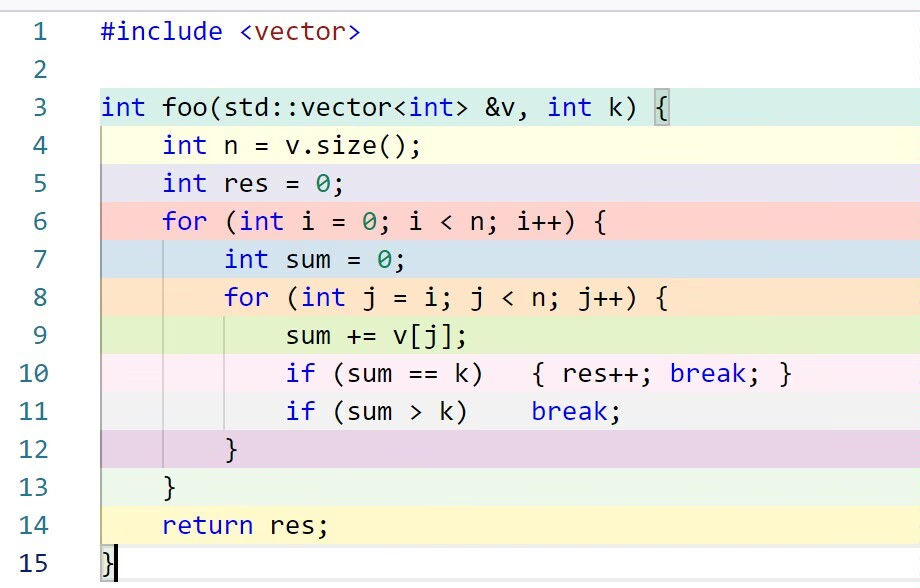

# 华为

岗位是「编译器与编程语言开发工程师」。

## 实习

3.2 投的，3.23 才笔试。

3.24 做了个性测试。

### 3.23 笔试

系统经常崩，题意不清，体验不是很好。
T1 改了好久终于 AC 了，原来是要跨上最后一级台阶而不是跨到最后一级台阶的上面；
T2 改了好久也终于 AC 了，原来两边都有可能有对面没有的 tag；
T3 懒得做了，但是输出 false 能有 25% 的分，非常离谱。

#### T1

有 n (~100000) 级台阶，每级台阶有一个魔法值，表示从这个台阶一步最多可以向上跨多少级；给定 k 表示最多能跨几步；要求计算能否在 k 步内到达最上面，如果可以输出最小的步数，不可以则输出 -1

??? success "我的答案"
    ```c++
    #include <iostream>
    using namespace std;

    int arr[200005];
    int maxM = 0;

    int findCurrent(int cur) {
        //cout << endl << cur << ": ";
        for (int i = max(cur - maxM, 0); i < cur; i++) {
            //cout << arr[i] << " ";
            if (arr[i] >= cur)
                return i;
        }
        return -1;
    }

    int main() {
        int n;
        cin >> n;
        for (int i = 0; i < n; i++) {
            cin >> arr[i];
            if (arr[i] > maxM)
                maxM = arr[i] + 1;
            arr[i] += i;
        }
        /*for (int i = 0; i < n; i++)
            cout << arr[i] << " ";
        cout <<endl;*/
        int x, current = n - 1;
        cin >> x;
        for (int i = 1; i <= x; i++) {
            current = findCurrent(current);
            if (current == 0) {
                cout << i << endl;
                return 0;
            }
            if (current == -1) {
                cout << -1 << endl;
                return 0;
            }
        }
        cout << -1 << endl;
        return 0;
    }
    ```

#### T2

定义了一种数据格式 TLV，其中每个部分由 1 个字节的 tag，1 个字节的 length，以及 length 个字节的 value 组成。接收的报文有若干个这样的数据首尾相接组成，每个字节用 2 位 16 进制数表示，字母均为大写。例如 `0F04ABABABAB1001FF` 的第一个 tag 是 `0F`，length 是 `04`，后面的 4 个字节 `ABABABAB` 是数据；然后 `10` 是下一个数据的 tag，length 是 `01`，后面的 1 个字节 `FF` 是数据。

输入一个这样的报文 (~10000 chars)，输入一个 n(~1000)，输入 n 个十进制数表示需要的 tags。保证输入的报文和需要的 tags 中的 tag 都是严格递增的。对于 tags 中的每个 tag，要求输出其 length 和 offset，其中 offset 表示这个 tag 的 value 在这个报文中的偏移量，从 0 开始，以 byte 为单位。

tags 中的 tag 有的可能不存在于报文中，这种情况下 length 和 offset 均视为 0。报文的末尾可能有不完整的数据，这种数据应当被抛弃。

??? success "我的答案"
    ```c++
    #include <iostream>
    #include <vector>
    using namespace std;

    string str; // ~10000
    int head = 0;

    int getHex(int offset) {
        char c = str[head + offset];
        if (c >= '0' && c <= '9')
            return c - '0';
        return c - 'A' + 10;
    }

    int getByte() {
        if (head + 2 > str.size())
            return -1;
        int high = getHex(0);
        int low = getHex(1);
        //cout << str[head] << " " << str[head + 1] << " " << high << " " << low << endl;
        return high * 16 + low;
    }

    vector<int> getPacket() {
        if (head >= str.size()) {
            return {-1, 0, 0};
        }

        int tag = getByte();
        head += 2;
        if (tag == -1) {
            return {-1, 0, 0};
        }

        int length = getByte();
        head += 2;
        if (length == -1) {
            return {-1, 0, 0};
        }

        int offset = head / 2;

        head += length * 2;
        if (head > str.size()) {
            return {-1, 0, 0};
        }
        return {tag, length, offset};
    }

    int main() {
        cin >> str;
        int n;  // ~1000
        cin >> n;
        int queries[1005];
        for (int i = 0; i < n; i++) {
            cin >> queries[i];
        }
        vector<vector<int>> results;
        while (true) {
            vector<int> temp = getPacket();
            if (temp[0] == -1)
                break;
            results.push_back(temp);
        }

        int j = 0;
        for (int i = 0; i < n; i++) {
            if (j >= results.size()) {
                cout << "0 0\n";
            }
            else if (queries[i] == results[j][0]) {
                cout << results[j][1] << " " << results[j][2] << endl;
                j++;
            }
            else if (queries[i] > results[j][0]) {
                i--; j++;
            }
            else {
                cout << "0 0\n";
            }
        }
        return 0;
    }
    ```

#### T3

安排面试。有若干编程语言，m 个面试官和 n 个面试者。每个面试官掌握若干编程语言，每个面试者面试一门语言。问在每个面试官最多能面 k 个面试者的情况下，是否能够找到一种安排。

数据范围忘了。

??? quote "讨论"
    跟 27rabbit 先生讨论得出了我肯定不会做的结论。好像是最大流还是啥。

### 4.7 技术面

时长大概 30 分钟。

自我介绍。没有对自我介绍展开任何提问。

复盘机试题目。我说了第一个题的思路，后面的他就没问了。

现场做题，给 20 分钟的时间。问了数据范围，给 `N~100, a[i]~10000`。

???+ info "题目"
    给定一个用字符数组表示的 CPU 需要执行的任务列表。其中包含使用大写的 A - Z 字母表示的 26 种不同种类的任务。

    任务可以以任意顺序执行，并且每个任务都可以在 1 个单位时间内执行完。CPU 在任何一个单位时间内都可以执行一个任务，或者在待命状态。

    然而，两个相同种类的任务之间必须有长度为 n 的冷却时间，因此至少有连续 n 个单位时间内 CPU 在执行不同的任务，或者在待命状态。

    你需要计算完成所有任务所需要的最短时间。

    示例 1：

    输入: `tasks = ["A","A","A","B","B","B"], n = 2`

    输出: `8`

    执行顺序: `A -> B -> (待命) -> A -> B -> (待命) -> A -> B.`

    ??? success "我的答案"
        ```c++
        #include <iostream>
        #include <vector>
        #include <algorithm>

        using namespace std;

        int shortestTime(vector<char> &tasks, int n) {
            int currentTime = 0;
            vector<int> count(26, 0);
            auto totTasks = tasks.size();
            for (auto c : tasks)
                count[c - 'A']++;
            sort(count.begin(), count.end());

            vector<int> lastTask(26, -1);
            while (totTasks) {
                for (int i = 25; i >= 0; i--)
                    if (count[i] && (lastTask[i] == -1 || currentTime - lastTask[i] > n)) {
                        count[i]--;
                        totTasks--;
                        lastTask[i] = currentTime;
                        cout << currentTime << " " << i << endl;
                        break;
                    }
                currentTime++;
            }

            return currentTime;
        }

        int main() {
            int n;
            string input;
            cin >> input;
            vector<char> tasks;
            for (auto &c : input)
                if (c >= 'A' && c <= 'Z')
                    tasks.push_back(c);

            cin >> n;
            cout << shortestTime(tasks, n) << endl;
            return 0;
        }
        ```

问了做的编译器的相关问题。问了词法分析怎么实现的，我说是用 flex 的，但是原理我知道。他让我介绍一下原理。

然后就结束了，也没有反问环节。

### 4.7 主管面

本来是紧接着上一个面试的，但是因为我有课，安排在了晚上。时长只有 15 分钟。

自我介绍。问了 MUA 解释器的事情，包含哪些重要的模块。

给一个题目，让我说思路：给一个链表和一个数字 N，返回删除掉倒数第 N 个结点的链表。经典双指针。

问了实习的主要目的。回答了希望有实习经历；体验一下编程语言和编译在工业界的落地，获取实际经历；了解后面的发展方向。

问了未来几年的发展规划。回答了如果能保研就和老师继续学编程语言，保不了就就业。

问为什么喜欢编程语言和编译器。回答了对其他方向没找到兴趣，但是手写过编译器和解释器，正在给大家朋辈辅学将编译原理；因此从兴趣和经验来说都比较倾向这个方向。另外和老师聊过，认为有很多相关的发展方向，前景不错。

问了编译器的情况。问了符号表是怎么实现的。

问了如果实习的话大概能实习多久。考不考虑 IDE 相关的岗位，回答对编程语言更感兴趣一些。

反问阶段，问了大概会做什么具体工作。回答了有两类实习生，一类是从零开始团队协作做一个课程设计一样的东西；还有一类的是个人在现有项目之上找突破。是可以选择的。

另外问了有没有转正的机会。回答了「理论上是有可能的」，但是「现在实习生面试和校招面试是解耦的」。实习完之后如果实习比较好会有一个成绩，类似提前批一样走流程。

---

主管面结束后，HR 通知我面试都通过了，只剩下 offer 审批流程了；并在 4.14 通知我有一个信息填错了让我修改，次日要 offer 材料上报审批。我改了之后就再也没有消息了。官网上的进展停留在下面的情况：


---

## 秋招

9.19 去问了 HR 还有没有机会，HR 说有的，并关注是否考虑读研。

因为实习笔试过了，所以没有安排笔试。

### 9.26 技术一面

面试官很和蔼，一直在正面评价「可以看出来你……」。

说简历和笔试情况都不错。还是要对笔试复盘。这次对三个题都聊了一下，但是我基本都记不清了；给我介绍了第三题，但是我还是不会做。

问了源代码是怎么变成可执行文件的。

问了接触过什么样的中间代码，这种中间码在现在来看是否过时。我回答基本没有了解，教材上的两种都非常过时。我听说过 LLVM 的 IR，但是没看过。我们当时用的中间代码是自己设计的，因为不想用 LLVM。

问了喜欢什么语言，是类型安全的吗，对这门语言的评价是什么。我回答是 C++，类型是不安全的。

问了咸鱼雀的动机和解决方案。回答了做的非常潦草，只用了几天，没什么含金量；大多数时间花在学 SpringBoot 上。做了一些加密、蓝绿发布之类的设计。

介绍了 IDE 的智能化，例如 CLion。IDE 也需要多用户并行编辑。看起来像劝我去 IDE，但是他没说。

写代码。给一个正整数数组和一个正整数 k，返回有多少个连续子数组，其和刚好为 k。

??? success "我的答案"
    应该是个双指针，但是当时不会双指针。写了朴素循环：

    

    问有什么优化思路，我边想边说，说到了前缀和，他也没继续问，直接往下走了。

反问阶段。问具体做什么工作。问了仓颉解决什么问题，是解决生态问题还是什么。回答最开始做是因为各种语言都有好特性，但是没有一门语言原生支持这些特性，所以华为想做。

介绍了如果想做编程语言或者编译，华为确实是国内最好的选择。

### 9.26 技术二面

自我介绍。面试官说看了我的博客，内容挺丰富的。

让介绍了解释器的设计。

让介绍了对面向对象的理解。追问了「如果你意识到多态在这里是最重要的话，那说明你已经有一定代码量了。那为什么人们说起面向对象，封装性都排在第一位呢？」

让举一个多态的例子。

问了不了解设计模式，我说不了解。

问 C++ 编译时内存分配有几种情况，我说没有了解过。

问 C 和 C++ 之间 static 关键字的区别。我说没怎么用过 C，于是让我介绍 C++ 中 static 的含义。

问如何实现 HashMap，如何解决冲突。

让在线做道题，直接给了 LeetCode 链接：https://leetcode.cn/problems/defuse-the-bomb/。

问到现在写过的代码量是多少。

让举个例子说明遇到的一个棘手的问题，以及如何解决的。

问最近有没有读技术类的书籍。

问有没有在技术领域之外学别的内容，对生活上有什么帮助。

反问阶段，问了公司对校招生有什么方面的期待。面试官说「从技术来说，你跟我们的部门非常非常 match」。同时更关注沟通能力和学习能力，还有抗压之类的能力。


### 9.30 主管面

这一场大概 30 min。面试官是中央软件院 IDE Lab 的主任。

自我介绍。「首先能对编译原理产生兴趣就很不错了。」

让大概讲那个 Pascal 的编译器。问对 LLVM 或者 gcc 有什么了解，我回答没有了解，因为不知道从哪里入手。「全国最能入门的地方就是华为了。」

问了解释器做了什么。

问了实习过程中做的那个优化。问为什么出发很慢，我大概扯了扯，他说因为除法的部件是没办法做流水的。

问了将来的打算。我说打算直接工作，对编译器和编程语言都比较感兴趣。

问除了 gcc 和 LLVM 之外还知不知道别的编译器。介绍了华为内部是有一个编译器的，叫方舟；对于想从事这个方向工作的人来说这是一个非常好的机会，因为有很多新东西可以做。「现在最好的学习机会就在这里。」

反问阶段。我问了方舟的动机是什么，解决什么问题。介绍了 LLVM 将编译器的门槛降低了下来，但代价是在一些高性能的编译上是有缺陷的。LLVM 追赶上 gcc 的性能花了七八年，但是方舟只花了一年。因为方舟有更现代的体系和架构，和 LLVM 的设计理念不一样。

---

面试通过当天，HR 打电话说公司 offer 要到 10 月底统一发，需要等一等。

10.12，HR 打电话来问有没有其他 offer，我回答暂时没有。

10.31，HR 来问有没有其他 offer，我回答有几个，还在考虑；HR 表示我的 offer 已经通过了部门审批，正在进行平台审批；我问还要多久，HR 说可能还要一两周，今年整体都比较晚。HR 问现在有的 offer 的情况，我大概透露了薪资，并表示在相应公司回复的 ddl 之前如果华为这边还没出 offer 就去那边了，ddl 是 11.7。

11.7，再去问 HR，HR 说暂时还没出，问我是不是准备签了，我说是的。然后就没消息了。

还是很可惜的QWQ 觉得是很好的一个机会