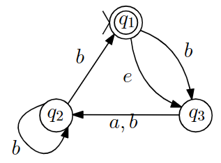
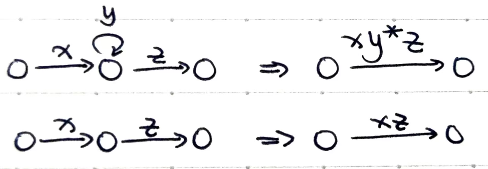
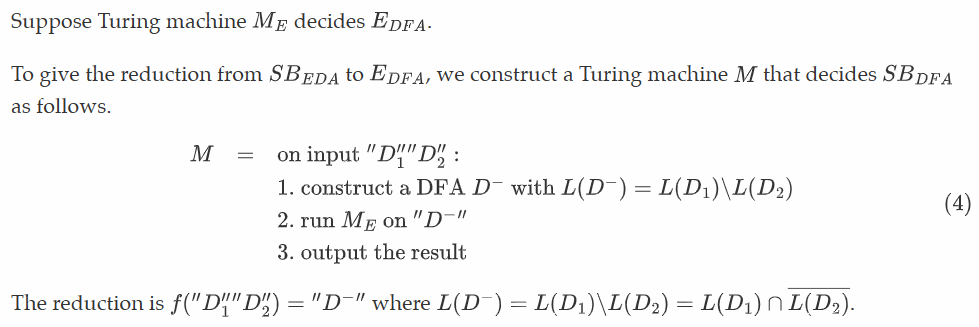

# 计算理论

!!! abstract
    这课它不进脑子啊！

    补天用的，不全。有问题请务必告诉我TAT

Admonitions 使用说明：

=== "danger"
    !!! danger
        放易错点

=== "warning"
    !!! warning
        放错过的题

=== "note"
    !!! note
        放要会证的 lemma

=== "example"
    !!! example
        放要会做的题

=== "tips"
    !!! tips
        放一些思路

=== "info"
    !!! info
        其他

## 1 Finite Automata & Regular Languages

### 1.1 Language

- symbol
- alphabet $\Sigma$
- string $w$ (length of string $|w|$, empty string $e$)
- $\Sigma^N$, $\Sigma^*$, $\Sigma^+$ 
- 字符串操作 concatenation $w_1w_2$, exponentiation $w^i$, reversal $w^R$
- language $L\subseteq \Sigma^*$
    - 每个判定问题都和一个 language 对应

### 1.2 Deterministic Finite Automata

- DFA $M = (K, \Sigma, \delta, s, F)$
    - 其中 transition function $\delta : K \times \Sigma \to K$
- configuration $(q, w) \in K \times \Sigma^*$
- yields in 1 step with M $\vdash_M$
- yields with M $\vdash_M^*$
- 定义了 $M$ accept 字符串的条件
- 定义了 $M$ accept 的语言 $L(M)$

!!! danger
    画 DFA 的时候，任何一个状态都要包含所有可能 symbol 的对应关系！即 $\forall p \in K, \forall c \in \Sigma, \exists\ q \in K \text{ s.t. } \delta(p, c) = q$

### 1.3 Non-Deterministic Finite Automata

- NFA $M = (K, \Sigma, \Delta, s, F)$
    - 其中 transition relation $\Delta\subseteq K\times (\Sigma\cup \{e\}) \times K$
- configuration $(q, w) \in K \times \Sigma^*$
- 定义了 yields in 1 step with M $\vdash_M$, yields with M $\vdash_M^*$, $M$ accept 字符串的条件, $M$ accept 的语言 $L(M)$
- **Theorem.** 任意 NFA $M$ 都能找到一个 DFA $M'$ 使得 $L(M) = L(M')$，反之同理。$M$ 到 $M'$ 的构造思路是，$M'$ 中的状态集合 $K'$ 是 $M$ 中状态集合 $K$ 的 power set。构造方法是，$s'$ 是 $s$ 的 $\epsilon$-closure，然后从它开始向外引边 (See [here](../../compile_principle/1%20Lexical%20Analysis/#242-将-nfa-转换为-dfa))。

!!! warning
    Assignment 2 Q4. 将 NFA 转为 DFA：
    
{width=200}

    ??? success "答案"
        
{width=400}

### 1.4 Regular Languages

- A language is **regular** if it is accepted by some DFA or NFA

!!! note
    课程和作业中构造 DFA 证明了，如果 $A$ 和 $B$ 是 regular languages，$A\cup B$, $A\cap B$, $\bar A$ 都是 regular 的；构造 NFA 证明了，如果 $A$ 是 regular 的，那么 $A*$ 是 regular 的。

|语言类型 / 封闭性|$\cup$|$\cap$|$\circ$|$\bar A$|$*$|
|:-|:-|:-|:-|:-|:-|
|Regular|:material-check:|:material-check:|:material-check:|:material-check:|:material-check:|

Note: $A - B = A \cap \bar B$，因此如果 $\cap$ 和 $\bar A$ 都封闭，则差运算也封闭。

### 1.5 Regular Expression

- 用来描述 Regular Languages
- $L(\varnothing) = \varnothing$, $L(a) = \{a\}$
- $L(R_1\cup R_2) = L(R_1) \cup L(R_2)$, $L(R_1R_2) = L(R_1)\circ L(R_2), L(R^*) = L(R)^*$
- Precedence: $* > \circ > \cup$
- **Theorem.** 任意 NFA $M$ 都能找到一个 REX $R$ 使得 $L(M) = L(R)$，反之同理。$M$ 到 $R$ 的思路是，首先简化 $M$ 使得不存在 $s$ 的入边且 final state 仅有一个且无出边；然后每次删除一个 state，即对于它的每一对入边和出边：  

{width=400}

!!! warning
    Assignment 2 Q6. 写 REX：$\{w\in\{a,b\}^∗:\text{ the number of }b\text{'s in }w\text{ is divisible by 3}\}$

    ??? success "答案"
        $a^*\cup(a^*ba^*ba^*ba^*)^*$

### 1.6 Pumping Theorem

**Theorem.** 若 $L$ 是一个 regular language，则存在 pump length $p\in \mathbb{Z}^*$ 使得 $\forall w\in L$ with $|w| \ge p$ 可被分为 3 个部分 $w = xyz$，满足：

1. $\forall i \ge 0, xy^iz\in L$
2. $|y| > 0$
3. $|xy| \le p$

泵定理是 RL 的一个必要**不**充分条件。

!!! example
    课程中用泵定理证明了 $\{0^n1^n : n \ge 0\}$ 不是 regular 的，课后题目中也证明了 $\{ww : w \in \{a, b\}^*\}$ 不是 regular 的。
    
    这种证明通常的思路是，假设 $L$ 是 RL，从而假设 pump length 为 $p$，然后构造一个含 $p$ 且属于 $L$ 的 string，证明它不符合 pumping theorem。

!!! info
    常见的 non-regular languages 和简要证明思路 ($p$ 是 pump length):

    - $L = \{0^n1^n\}$: 选 $0^p1^p$，则 $xy^0z \notin L$ 
    - $L = \{ww\}$, $L = \{ww^R\}$: 选 $ab^pab^p$ 和 $b^paab^p$，则 $xy^0z \notin L$ 
    - $L = \{0^m1^n\}$ where $m > n$: 选 $0^{p+1}1^p$，则 $xy^0z \notin L$ ($m\ge n$ 也一样)
    - $L = \{0^m1^n\}$ where $m < n$: 选 $0^p1^{p+1}$，则 $xyyz \notin L$ ($m\le n$ 也一样)
        - 根据上面两个例子可以看出，union of 2 non-regular languages 不一定是 non-regular 的，例如 $m > n$ 和 $m \le n$ 的 union 是 $0^*1^*$
    - $L = \{0^m1^n\}$ where $m \neq n$: 假设 regular，则 $(\{0^*1^*\} - L) \cap \{0^*1^*\} = \{0^n1^n\}$ is regular，矛盾
    - $L = \{1^n\}$ where $n$ is prime: 选 $1^k$ where $k > p$ and $k$ is prime，若 $y = 1^s$ where $0 < s \le p$，则 $\forall n \ge 0, k + (n - 1)s$ is prime。但取 $n = k + 1$ 得到 $k + ks = k(1 + s)$ is not prime，矛盾
    - $L \in \{0, 1\}^*$ where numbers of 0's and 1's are equal: 假设 regular，则 $L \cup 0^*1^* = \{0^n1^n\}$ is regular，矛盾

!!! tips
    Assignment 3 Q2 这样的题：

    
{width=700}

    多想一想 $\{0^n1^n : n \ge 0\}$ 不是 regular 这个例子，同时善用德摩根律之类的各种东西把需要证明的结果凑出来，能凑出来就是 regular 的。

!!! warning
    这种题[^98]：
    
{width=500}

!!! warning
    RL 和 Non-RL、Non-RL 和 Non-RL 的 concat 都有可能是 RL。

    前者的一个例子是，RL 为 $\varnothing$，则它们的 concat 也是 $\varnothing$。

    后者的一个例子是：[^98]

    
{width=600}

!!! info
    $(A\subseteq B)\equiv (A-B=\varnothing )\equiv(A\cup B=B)\equiv(A\cap B=A)$

[^98]: https://www.cc98.org/topic/5485312/1#1
*[DFA]: Deterministic Finite Automata
*[NFA]: Non-Deterministic Finite Automata
*[RL]: Regular Languages
*[REX]: Regular Expression

## 2 PushDown Automata & Context-Free Languages

Context-Free Languages 有 2 种描述：Context-Free Grammar 和 Pushdown Automata

### 2.1 Context-Free Grammars

- CFG $G = (V, \Sigma, S, R)$
    - $V$ 是 symbols, $\Sigma$ 是 terminals, $V - \Sigma$ 是 non-terminals
    - $R$ 中的每一条形如 $A\to u$ 或记为 $(A, u)$
    - $S$ 是 start symbol
- derives in 1 step with G $\Rightarrow_G$
- derives with G $\Rightarrow_G^*$
- 定义了 $G$ generates $w$ 的条件
- 定义了 $G$ generates 的语言 $L(G)$
- 定义了 leftmost derivation / rightmost derivation / parse tree
- 歧义

!!! warning
    Give a context-free grammar that generates the following language. Your grammar should use at most 2 non-terminals and should have at most 6 rules.
    
    $\{w\in\{0,1\}^∗: w$ has equal number of $0$'s and $1$'s$\}$

    ??? success "答案"
        $S \to e\ |\ 1S0\ |\ 0S1$

        
{width=500}

### 2.2 Chomsky Norm Form

- A CFG is in CNF if each of its rules is of 3 forms:
    1. $S \to e$
    2. $A \to BC\quad (B, C \in V - \Sigma - \{S\})$
    3. $A \to a\quad (a \in \Sigma)$
- **Theorem.** Every CFG has an equivalent CFG in CNF
    - 构造：$S$ 在 rhs，则新增 $S_0 \to S$ 作为新的 start symbol；如果右侧有 $e$，就删除这个 non-terminal，用到它的对应更改（且可能也要删除）；如果 rhs 有多个，拆开即可；如果只有一个 non-terminal，用它的 rhs 替代即可；如果 rhs 有 terminal，引入 non-terminal。
- **Theorem.** 用 CNF 生成一个长度为 $n > 0$ 的 string，确切需要 $2n-1$ 次 derivation，其中 $n-1$ 次用 (b) 扩展长度，$n$ 次用 \(c) 替换成 terminal。

### 2.3 Pushdown Automata

- PDA = NFA + Stack
- PDA $P = (K, \Sigma, T, \Delta, s, F)$
    - $T$ 是 stack alphabet
    - transition relation $\Delta \subseteq (K \times (\Sigma \cup \{e\}) \times T^*)\times(K \times T^*)$，表示当前状态接受某个 symbol 并从栈上 pop 出某个字符串后，会转移到另一个状态并在栈上 push 另一个字符串
- Configuration $(p, w, \alpha) \in (K \times \Sigma^* \times T^*)$，依次表示 current state, unread input, stack content
- 定义了 $\vdash_P$, $\vdash_P^*$, $P$ accept 字符串的条件（到终态且栈为空）, $P$ accept 的语言 $L(P)$
- 我们聊的 PDA 是 non-deterministic 的。它比确定性 PDA 的运算能力强，因为确定性的 PDA 无法用单个 stack 模拟多个 stack。这与 DFA = NFA 不同

!!! example
    课程和作业中给出了 $L \in \{0, 1\}^*$ where numbers of 0's and 1's are equal 等的 PDA。

!!! danger
    语言中包含「小于」之类的关系的时候，记得给出办法把栈清空。

### 2.4 CFG <=> PDA

- CFG $G$ $\to$ PDA $P$: 在栈上 non-deterministically generate a string using $G$, compare it to input, accept if match.
- 定义 **Simple PDA**: A PDA is simple，如果只有一个终态，且每个 transition 要么只 pop 一个，要么只 push 一个。
- PDA $\to$ Simple PDA $\to$ CFG: 略

### 2.5 Pumping Theorem for CFL

**Theorem.** 若 $L$ 是一个 CFL，则存在 pump length $p\in \mathbb{Z}^*$ 使得 $\forall w\in L$ with $|w| \ge p$ 可被分为 3 个部分 $w = uvxyz$，满足：

1. $\forall i \ge 0, uv^ixy^iz\in L$
2. $|v| + |y| > 0$
3. $|vxy| \le p$

泵定理是 CFL 的一个必要**不**充分条件。

!!! example
    课程中用泵定理证明了 $L = \{a^nb^nc^n : n \le 0\}$ 不是 CFL。

!!! info
    不严谨地说，如果某个语言能够被切分成若干无关的段，每段是一个 RL 或者关于某个「中点」「中心对称」（从而能够借助堆栈的后进先出特性来维护），那么这个语言就是上下文无关的。

    常见的 non-context-free languages:

    - 涉及三个或以上相关的计数、比较的，因为栈没法比那么多次
        - $a^nb^nc^n$
        - $a^ib^jc^k$, where $i > j > k$
        - $w \in \{a, b, c\}^*$ where the numbers of a's, b's and c's are equal
            - 不过它的补是 context-free 的，因为它可以写成 #a != #b, #a != #c, #b != #c 的并。这是一对有用的例子。
    - 无法用栈**线性**比较的
        - $a^{n^2}$
        - $a^m$ where $m$ is prime
    - 需要用到非栈顶信息的，因为栈只能访问栈顶
        - $a^mb^nc^md^n$
        - $ww$: 选 $w = a^pb^p$，讨论 $vxy$ 在中间或者左半边/右半边的情况

    Ref: [Check if the language is Context Free or Not](https://www.geeksforgeeks.org/check-if-the-language-is-context-free-or-not/)

### 2.6 CFL

A language is context-free if it's accepted by some PDA.

!!! note
    Assignment 5 Q5 中证明了 RL 是 CFL。用 NFA 构造 PDA 即可。

!!! note
    **CFL 对 $\cup$, $\circ$, $*$ 封闭，但对 $\cap$, $\bar A$ 不封闭。**

    证明 CFL 对并封闭，只需合并两个 CFL 的 CFG；对连接封闭，只需添加 $S\to S_AS_B$；对克林闭包封闭，只需添加 $S\to S_AS | e$。

    不封闭的反例：我们证明了 $L = \{a^nb^nc^n : n \le 0\}$ 不是 CFL；而它又是 $L_1 = \{a^nb^nc^m : n \le 0, m \le 0\}$ 和 $L_2 = \{a^nb^mc^m : n \le 0, m \le 0\}$ 的交，因此 CFL 对交运算不封闭。

    由于 CFL 对并封闭，那么假设 CFL 对补封闭，则由德摩根律，CFL 对交封闭，矛盾。因此 CFL 对补不封闭。

!!! note
    但是，Assignment 6 Q3 中证明了 CFL 和 RL 的交是 CFL。CFL 对交不封闭的核心原因是我们无法用一个栈模拟两个栈；但是在 CFL 和 RL 交时只需要一个栈就够了。

    **因此，证明一个 language 不是 CFL，还可以通过反证法，说明它和一个 RL 的交是一个已知的 non-CFL。**

    因此，$L-R = L \cap \bar R$ 是 CFL；但 $R-L = R \cap \bar L$ 不一定是 CFL，因为 CFL 对补不封闭。一个例子是，$R = \{a, b, c\}^*, L = \bar A$, 其中 $A = \{w \in \{a, b, c\}^*\}$ where the numbers of a's, b's and c's are equal。$L$ 是 CFL，$A$ 不是，而 $R - L = A$。

|语言类型 / 封闭性|$\cup$|$\cap$|$\bar A$|$\circ$|$*$|
|:-|:-|:-|:-|:-|:-|
|Context-Free|:material-check:|:material-close:|:material-close:|:material-check:|:material-check:|

*[PDA]: PushDown Automata
*[CFL]: Context-Free Languages
*[CFG]: Context-Free Grammars
*[CNF]: Chomsky Norm Form

## 3 Turing Machines 

### 3.1 Turing Machines

- TM $M = (K, \Sigma, \delta, s, H)$
    - $K$ 是 states，$s$ 是 initial state，$H$ 是 halting states
    - $\Sigma$ 是 alphabet，包含 left end symbol ▷ 和 blank symbol ⌴
    - transition function $\delta: (K - H) \times \Sigma \to K \times (\Sigma \cup \{\to, \leftarrow\})$，表示当前 state 接受当前 head 所指的 symbol 后转换到某个 state，并且 head 写入某个 symbol 或者向左 / 向右移动，且满足：
        - 到了最左边，下次一定向右走
        - 不能往某个格子里写入 ▷
- configuration $(q, ▷\alpha, \beta) \in K \times ▷(\Sigma - \{▷\})^* \times ((\Sigma - \{▷\})^*((\Sigma - \{▷, ⌴\})^*)\cup \{e\})$，依次表示当前状态、head 及左边的 string、head 右边的 string（到最后一个非 ⌴ symbol 为止）
- TM 从初始状态开始，每次读取 head 所指格子中的 symbol 并根据 transition function 的操作进行，直到遇到某个停机状态。

构造若干 TM（按定义构造，或者组合若干 TM）：

{width=700}

### 3.2 Usages

TM 可以用来 recognize languages。

#### Semidecide & Recursively Enumerable

- 定义 input alphabets $\Sigma_0 = \Sigma - \{▷, ⌴\}$，因此 TM 也可以写成 $M = (K, \Sigma_0, \Sigma, \delta, s, H)$
- 定义 $L(M) = \{w \in \Sigma_0^* : (s, ▷⌴, w) \vdash_M^* (h, \alpha) \text{ for some } h \in H\}$，即 the set of strings that $M$ halts on
- 称 $M$ **semidecides** $L(M)$
- 如果某个 language 被某个 TM semidecide，则称它是 **recursively enumerable** 的

#### Decide

- 如果 $M = (K, \Sigma_0, \Sigma, \delta, s, \{y, n\})$ 是一个 TM，那么如果对于 $L$ 中的任一字符串 $w$，要么 $(s, ▷⌴, w) \vdash_M^* (y, \alpha)$ （称为 $M$ **accepts** $w$），要么 $(s, ▷⌴, w) \vdash_M^* (n, \alpha)$ （称为 $M$ **rejects** $w$），则称 $M$ **decides** $L$。
- 如果某个 language 被某个 TM decide，则称它是 **recursive** 或 **decidable** 的

TM 也可以用来 compute functions。

#### Compute

- 如果 $M = (K, \Sigma_0, \Sigma, \delta, s, H)$ 是一个 TM，对 $w \in \Sigma_0^*$，如果 $(s, ▷⌴, w) \vdash_M^* (h, ▷⌴, y)$ for some $h \in H, y \in \Sigma_0^*$，则称 $y$ 是 the output of $M$ on $w$，记为 $y = M(w)$。
- 如果对 $f: \Sigma_0^* \to \Sigma_0^*$ 有 $\forall w \in \Sigma_0^*, M(w) = f(w)$，则称 $M$ **computes** $f$。
- 如果某个 function 被某个 TM compute，则称它是 **recursive** 或 **computable** 的

### 3.3 Extensions

我们说明对 TM 的各种扩展不会增强其计算能力；即能使用没有扩展的 TM 模拟之：

1. multiple tapes：$\Sigma' = (\Sigma \cup \underline\Sigma)^k$ （$\underline\Sigma$ 是用来模拟多个 head 的）
2. 2-way infinite tape：折成两条
3. multiple heads: 也是 $\Sigma' = (\Sigma \cup \underline\Sigma)^k$
4. 2-dimentional tape: 按 BFS 序折成一维
5. random access: 多走几步就行
6. non-deterministic——

#### Non-deterministic Turing Machines

- NTM $M = (K, \Sigma, \Delta, s, H)$
- $M$ semidecides $L(M)$，如果有 branch halts 则在 $L(M)$ 中
- $M$ decides $L$，如果所有分支都能 halt，且存在分支 accept
- 例如，$C = \{w : w\ 是合数\}$，则可以构造 NTM 非确定性地猜 $p < w$ 和 $q < w$，如果 $w == pq$ 则 halts with y，否则 halts with n。

**Theorem.** An NTM can be simulated by a DTM.

大概的思路是，NTM 就是棵树，可以用 DTM 来 BFS 搜。搜的时候可以用 3-tape，\#1 存 input，\#2 存 BFS 序列 (1, 2, 3, 11, 12, 21, 22, 31, 32, 111, ...)，\#3 用来根据 \#2 模拟，每次尝试如果没 halt 就恢复 \#1 的 input

### 3.4 Description

**Church-Turing Thesis.** 大意是说，算法是一个在所有 input 都 halt 的 TM；算法用来解决 decision problem，而这样的 TM decide 某个语言。因此我们可以用算法来描述 TM。

因此，TM 有 3 种描述方式：

1. formal definition
2. implement-level description (diagram)
3. high-level description (pseudo code)

用伪代码表述的一个问题是编码。事实上，任何有限集合都能编码，任何由有限集合组成的有限元组也能编码。（因此 TM 也能被编码。）

*[NTM]: Non-deterministic Turing Machines 非确定性图灵机
*[TM]: Turing Machines 图灵机
*[RE]: Recursively Enumerable 递归可枚举
*[REC]: Recursive / Decidable 递归

## 4 Reduction, Undecidability and Grammar

### 4.1 Reduction

A 到 B 的归约就是找到一个 recursive / computable 的 function $f : \Sigma_A^* \to \Sigma_B^*$ 使得 $\forall x \in \Sigma_A^*, x\in A \Leftrightarrow f(x) \in B$

即，$A \le B$

构造了一些语言对应的图灵机：

- $A_\text{DFA}$ = {"D""w" : D is a DFA that accepts w}: run M on w, if accept accept, else reject
- $A_\text{NFA}$: NFA -> DFA, run the TM for $A_\text{DFA}$, output the result
    - reduction: f("N""w") = "D""w"
- $A_\text{REX}$: REX -> NFA, ...
- $E_\text{DFA}$: BFS, find path from $s$ to some $f\in F$
- $EQ_\text{DFA}$: f("D1""D2") = "D" where D = D1 $\oplus$ D2
- $A_\text{CFG}$: 转为 CNF，尝试所有 length = 2|w| - 1 的 derivation
- $A_\text{PDA}$: PDA -> CFG
- $E_\text{CFG}$: 将 e 和所有 terminals 标记，然后将标记反向传递
- $E_\text{PDA}$: PDA -> CFG

归约可以这样写：

{width=800}

### 4.2 Undecidability

!!! note
    **Theorem.** 如果存在一个从 A 到 B 的 reduction $f$，如果 B 是 REC，则 A 也是 REC。  
    证明大概是，构造 A 的一个 TM，如果 $M_B$ 接受 $f(w)$ 则接受，否则拒绝。

    **Theorem.** 如果存在一个从 A 到 B 的 reduction $f$，如果 B 是 RE，则 A 也是 RE。  
    证明大概是，构造 A 的一个 TM，run $M_B$ on $f(w)$，则若 $M_B$ 则停机，否则 loop。

- 定义了单射 injection、满射 surjection、双射 bijection
- 定义了两个集合等势 equinumerous，如果存在它们之间的一个双射
- 定义了集合 A 可数 countable，如果 it's finite or is equinumerous with $\mathbb{N}$；否则是 uncountable 的
- **Theorem.** 对于集合 A，以下表述等价：
    1. A is countable
    2. 存在 injection $f: A \to \mathbb{N}$
    3. 存在一种枚举 A 种元素的方式，使得 A 中的任一元素 a 都能在 n 步内被枚举到，且 n 只取决于 a
- 证明思路大概是，(a) => \(c): 有双射，因此 a 可以在 $f(a) + 1$ 步内被枚举到；\(c) => (b): $f(a) = 首次枚举到时的步数$；(b) => (a): 将 A 按 $f(a)$ 排序，$g(a) = a 的下标$ 形成双射
- **Corollary.** 可数集合的任意子集也可数

#### 存在非 RE 的语言

- **Theorem.** 给定 alphabet $\Sigma$，$\Sigma^*$ 是可数的。
    - 由于 TM 可编码，因此所有 TM 的集合是可数的。
    - 由于每个语言都是 $\Sigma^*$ 的子集，因此每个语言都是可数的。
- **Theorem.** $\mathcal{L}$ 是 $\Sigma$ 上所有语言的集合，则 $\mathcal{L}$ 是不可数的。
    - 用 **对角化 diagonalization** 证明，即假设 $\mathcal{L}$ 可数，则将其列举；所有字符串也可列举；定义语言 $D = \{s_i : s_i \notin L_i\}$，因此 $D$ 与任一 $L_i$ 都不同，因此 $D\notin\mathcal{L}$，矛盾。
- 由上面两条得知，所有 TM 的集合是可数的，但所有语言的集合是不可数的，而每个 TM 只能 semidecide 一种语言，因此一定存在不是 RE 的语言。

#### 非 RE 的语言，以及 RE 但非 REC 的语言

- $H$ = {"M""w" : M is a TM that halts on w} 是 RE 但非 REC 的。
- $H_d$ = {"M" : M is a TM that does not halt on "M"} 不是 RE 的。
    - 证明 $H$ 是 RE 的，只需要构造 **Universal TM** U = run M on w 即可
    - 证明 $H_d$ 不是 RE 的：用反证法，假设存在 $M_D$ semidecides $H_d$，那么 run $M_D$ on "$M_D$"，得到 $M_D$ halts on "$M_D$" iff $M_D$ doesn't halt on "$M_D$"，矛盾，因此不是 RE 的
    - 证明 $H$ 不是 REC 的：用反证法，假设是 REC 的，存在 $M_H$ decides $H$，则能构造 $M_D$ = run $M_H$ on "M""M", accept if reject, else reject。$M_D$ decides $H_d$，与 $H_d$ 不是 RE 的矛盾，因此 $H$ 不是 REC 的

### 4.3 Closure Properties

|语言类型 / 封闭性|$\cup$|$\cap$|$\bar A$|$\circ$|$*$|
|:-|:-|:-|:-|:-|:-|
|Regular|:material-check:|:material-check:|:material-check:|:material-check:|:material-check:|
|Context-Free|:material-check:|:material-close:|:material-close:|:material-check:|:material-check:|
|Recursively Enumerable|:material-check:|:material-check:|:material-close:|:material-check:|:material-check:|
|Recursive|:material-check:|:material-check:|:material-check:|:material-check:|:material-check:|

Note: $A - B = A \cap \bar B$，因此如果 $\cap$ 和 $\bar A$ 都封闭，则差运算也封闭。

证明：

- REC
    - $\cup$ 任一 accept，$\cap$ 都 accept，$\bar A$ 翻转结果
    - $\circ$：构造 TM，遍历所有可能的拆分，分别用两个 TM 跑，如果都 accept 就 accept
    - $*$：更多拆分方案
- RE
    - $\cap$ 即依次运行
    - $\cup$ 构造 TM 并行运行两个 TM
    - $\circ$ 和 $*$ 如 REC 那样拆分，但是用 NTM non-deterministically 拆
    - $\bar A$——

**Lemma.** $A$ 是 REC iff $A$ 和 $\bar A$ 都是 RE  
证明思路大概是，如果都是 RE，对于任意输入，两个 TM 必有且仅有一个停机；并行跑这两个 TM，根据哪个停机决定 accept 还是 reject。

而 H 是 RE 但非 REC，因此 $\bar H$ 不是 RE，因此 RE 对 $\bar A$ 不封闭。

### 4.4 一些证明思路

#### 证明某个语言非 REC

- 找到一个从 H 或其他已知 non-REC 的语言到 A 的 reduction
- 或者用反证法

**Rice's Theorem.**

#### 证明某个语言是 REC

- 构造 TM decide A
- 或者找到从 A 到已知 REC 语言的归约
- 或者使用 **Lemma.** $A$ 是 REC iff $A$ 和 $\bar A$ 都是 RE

#### 证明某个语言非 RE

- 使用 **Lemma.** $A$ 是 REC iff $A$ 和 $\bar A$ 都是 RE
- 或者找到已知 non-RE 的语言到 A 的 reduction

#### 证明某个语言是 RE

- 构造 TM semidecide A
- 或者找到从 A 到已知 RE 语言的归约

[练习](../toc/final_review_sp06.pdf)

[答案](../toc/final_review_sp06_sol.pdf)

### 4.5 剩下的东西

- A language L is **Turing enumerable** iff it's RE
- A language L is **lexicographically Turing enumerable** iff it's REC
- Grammar：和 CFG 的区别是左边可以有好几个 symbol，但是至少有一个 non-terminal。也是 $G = (V, \Sigma, S, R)$
- 显然，CFG 也是 Grammar
- **Theorem.** 一个语言由一个 Grammar 产生，当且仅当它被某个 TM semidecided，即它是 RE 的。

## 5 Numerical Functions and Recursion Theorem

## 6 Computational Complexity

