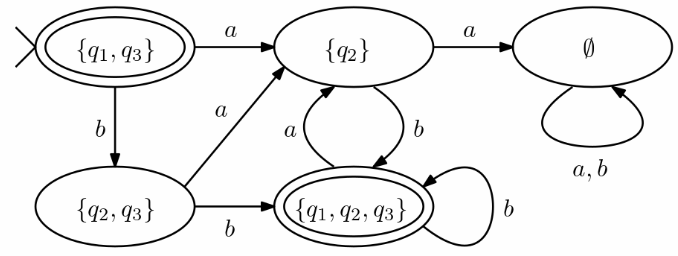
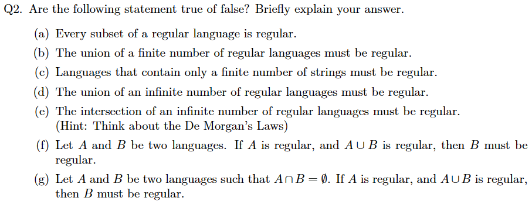

# 计算理论

!!! abstract
    这课它不进脑子啊！

Admonitions 使用说明：

=== "danger"
    !!! danger
        放易错点

=== "warning"
    !!! warning
        放错过的题

=== "note"
    !!! note
        放要会证的 lemma

=== "example"
    !!! example
        放要会做的题

=== "tips"
    !!! tips
        放一些思路

=== "info"
    !!! info
        其他

## 1 Finite Automata & Regular Languages

### 1.1 Language

- symbol
- alphabet $\Sigma$
- string $w$ (length of string $|w|$, empty string $e$)
- $\Sigma^N$, $\Sigma^*$, $\Sigma^+$ 
- 字符串操作 concatenation $w_1w_2$, exponentiation $w^i$, reversal $w^R$
- language $L\subseteq \Sigma^*$
    - 每个判定问题都和一个 language 对应

### 1.2 Deterministic Finite Automata

- DFA $M = (K, \Sigma, \delta, s, F)$
    - 其中 transition function $\delta : K \times \Sigma \to K$
- configuration $(q, w) \in K \times \Sigma^*$
- yields in 1 step with M $\vdash_M$
- yields with M $\vdash_M^*$
- 定义了 $M$ accept 字符串的条件
- 定义了 $M$ accept 的语言 $L(M)$

!!! danger
    画 DFA 的时候，任何一个状态都要包含所有可能 symbol 的对应关系！即 $\forall p \in K, \forall c \in \Sigma, \exists\ q \in K \text{ s.t. } \delta(p, c) = q$

### 1.3 Non-Deterministic Finite Automata

- NFA $M = (K, \Sigma, \Delta, s, F)$
    - 其中 transition relation $\Delta\subseteq K\times (\Sigma\cup \{e\}) \times K$
- configuration $(q, w) \in K \times \Sigma^*$
- 定义了 yields in 1 step with M $\vdash_M$, yields with M $\vdash_M^*$, $M$ accept 字符串的条件, $M$ accept 的语言 $L(M)$
- **Theorem.** 任意 NFA $M$ 都能找到一个 DFA $M'$ 使得 $L(M) = L(M')$，反之同理。$M$ 到 $M'$ 的构造思路是，$M'$ 中的状态集合 $K'$ 是 $M$ 中状态集合 $K$ 的 power set。构造方法是，$s'$ 是 $s$ 的 $\epsilon$-closure，然后从它开始向外引边 (See [here](../../compile_principle/1%20Lexical%20Analysis/#242-将-nfa-转换为-dfa))。

!!! warning
    Assignment 2 Q4. 将 NFA 转为 DFA：
    
{width=200}

    ??? success "答案"
        
{width=400}

### 1.4 Regular Languages

- A language is **regular** if it is accepted by some DFA or NFA

!!! note
    课程和作业中构造 DFA 证明了，如果 $A$ 和 $B$ 是 regular languages，$A\cup B$, $A\cap B$, $\bar A$ 都是 regular 的；构造 NFA 证明了，如果 $A$ 是 regular 的，那么 $A*$ 是 regular 的。

|语言类型 / 封闭性|$\cup$|$\cap$|$\circ$|$\bar A$|$*$|
|:-|:-|:-|:-|:-|:-|
|Regular|:material-check:|:material-check:|:material-check:|:material-check:|:material-check:|

Note: $A - B = A \cap \bar B$，因此如果 $\cap$ 和 $\bar A$ 都封闭，则差运算也封闭。

### 1.5 Regular Expression

- 用来描述 Regular Languages
- $L(\varnothing) = \varnothing$, $L(a) = \{a\}$
- $L(R_1\cup R_2) = L(R_1) \cup L(R_2)$, $L(R_1R_2) = L(R_1)\circ L(R_2), L(R^*) = L(R)^*$
- Precedence: $* > \circ > \cup$
- **Theorem.** 任意 NFA $M$ 都能找到一个 REX $R$ 使得 $L(M) = L(R)$，反之同理。$M$ 到 $R$ 的思路是，首先简化 $M$ 使得不存在 $s$ 的入边且 final state 仅有一个且无出边；然后每次删除一个 state，即对于它的每一对入边和出边：  

{width=400}

!!! warning
    Assignment 2 Q6. 写 REX：$\{w\in\{a,b\}^∗:\text{ the number of }b\text{'s in }w\text{ is divisible by 3}\}$

    ??? success "答案"
        $a^*\cup(a^*ba^*ba^*ba^*)^*$

### 1.6 Pumping Theorem

**Theorem.** 若 $L$ 是一个 regular language，则存在 pump length $p\in \mathbb{Z}^*$ 使得 $\forall w\in L$ with $|w| \ge p$ 可被分为 3 个部分 $w = xyz$，满足：

1. $\forall i \ge 0, xy^iz\in L$
2. $|y| > 0$
3. $|xy| \le p$

泵定理是 RL 的一个必要**不**充分条件。

!!! example
    课程中用泵定理证明了 $\{0^n1^n : n \ge 0\}$ 不是 regular 的，课后题目中也证明了 $\{ww : w \in \{a, b\}^*\}$ 不是 regular 的。
    
    这种证明通常的思路是，假设 $L$ 是 RL，从而假设 pump length 为 $p$，然后构造一个含 $p$ 且属于 $L$ 的 string，证明它不符合 pumping theorem。

!!! info
    常见的 non-regular languages 和简要证明思路 ($p$ 是 pump length):

    - $L = \{0^n1^n\}$: 选 $0^p1^p$，则 $xy^0z \notin L$ 
    - $L = \{ww\}$, $L = \{ww^R\}$: 选 $ab^pab^p$ 和 $b^paab^p$，则 $xy^0z \notin L$ 
    - $L = \{0^m1^n\}$ where $m > n$: 选 $0^{p+1}1^p$，则 $xy^0z \notin L$ ($m\ge n$ 也一样)
    - $L = \{0^m1^n\}$ where $m < n$: 选 $0^p1^{p+1}$，则 $xyyz \notin L$ ($m\le n$ 也一样)
        - 根据上面两个例子可以看出，union of 2 non-regular languages 不一定是 non-regular 的，例如 $m > n$ 和 $m \le n$ 的 union 是 $0^*1^*$
    - $L = \{0^m1^n\}$ where $m \neq n$: 假设 regular，则 $(\{0^*1^*\} - L) \cap \{0^*1^*\} = \{0^n1^n\}$ is regular，矛盾
    - $L = \{1^n\}$ where $n$ is prime: 选 $1^k$ where $k > p$ and $k$ is prime，若 $y = 1^s$ where $0 < s \le p$，则 $\forall n \ge 0, k + (n - 1)s$ is prime。但取 $n = k + 1$ 得到 $k + ks = k(1 + s)$ is not prime，矛盾。
    - $L \in \{0, 1\}^*$ where numbers of 0's and 1's are equal: 假设 regular，则 $L \cup 0^*1^* = \{0^n1^n\}$ is regular，矛盾

!!! tips
    Assignment 3 Q2 这样的题：

    
{width=700}

    多想一想 $\{0^n1^n : n \ge 0\}$ 不是 regular 这个例子，同时善用德摩根律之类的各种东西把需要证明的结果凑出来，能凑出来就是 regular 的。

|语言类型 / 封闭性|$\cup$|$\cap$|$\bar A$|$\circ$|$*$|
|:-|:-|:-|:-|:-|:-|
|Regular|:material-check:|:material-check:|:material-check:|:material-check:|:material-check:|
|Context-Free|:material-check:|:material-close:|:material-close:|:material-check:|:material-check:|
|Recursively Enumerable|:material-check:|:material-close:|:material-check:|:material-check:|:material-check:|
|Recursive|:material-check:|:material-check:|:material-check:|:material-check:|:material-check:|

Note: $A - B = A \cap \bar B$，因此如果 $\cap$ 和 $\bar A$ 都封闭，则差运算也封闭。

*[DFA]: Deterministic Finite Automata
*[NFA]: Non-Deterministic Finite Automata
*[RL]: Regular Languages
*[REX]: Regular Expression
