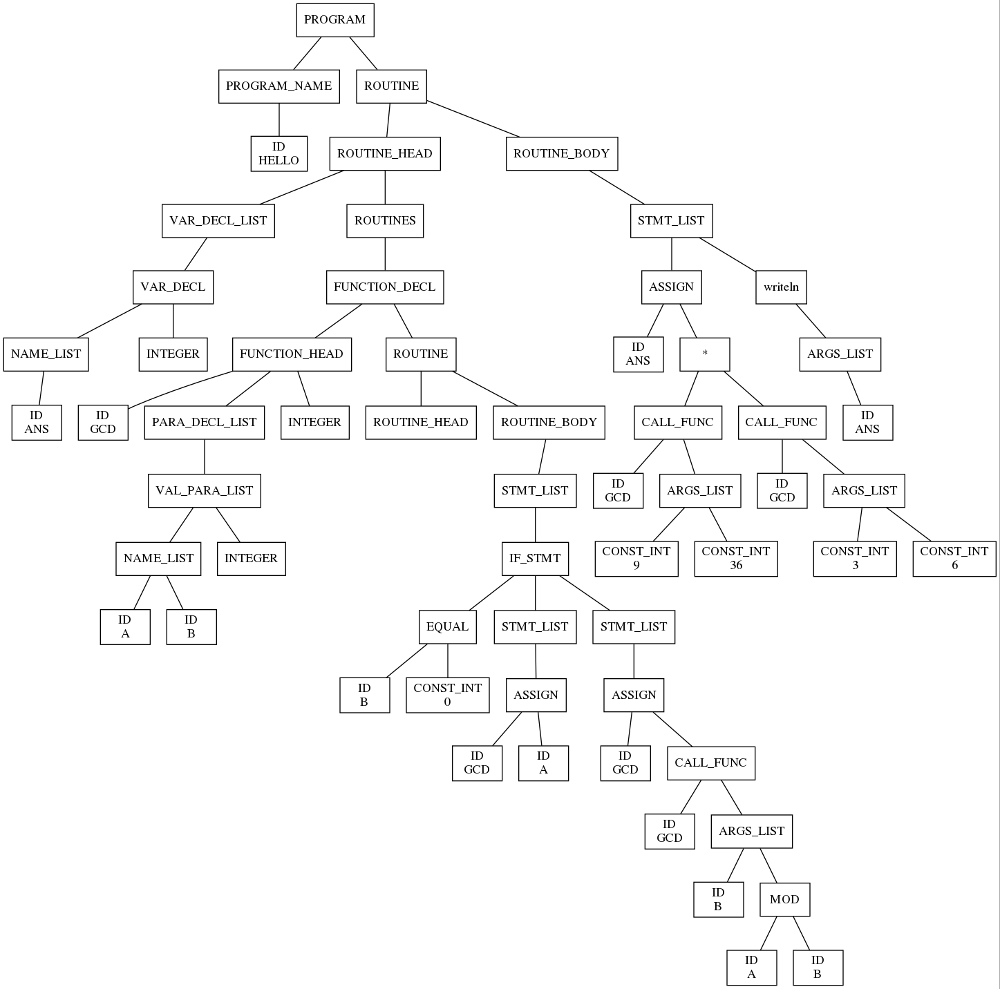

## 1 Abstract Syntax | 抽象语法

语法 (syntax) 规定了如何将各种 phrases(expr, commands / statements, decl, etc.) 组合成程序。

- 表层语法树 / 具体语法树 (surface syntax tree / concrete syntax tree): 表示 parse 出的结果，和语法规则对应；
- 抽象语法树 / 结构语法树 (abstract syntax tree / structural syntax tree): 排除了一些无用的组分，例如 factor, term 之类的内容；这些内容只为了 parse 的正常执行，但是对 semantic 帮助不大。

### 1.1 Abstract Syntax Tree, AST | 抽象语法树

抽象语法树是一棵有序树，其叶子结点为 **变量 (variable)** 或者没有 **参数 (argument)** 的 **运算符(operator)**，其内部节点是 operators。

???+ note
    需要注意的是，这里的 variable 和 operator 不能简单地理解为编程语言中的相关概念。例如，下面这棵语法树里，诸如「函数定义」(`FUNCTION_DECL`) 之类的中间节点也是 operator；而「整型」(`INTEGER`) 之类的叶子结点也是 variable。
    

    另外，严格地说，上面这张图并不是一棵 AST (这张图来自我编译原理大作业对一个例程生成的语法树)。首先，图中仍然保留了一些形如 `STMT_LIST` 的节点，这些节点仍属于 concrete syntax 的范畴；另外，图中的 `ID` 之类的 variable 注明了其名字，例如 `ANS`, `GCD` 等，所以它有我们在 1.2 会讲到的 ABT 的性质。

AST 按语法的不同形式分为不同的 **类别 (sort)**，记作 $s$。类别的集合记作 $S$。  

!!! example
    例如，常见的编程语言区分 expression 和 statement，这就是两个不同的 sort，分别记为 $s_1$ 和 $s_2$。

多个 AST 通过 operator 进行组合。我们通过运算符的 **元数 (arity)** 规定运算符的 sort $s$ 及其参数的数目 $n$ 和 sort $s_i$，记作 $(s_1, \dots, s_n)s$。  
用 $o$ 表示运算符，具有 arity $\alpha$ 的运算符的集合记作 $O_\alpha$；记 $O = \{O\alpha\}$ 为一个按 arity 索引的、由互不相交的 $O_\alpha$ 构成的集族。

!!! example
    承上例，假设 $s_1$ 中存在运算符 `plus`, `times` 和 `num`，它们的结构分别类似于 `plus(expr1; expr2)`, `times(expr1; expr2)` 和 `num[n]` ( 其中 $n\in \mathbb{N}$ )；$s_2$ 中存在运算符 `if` ，它的结构类似于 `if (expr) then stmt1 else stmt2`。那么 `plus` 和 `times` 的 arity 均记作 $(s_1, s_1)s_1$，而 `num` 的 arity 记作 $(\mathbb{N})s_1$， `if` 的 arity 记作 $(s_1, s_2, s_2)s_2$。

Variables 用 $x$ 来表示；sort $s$ 上的变量集合记为 $X_s$；sort 集合 $S$ 上的 **变量族** 定义为 $X = \{X_s\}_{s \in S}$。  
变量是某个领域内的未知的对象，用特定对象 **代换 (substitution)** 某个表达中的全部同个变量，则变量成为已知。  
变量是一个未知的对象或者占位符，其含义由代换赋予。

!!! example
    承上例，$2 + (3 \times x)$ 可以表达为 `plus(num[2]; times(num[3]; x))`。这里 $x$ 是一个变量。  
    由于 `num[4]` 也是 $s_1$ 类型的 AST，因此可以用它 **代换** 上面 AST 中的 $x$，得到  `plus(num[2]; times(num[3]; num[4]))`。  
    同时，由于 `plus(num[1]; num[2])` 也是 $s_1$ 类型的 AST，因此也可以用它代换上面 AST 中的 $x$，得到  `plus(num[2]; times(num[3]; plus(num[1]; num[2])))`。

给定一个 sort 集合 $S$ 和一个 operator 集族 $O$，variable 集族 $X = \{X_s\}_{s \in S}$ 定义同前。那么：

- 当 $X$ **上下文无关 (context-free)** 时，如果 $x \in X_s$，那么称 $x$ 的类别为 $s$；
- 如果对于任意 $s\in S$ 都有 $x \not \in X_s$，那么称 $x$ 对 $X$ 是 **新** 的 ( $x$ is **fresh** to $X$ )；
- 如果 $x$ is fresh to $X$，且 $s$ 是一个 sort，那么称 $X, x$ 是通过增加 $x$ 到 $X_s$ 所得的变量集族；
  - 如果 $s$ 由上下文决定而不是显式声明时，这个记法是有歧义 (ambiguous) 的。

!!! error
    上面这段还没看懂，之后回来补

我们形式化地给出 AST 的定义。AST 的族 $A[X] = \{A[X]_s\}_{s\in S}$ 是满足以下条件的最小族：

- 如果 $x \in X_s$，那么 $x\in A[X]_s$。即，一个类别是 $s$ 的变量是一棵类别为 $s$ 的 AST；
- 如果 $o$ 的元数为 $(s_1, \dots, s_n)s$，且 $a_1 \in A[X]_{s_1}, \dots, a_n \in A[X]_{s_n}$，那么 $o(a_1;\dots ;a_n) \in A[X]_s$。即，用运算符可以组合 AST。

**Structural Induction | 结构归纳法**  
根据上面的定义，由于 AST 的树形结构，如果我们希望证明所有 AST $a$ 都具有性质 $P(a)$，那么我们只需要对于所有生成 $a$ 的方式，都证明：「如果其子 AST 都具有该性质，那么生成的 $a$ 也具有该性质」即可。即证明：

- 如果 $x\in X_s$，则 $P_s(x)$；
- 如果 $(s_1, \dots, s_n)s$，且 $P_{s_1}(a_1), \dots, P_{s_n}(a_n)$ 都成立，那么 $P_s(o(a_1;\dots ;a_n))$ 也成立

即可。

我们进一步形式化地给出变量代换的定义。如果 $a\in A[X, x]_s, b\in A[X]_s$，则用 $b$ 代换 $a$ 中所有 $x$ 得到的结果是 $[b / x]a\in A[X]_s$，定义为：

- $[b / x]x = b$
- $[b / x]y = y$
- $[b / x]o(a_1; \dots; a_n) = o([b / x]a_1; \dots; [b / x]a_n)$

可以证明，如果 $a\in A[X, x]_s$，那么对于任意 $b\in A[X]$ 都存在唯一的 $c\in A[X]$ 满足 $[b / x]a = c$。

??? note "证明 (课堂上「让大家回去思考」)"
    对 $a$ 使用结构归纳法：

    - 如果 $a = x$，那么根据定义有 $c = b$；
    - 如果 $a = y \neq x$，那么根据定义有 $c = y$；
    - 如果 $a = o(a_1; \dots; a_n)$，根据归纳假设，有唯一的 $c_1, \dots, c_n$ 满足 $c_1 = [b / x]a_1, \dots, c_n = [b / x]a_n$，因此 $c = o(c_1; \dots; c_n)$。

### 1.2 Abstract Binding Tree, ABT | 抽象绑定树

> 『如果你去网上搜，你可以发现除了这本书以外没有人说 ABT 这个概念。』

给定一个表达式 `let x be expr1 in expr2`，表示引入一个变量 `x`，用于在表达式 `expr2` 中表示 `expr1`。  

变量 `x` 受 `let` 表达式的约束，只用在 `expr2` 中。在 `expr1` 中如果有任何 `x` 都只是碰巧名字相同的不同变量；这有些类似于 $(\lambda\ expr1. expr2)\ x$。与 $\lambda$ 演算一样，约束变量可以换名。

!!! example
    例如 `let x be num[7] in plus(x; x)` 就可以得到 `plus(num[7]; num[7])`。类似于 $(\lambda\ x.x + x)\ 7 = 7 + 7$。

    而对于 `let x be times(x; x) in plus(x; x)`，就类似于 $(\lambda\ x.x + x)\ (x * x) = x * x + x * x$。根据 $\lambda$ 演算的相关知识容易理解，这里 `times` 中的 `x` 和 `plus` 中的 `x` 并不是同一个变量。

    容易理解，`let y be times(x; x) in plus(y; y)` 与上式表达的含义一致；即约束变量可以换名。

我们用 $x_1, \dots, x_k.a$ 的形式表示将变量序列 $x_1, \dots, x_k$ **绑定 (bind)** 到运算符 $a$ 的参数上，从而将以 $a$ 为根的 AST 泛化为一棵 **抽象绑定树 (Abstract Binding Tree, ABT)**。$x_1, \dots, x_k.a$ 称为 **抽象子 (abstractor)**；这表示变量序列 $x_1, \dots, x_k$ 在 ABT $a$ 中是约束的 (bound)。在 $k = 0$ 时，$.a$ 可以简写为 $a$。通常我们将 $x_1, \dots, x_k$ 记为 $\vec{x}$，从而用 $\vec{x}.a$ 表示 $x_1, \dots, x_k.a$。

这种绑定决定了 $\vec{x}$ 的 **作用域 (scope)** 是 ABT $a$。

前面的 `let x be expr1 in expr2` 就是 `let(expr1; x.expr2)`。这个形式表示 `x` 在 `expr2` 中是约束的，或者说 `x` 的作用域是 `expr2`。

!!! example
    前例中 `let x be num[7] in plus(x; x)` 表示为 `let(num[7]; x.plus(x; x))`；`let x be times(x; x) in plus(x; x)` 可以表示为 `let(times(x; x); x.plus(x; x))`。后者表示的 ABT 形如：
    

绑定使得 operator 的 arity 得到了泛化。元数形如 $(s_1, \dots, s_n)s$，而 **泛化元数 (generalized arity)** 形如 $(v_1, \dots, v_n)s$；其中每一个 $v$ 称为一个 **价 (valence)**，具有 $s_1, \dots, s_k.s$ 即 $\vec{s}.s$ 的形式，指定了参数的类别以及所绑定的变量的数量和类别。

我们称变量序列 $\vec{x}$ 属于 $\vec{s}$，如果它们有相同的长度 $k$，且对每一个 $1 \le i \le k$ 都有 $x_i$ 的类别是 $s_i$。

!!! example
    前例中 `let` 运算符的元数（泛化元数，但「泛化」根据上下文可以推断，因此可以简称为元数，后同）为 $(s_1, s_1.s_1)s_1$。这表示 `let` 运算符的类别是 $s_1$（即表达式，参见 1.1 例子中的定义），第一个参数为不绑定任何变量的表达式；第二个参数为含有一个约束变量的表达式，约束变量是一个表达式。

我们形式化地给出 ABT 的定义。ABT 的族 $B[X]$ 的定义与 AST 的族 $A[X]$ 的定义类似，但是 $X$ 在进入抽象子的作用域时会发生变化。

我们尝试这样定义 ABT：ABT 的族 $B[X] = \{B[X]_s\}_{s\in S}$ 是满足以下条件的最小族：

- 如果 $x \in X_s$，那么 $x\in B[X]_s$。即，一个类别是 $s$ 的变量是一棵类别为 $s$ 的 ABT；
- 如果 $o$ 的元数为 $(\vec{s_1}.s_1, \dots, \vec{s_n}.s_n)s$，且 $a_1 \in B[X, \vec{x_1}]_{s_1}, \dots, a_n \in B[X, \vec{x_n}]_{s_n}$，那么 $o(\vec{x_1}.a_1;\dots ;\vec{x_n}.a_n) \in B[X]_s$。即，用运算符可以组合 ABT。

这种定义的问题是，形如 `let(expr1; x.let(expr2; x.expr3))` 的 ABT 是 ill-formed 的，因为第一个绑定将 $x$ 添加到 $X$ 得到 $X,x$，这使得第二个绑定不能再将 $x$ 添加到 $X,x$ 中，因为 $x$ 对于 $X,x$ 来说不是新的。也就是说，**这种定义没有正确解释约束变量的换名**。

我们可以通过 **fresh renaming** 解决上述问题。具体而言，给定变量族 $X$，$\vec{x}$ 的 fresh renaming 定义为一个 $\vec{x}$ 到 $\vec{x}'$ 的一个双射 $\rho : \vec{x} \leftrightarrow \vec{x}'$，其中 $\vec{x}'$ 对于 $X$ 而言是新的。我们用 $\hat\rho (a)$ 表示将 $a$ 中的每个 $x_i$ 的出现替换为 $\rho(x_i)$ 后的结果。

因此，我们给出 ABT 的族 $B[X] = \{B[X]_s\}_{s\in S}$ 的正确定义：

- 如果 $x \in X_s$，那么 $x\in B[X]_s$。
- 如果 $o$ 的元数为 $(\vec{s_1}.s_1, \dots, \vec{s_n}.s_n)s$，且对于每个 $1 \le i \le n$ 和对应的 fresh renaming $\rho_i : \vec{x}_i \leftrightarrow \vec{x}_i'$ ，都有 $\hat\rho_i(a_i) \in B[X, \vec{x_i}']$，那么 $o(\vec{x_1}.a_1;\dots ;\vec{x_n}.a_n) \in B[X]_s$。

定义这种意义下的结构归纳法：**structural induction modulo fresh renaming**。（没讲，且懒得看）

定义 $\alpha$-等价 ($\alpha$-equivalence)。（讲了，但懒得看）

ABT 根据是否 $\alpha$-等价判定是否相同。

定义 ABT 上的代换。（也讲了，也懒得看）
