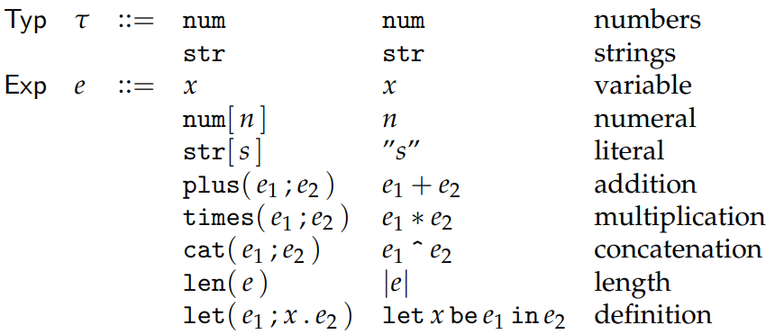

# 4 Statics | 静态语义

大多数编程语言（无论是编译型还是解释型）从代码到执行之间都可以分为两个阶段：**静态 (static)** 阶段和 **动态 (dynamic)** 阶段。静态阶段由 parsing（满足语法） 和 type checking（满足静态语义） 组成，以保证程序是 **well-formed** 的；动态阶段由 well-formed 程序的执行组成，如果能够正确运行，则程序是 **well-behaved** 的。

当且仅当 well-formed 的程序在执行时是 well-behaved 的，我们称这种编程语言是 **安全 (safe)** 的。

书中定义了 **E** 语言，它的抽象和具体语法如下面的 **语法表 (syntax chart)** 所示：

上表中规定了一系列 operators 和它们的 arities，例如 `let` 的 arity 就是 `(Exp, Exp.Exp)Exp`。

我们在第 1 节提到，语法 (syntax) 规定了如何将各种 phrases(expr, commands / statements, decl, etc.) 组合成程序。在本节的开头我们也提到，在静态阶段，为了保证一个程序是 well-formed 的，我们需要检查它满足语法和静态语义。这里提到的 **静态语义 (statics)** 由一系列规则组成，这些规则是用来推导 **定型判断 (typing judgments)** 的。所谓 typing judgments，就是用来陈述某个表达式符合某个类型的判断。

容易理解的是，表达式 `plus(x; num[n])` 是否合法，取决于 `x` 的类型是否是 `num`。也就是说，phrases 对于其所处的上下文是敏感的。因此，**E** 的 statics 由形如 $\vec{x}\ |\ \Gamma\vdash e:\tau$ 的泛型假言判断组成。其中，$\vec{x} = \text{dom}(\Gamma)$ 是变量的有限集合； $\Gamma$ 是定型上下文，它对每个 $x\in \vec{x}$ 有一个形如 $x:\tau$ 的假设。

如果 $x\notin \text{dom}(\Gamma)$，那么我们称 $x$ 对于 $\Gamma$ 是新的。这时，我们可以把 $x:\tau$ 添加到 $\Gamma$ 中得到 $\Gamma, x:\tau$。

**E** 的 statics 用以下规则定义：

$$\frac{}{\Gamma, x:\tau\vdash x:\tau}$$

$$\frac{}{\Gamma\vdash \text{str}[s]:\text{str}}$$

$$\frac{}{\Gamma\vdash \text{num}[n]:\text{num}}$$

$$\frac{\Gamma\vdash e_1:\text{num}\quad \Gamma\vdash e_2:\text{num}}{\Gamma\vdash \text{plus}(e_1;e_2):\text{num}}$$

$$\frac{\Gamma\vdash e_1:\text{num}\quad \Gamma\vdash e_2:\text{num}}{\Gamma\vdash \text{times}(e_1;e_2):\text{num}}$$

$$\frac{\Gamma\vdash e_1:\text{str}\quad \Gamma\vdash e_2:\text{str}}{\Gamma\vdash \text{cat}(e_1;e_2):\text{str}}$$

$$\frac{\Gamma\vdash e:\text{str}}{\Gamma\vdash \text{len}(e):\text{num}}$$

$$\frac{\Gamma\vdash e_1:\tau_1\quad \Gamma, x:\tau_1\vdash e_2:\tau_2}{\Gamma\vdash \text{let}(e_1; x.e_2):\tau_2}$$

???+ note 
    第 2 和第 3 条的 `str` 和 `num` 是类型的 **引入形式 (introduction form)**，确定某个类型的 **value** 或者说是 **canonical form**
    
    而后面的若干条则是一些 **消去模式 (elimination form)**，确定如何使用类型来形成另一种（可能是相同的）类型。

    例如，`num` 类型的引入形式是数，而消去形式是 `plus` 和 `times`。

根据上述定义，有如下引理：

**引理 4.1（类型唯一性，unicity of typing）**：$\forall\ \Gamma, e$，至多存在一个 $\tau$ s.t. $\Gamma\vdash e:\tau$。

**引理 4.2（定型反转，inversion for typing）**：假设 $\Gamma\vdash e:\tau$，若 $e = \text{plus}(e_1;e_2)$，那么 $\tau = \text{num}, \Gamma\vdash e_1:\text{num}, \Gamma\vdash e_2:\text{num}$。对于 times 等其他结构也类似。

**引理 4.3（弱化，weakening）**：若 $\Gamma\vdash e':\tau'$，则对任意 $x\notin \text{dom}(\Gamma)$，有 $\Gamma, x:\tau\vdash e':\tau'$。

**引理 4.4（代换，substitution）**：若 $\Gamma, x:\tau\vdash e':\tau'$ 且 $\Gamma\vdash e:\tau$，则 $\Gamma\vdash [e/x]e':\tau'$。

从实际的编程语言中理解，$x:\tau$ 是一棵 ABT，作为一个占位符，在 $e'$ 中的每次出现表示一个代码片段；而 $e:\tau$ 是一棵同样类型的 ABT，表示一个代码片段。这里的「代换」其实就实现了函数调用，即 $x$ 实际上给出的是函数签名，而 $e$ 则包含了具体的实现。也就是说，这一引理表达了 **模块化 (modularity)** 和 **链接 (linking)** 的重要概念。

**引理 4.5（分解，decomposition）**：若 $\Gamma\vdash [e/x]e':\tau'$，则对满足 $\Gamma\vdash e:\tau$ 的每个类型 $\tau$，有 $\Gamma, x:\tau \vdash e':\tau'$。

这其实是引理 4.4 的逆操作，表明任何一个（大的）子表达式都可以分割出来形成一个独立模块。