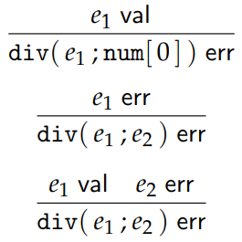

# 6 Type Safety | 类型安全

**定理 6.1（类型安全，type safety）** 我们定义，满足如下两个性质的语言是类型安全的：

- **定理 6.2（保持性，preservation）** 如果 $e:\tau$ 且 $e\mapsto e'$，那么 $e':\tau$。
- **定理 6.4（进展性，progress）** 如果 $e:\tau$，则要么 $e$ val，要么存在 $e'$ 使得 $e\mapsto e'$。

## 运行时错误

例如，我们希望给 **E** 加上除法运算：

但是，`div(num[3]; num[0])` 是 well-typed 的，但是会 stuck。我们有 2 种思路纠正这种问题：

1. 增强类型系统，使得 divide by 0 的情况不会出现。这种方式比较困难，因为我们很难静态地预测表达式在求值时是否非 0。
2. 增加动态检查，使得 divide by 0 时报错并将错误视作求值的输出。

实现上述第 2 种思路，可以引入形如 $e$ err 的判断来表示 $e$ 会导致运行时错误，比如 divide by 0。其定义的一部分如下；

第一条是 err 的产生，而后面两条（以及其他类似的计算）是 err 的传播。

也就是说，我们实际上将错误分为了两种：**checked error** 和 **unchecked error**；前者是类似这里 divide by 0 的错误，我们需要额外的规则来检查；而后者是类型系统本身就能够排除的错误，我们不需要额外的检查就可以实现。