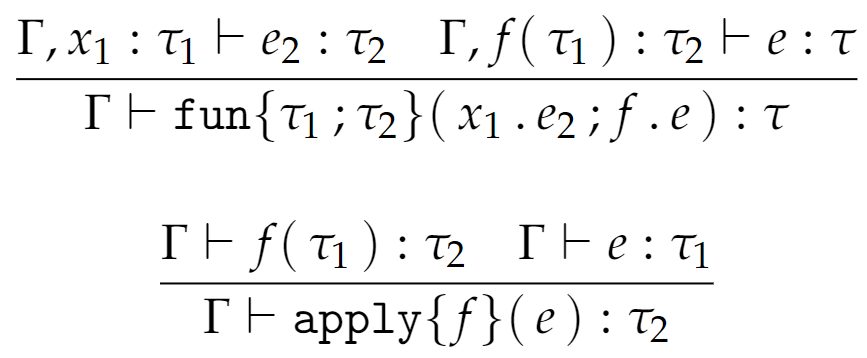
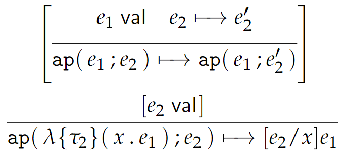

# 8 Function Definitions and Values

在 **E** 语言中，我们能够实现将给定表达式加倍的运算，但是我们不能构造「加倍」这样一个概念，也就是定义一个 **函数 (function)**。

我们可以通过把一个名字绑定到一棵带约束变量的 abt 上来定义一个函数。这里的约束变量就是函数参数。我们可以用特定的表达式替换约束变量来完成函数的应用。

## 8.1 First-Order Function | 一阶函数

语言 **ED** 在语言 **E** 的基础上扩充了函数定义和函数应用，其抽象和具体语法如下：

<center>{width=600}</center>

函数定义中，$f$ 是 $e$ 中的一个函数名，它被绑定到抽象子 $x_1.e_2$ 上，即参数为 $x_1$，定义是 $e_2$。

???+ note "关于花括号"
    课本 1.2 节末尾举例，abt $o\{a_1;a_2\}(a_3;x.a_4)$ 和 abt $o(a_1;a_2;a_3;x.a_4)$ 相同；这样的括号只是用来分组从而提高可读性的。

**函数头 (function header)** $f(x_1:\tau_1):\tau_2$ 表示函数的 **定义域 (domain)** 是 $\tau_1$, **值域 (range)** 是 $\tau_2$。由于 **E** 中只有 `num` 和 `str` 两个类型，因此上述定义域和值域也只能是这两种。

在 **E** 的基础上，**ED** 的静态语义由以下定型规则定义：

<center>{width=300}</center>

为了给出 **ED** 的动态语义，我们定义 **函数代换 (function substitution)** $[\![ x_1.e_2/f ]\!] e$，表示用 $x_1.e_2$ 代换 $e$ 中所有 $f$ 的出现。

[//]: # (上面的 Double square brackets 应该用 \llbracket 和 \rrbracket 实现，不过因为 MathJax 不自带这个，所以用了这种方法实现。)

我们下面尝试给出函数代换的具体含义。事实上，在形如 $\text{apply}\{f\}(e')$ 的函数应用中才会出现函数名 $f$，因此此时我们对 $[\![ x.e/f ]\!] \text{ apply}\{f\}(e')$ 的定义就类似于 $\text{let } x \text{ be } e' \text{ in } e$。不过，由于 $e'$ 中还可能存在 $f$，因此我们对函数代换的定义如下：

<center>{width=400}</center>

有了函数代换，我们就可以在 **E** 的基础上定义 **ED** 的动态语义了：

<center>{width=300}</center>

即，如果在某个 abt $e$ 中存在对函数 $f$ 的定义，那么在求值时，应当用 $x_1.e_2$ 代换 $e$ 中所有 $f$ 的出现。

## 8.2 High-Order Functions | 高阶函数

在 **ED** 中，变量定义和函数定义非常相似；我们试图将它们统一起来。

语言 **EF** 在语言 **E** 的基础上扩充了函数类型，其抽象和具体语法如下：

<center>{width=450}</center>

!!! note
    上面的抽象语法中 $\to (\tau_1; \tau_2)$ 在中文课本和课件中记作 $\text{arr}(\tau_1; \tau_2)$；$\lambda \{\tau\}(x.e)$ 在中文课本和课件中记作 $\text{lam}\{\tau\}(x.e)$。

如我们之前所说，函数定义就是将函数名绑定到抽象子上。因此我们把抽象子具体化为一种表达式形式，称作 **$\lambda$ 抽象**，记作 $\lambda \{\tau\}(x.e)$；其类型即为函数类型 $\to (\tau_1; \tau_2)$，$\tau_1$ 和 $\tau_2$ 分别是其定义域和值域。$\text{ap}(e_1;e_2)$ 的函数应用，这里 $e_1$ 不一定是一个函数名，它可能是任何类型为函数类型的表达式。

这样，我们就可以把函数当做任何其他表达式一样使用了，包括作为参数和返回值。因此，我们说在这样的语言中，函数是 **一等 (first-class)** 的；这样的函数被称为是高阶的，而非一阶的。

在 **E** 的基础上，**EF** 的静态语义以如下定型规则给出：

<center>{width=250}</center>

引理 4.2 的类型反转和引理 4.4 的代换在此处也成立。

在 **E** 的基础上，**EF** 的动态语义以如下规则给出：

<center>{width=250}</center>

<center>{width=300}</center>

和 5.2 节讨论的一样，这里用方括号括起的部分（除了代换）区分按值调用和按名调用两种规则，也就是参数是否需要被求值后再应用。

!!! note "8.4 Dynamic Scope | 动态作用域"
    这样一段代码，返回 `1` 还是 `2`：

    ```
    x <- 1
    f <- function(a) x + a
    g <- function() {
        x <- 2
        f(0)
    }
    g()
    ```

    在 **dynamic scoping** 中，函数只会访问当前环境中的对应（同名）变量。

    而在 **lexical scoping** (a.k.a. **static scoping**) 的语言中，变量的 scope 由程序的词法结构决定；亦即，这样的语言的函数访问的始终是它被创建处的对应变量。由于这样的变量不在调用时的当前环境中，因此它们必须被存在一个 **闭包 (closure)** 中。
    
    绝大多数语言是 lexical scoped 的。


