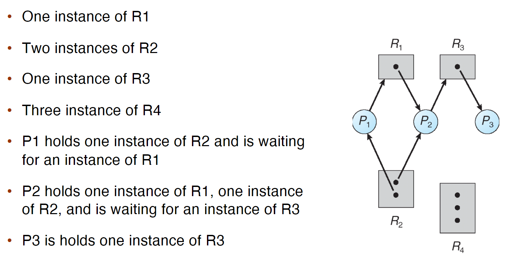
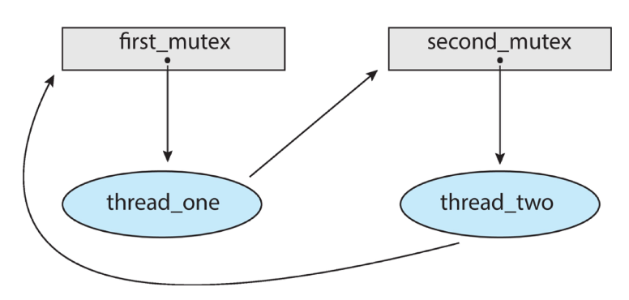
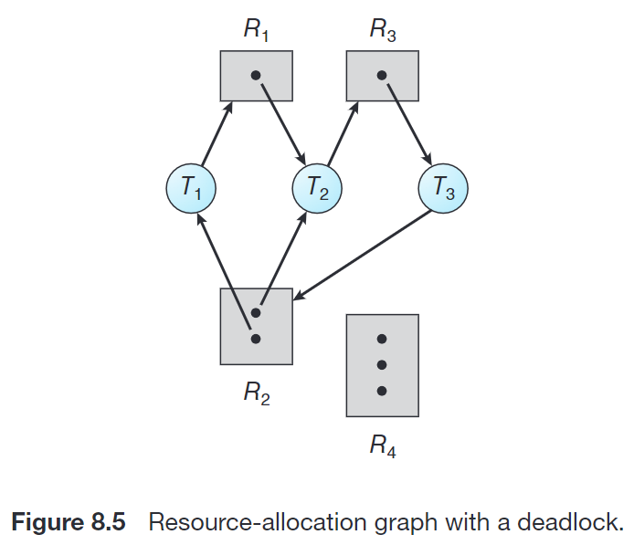
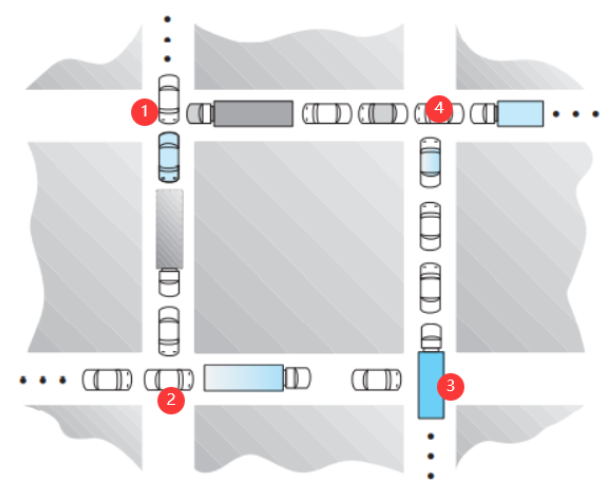
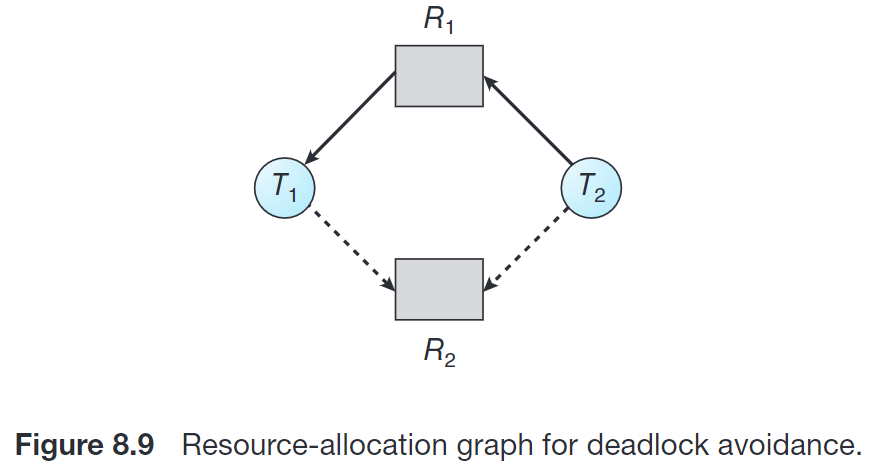
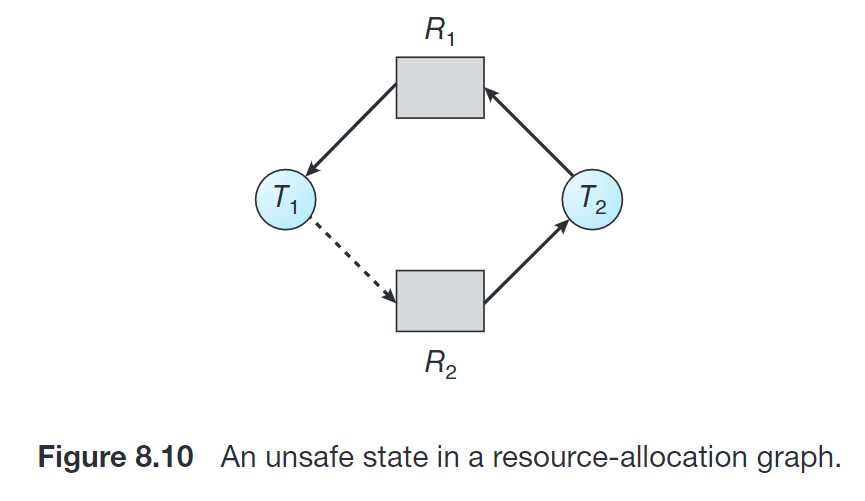

# 8 Deadlocks

## 8.1 死锁的定义和例子

**死锁 (Deadlock)** 是指，多个进程因竞争资源导致的一种僵局，即若干进程各自持有一些资源，同时等待获取另一个进程持有的资源，形成的互相等待的局面。

!!! example
    一个例子是，一个系统里有两个进程 $P_1$ 和 $P_2$，分别完成从一个磁盘驱动器拷贝内容到另一个磁盘驱动器的操作，即各自需要两个磁盘驱动器。系统里两个磁盘驱动器 $A$ 和 $B$。当前，$P_1$ 持有 $A$ 并希望获取 $B$，同时 $P_2$ 持有 $B$ 并希望获取 $A$，这两个进程就会相互等待，陷入死锁。

    即：

    ```C
    semaphore first_mutex = 1;
    semaphore second_mutex = 1;

    thread_one() {
        wait(first_mutex);
        wait(second_mutex);
        // ......
    }

    thread_two() {
        wait(second_mutex);
        wait(first_mutex);
        // ......
    }
    ```

!!! example "Bridge Crossing Example"
    <center></center>

    上图所示的情形也展示了一种死锁。

    可以看到，如果桥上的任一辆车愿意倒车回去，就能够解决死锁。我们可以通过分配优先级的方式要求哪辆车倒车。

    优先级可能导致 starvation。

## 8.2 系统资源分配图

我们对系统进行建模。假设有 $m$ 种不同类型的 **资源 (resources)** $R_1, \dots, R_m$，每种资源类型 $R_i$ 有 $W_i$ 个 **实例 (instance)**。各个活动进程 $P_1, \dots, P_n$ 会利用这些资源实例，每个资源的利用由 request, use, release 三步组成。

我们可以通过 **系统资源分配图** (**system resource-allocation graph**, 简称为 **资源分配图** 或 **分配图**) 刻画系统资源的情况。资源分配图是一个有向图。点集 $V = P \cup R$，其中 $P = \{P_1, \dots, P_n\}$ 是所有活动进程的集合，$R = \{R_1, \dots, R_m\}$ 是所有资源类型的集合。边集 $E$ 中包含 **申请边 (request edge)**，即形如 $P_i\to R_j$ 的边，表示进程 $P_i$ 已经申请了资源类型 $R_j$ 的一个实例，并正在等待这个资源；以及 **分配边 (assignment edge)**，即形如 $R_j\to P_i$ 的边，表示资源类型 $R_j$ 的一个实例已经分配给了进程 $P_i$。

在图形上，我们用圆表示进程，用矩形表示资源类型。由于资源类型可能有多个实例，我们在矩形内用数量等同于实例数量的圆点表示各个实例。每条申请边由一个圆指向一个矩形，而每条分配边由矩形中的一个圆点指向一个矩形。

!!! example
    

!!! example
    本节第一个例子的情况，可以用如下的资源分配图刻画：

    <center>{ width="400" }</center>

当进程申请一个资源时，应当添加一条申请边；当该申请可以得到满足时，这条申请边应当 **立即** 转换为分配边；当进程不再需要某个资源时，就删除对应分配边。

根据资源分配图的定义我们可以知道，如果资源分配图当前没有环，那么系统当前 **一定** 没有死锁；如果分配图有环，那么系统当前 **可能** 存在死锁。但是，如果分配图有环，且每个资源类型只有 1 个实例，那么 **必定** 存在死锁。

??? example "分配图有环不一定存在死锁"
    <center>{ width="400" }</center>

    <center>{ width="400" }</center>

## 8.3 死锁的必要条件

事实上，当下面四个条件 **同时** 成立时，系统才会出现死锁：

1. **Mutual exclusion** : 至少一个资源处于非共享模式；
2. **Hold and wait** : 一个进程应 **占有** 至少一个资源，并 **等待** 另一个为其他进程占有的资源；
3. **No preemption** : 资源不能被抢占，只能在进程结束后主动释放；
4. **Circular wait** : 有一组等待进程 {T0, T1, ..., Tn}，T0 is waiting for a resource held by T1, T1 is waiting for a resource held by T2, ..., Tn−1 is waiting for a resource held by Tn, and Tn is waiting for a resource held by T0.

这四个条件并不完全独立。

!!! example
    下图中描述了一个死锁状态：
    
    <center>{ width="400" }</center>

    我们验证它符合上述四个条件：

    * mutual exclusive：每个路口（资源） 1 ~ 4 同时只能有一辆车等待或通行
    * hold and wait：位于 1, 2, 3, 4 路口的车分别持有当前路口，并且等待 2, 3, 4, 1路口的车经过
    * no preemption：显然，任何一个路口边等待的车不能先于当前在路口等待的车经过路口
    * circular wait：位于 1, 2, 3, 4 路口的车分别等待 2, 3, 4, 1路口的车经过

## 8.4 死锁的处理策略

如何处理死锁呢？有四种方法：

- 保证系统不会进入死锁状态
    - **死锁预防 (deadlock prevention)**
    - **死锁避免 (deadlock avoidance)**
- 在系统进入死锁状态后恢复
    - **死锁检测和恢复 (deadlock detection and recovery)**：例如数据库
- 假装系统不会发生死锁，真的发生了就寄

事实上，大多数操作系统（包括 Linux 和 Windows）选择的是最后一种方案。因此，程序员需要自己编写程序来处理死锁。

但是前面三种还是要学👉👈

### 8.4.1 死锁预防

死锁预防的核心思路是，确保 8.3 节中至少一个必要条件永不成立，来保证系统不会出现死锁。我们分别讨论四个条件如何破坏。

#### 8.4.1.1 Mutual Exclusion

如果保证系统资源都能共享，则该条件用不成立。

但是这只是个美好的愿望，因为有很多资源天生就不能共享，比如信号量。

#### 8.4.1.2 Hold and Wait

保证每个进程在申请资源时不能占有其他资源。

实现方式之一是，在开始执行前申请并获得所有资源。或者，只允许进程在没有资源时才能申请资源。

这种方式的问题是，资源利用率较低，而且需要资源较多的进程可能发生 starvation。

#### 8.4.1.3 No Preemption

当一个进程请求一个资源但是没有立刻得到满足时，它必须释放已经持有的所有资源；直到它需求的所有资源（包括刚才释放的那些资源）都可用时才能一并获取它们并继续执行。

但是信号量之类的资源也不能这样用；同时也会降低资源利用率。

#### 8.4.1.4 Circular Wait

对所有资源类型进行排序，要求每个进程按照递增顺序申请资源。

程序员需要保证按照这个顺序申请资源，也就是说如果程序员不听话，还是会发生死锁。这种方法也可能影响资源利用率。

### 8.4.2 死锁避免

避免死锁需要一些额外信息，例如进程未来需要使用哪些资源、资源的使用顺序等。在每次请求到来时，即使对应资源可用，系统也应该结合现有可用资源、现有已分配资源以及各个进程未来申请和释放的资源，考虑是否让这个请求等待从而避免未来可能的死锁。

不同模型可能对上述额外信息有不同的需求。最简单且最有用的模型维护这样的 **资源分配状态 (resource allocation state):**

- 每个进程声明可能对每种资源类型的 **最大需求 (maximum demands)**
- 当前系统的 available 和 allocated 的资源数目。

#### 8.4.2.1 资源分配图算法

这种算法适用于每种资源类型只有 1 个实例的情况。

我们在资源分配图的基础上增加一种边，叫 claim edge，表示某个进程未来 **可能** 会需求某种资源，用虚线表示。

<center>{width="400"}</center>

<center>{width="400"}</center>

当这个需求真的出现的时候，claim edge 转为 request edge；当需求被满足的时候，request edge 转为 assignment edge；当该进程释放该资源时，assignment edge 转为 claim edge。

当一个需求来了的时候，如果 request edge 转为 assignment edge 不会导致图中有一个 cycle，则该要求可以被满足；否则该请求应当等待。

#### 8.4.2.2 安全状态 | Safe State

如果系统能够按照一定顺序为每个进程分配资源，同时避免死锁，那么系统就处在 **安全状态 (safe state)**。

具体而言，如果某个资源当前有 $A$ 个空闲，对于每个活动进程 $P_i$，它们各自持有 $C_i$ 个该资源，并仍然需要 $D_i$ 个该资源。如果存在一个序列 $<P_1, \dots, P_n>$ 使得对于任一 $P_i$，都有 $A + \sum_{j = 1}^{j < i} C_i \ge D_i$，则系统处于安全状态。

安全状态保证不发生死锁。

??? info "Proof"
    用归纳法。如果 $P_i$ 的需求不能立刻满足，它只需要等到 $\{P_j\ |\ j < i\}$ 全部完成，$P_i$ 就能获取所需资源。

<center>{width="300"}</center>

!!! example
    <center>{width="400"}</center>

    $<P1, P0, P2>$ 是一个 safe sequence。因此系统处在安全状态。

根据这一概念，我们可以这样定义死锁避免的算法：起初，系统处于安全状态。当有进程申请一个可用资源时，系统应确定，如果立刻进行这一分配后系统仍处于安全状态则可以分配，否则应当让进程等待。

#### 8.4.2.3 银行家算法 | Banker's Algorithm

我们通过 available, max, allocation, need 这四个矩阵刻画一个时间内各个进程对各种资源的持有和需求情况，以及当前系统的资源情况；操作系统根据这些数据保持系统处于安全状态，从而决定一个需求是否应当被立即满足。

参考下面的例子中问题 1 理解，找一个安全序列的基本思路就是：选取一个 need（的每一项都对应地）小于 available（的对应项）的进程，其运行完后会将 allocation 释放回 available，以此类推。

而决定一个需求是否应当被立即满足的方案是，**假设** 这个需求被接受了，根据该需求更新对应的 need, available, allocation，在此状态下推演是否有合法的安全序列。如果有，则可以立即满足，否则应等待。参考下面例子中的问题 2~4。

!!! question
    8.28 Consider the following snapshot of a system:

    <center>{width="400"}</center>

    Answer the following questions using the banker’s algorithm: 

    1. Illustrate that the system is in a safe state by demonstrating an order in which the threads may complete. 
    2. If a request from thread T4 arrives for (2, 2, 2, 4), can the request be granted immediately? 
    3. If a request from thread T2 arrives for (0, 1, 1, 0), can the request be granted immediately? 
    4. If a request from thread T3 arrives for (2, 2, 1, 2), can the request be granted immediately?

    ??? success "答案"
        1. 如图：  
        <center>{width="400"}</center>  
        我们可以先让 T2 运行（也可以是 T3），此后变成：  
        <center>{width="400"}</center>  
        现在可以让每个 thread 运行，因此之后任何一种运行方式都可以完成，如 T2->T4->T0->T1->T3。因此当前系统是安全的。
        2. 如果满足这一要求，之后的状态为：  
        <center>{width="400"}</center>  
        可见，此时任一线程都无法执行。因此此要求不能立即满足。  
        3. 如果满足这一要求，之后的状态为：  
        <center>{width="400"}</center>  
        这不影响我们如 1) 那样完成全部线程的运行，即系统是安全的。因此此要求可以立即满足。  
        4. 如果满足这一要求，之后的状态为：  
        <center>{width="400"}</center>  
        我们可以按 T3->T2->T4->T1->T0 等顺序完成全部线程的运行，即系统是安全的。因此此要求可以立即满足。

### 8.4.3 死锁检测

#### 8.4.3.1 Single Instance Resources

可以通过资源分配图的变体 **wait-for graph** 来解决：

<center>{width="500"}</center>

在这个图里找环，用拓扑排序的话时间复杂度是 $O(V + E)$ 的，这最差情况下是 $O(n^2)$ 的。

#### 8.4.3.2 Multi-Instance Resources

类似银行家算法。如果找不到任何安全序列，则说明系统处于死锁状态。

### 8.4.4 死锁恢复

死锁恢复有两个选择：

#### 8.4.4.1 进程终止 Treminate deadlocked processes

终止进程并不简单，它需要维护终止时的状态，并且有可能需要重新计算一些内容，同时还需要避免产生重复的副作用（如输出）；这需要花费很多时间。

Options:

- 放弃所有死锁进程。这样的花费会很大！
- 每次放弃一个进程，直到死锁环解除。这样的花费也很大，因为每次放弃一个进程之后都需要调用死锁检测算法。

同时后者需要考虑的是，如何选择放弃的进程？应当根据具体情况，参考如下指标选择造成的代价最小的进程来终止：

- 进程的优先级
- 已经算了多久，还要算多久
- 用了哪些、多少资源，是否容易抢占
- 还需要多少资源
- 终止这一进程的话还需要终止多少进程
- 进程是交互的还是批处理的

#### 8.4.4.2 资源抢占 Resource preemption

不断抢占资源给其他进程用，直到消除死锁环为止。

需要考虑三个问题：

1. **选择牺牲进程 (Select a victim)**。抢占哪些进程的哪些资源？这和前一节的讨论差不多。
2. **回滚 (Rollback)**。当一个进程的若干资源被抢占，我们需要将这个进程 **回滚** 到某个安全状态，即回滚到申请那些被抢占的资源之前。  
不过一般来说，很难确定什么是安全状态，最简单的方案就是完全回滚，也就是终止进程并重新执行。回滚到足够打断死锁的状态更加经济，但是需要系统保存更多资源。
3. **饥饿 (Starvation)**。如何保证不会永远从一个进程中抢占资源？在代价评价中增加回滚次数，也类似于 priority aging。
