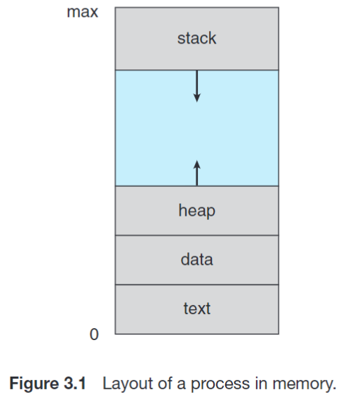
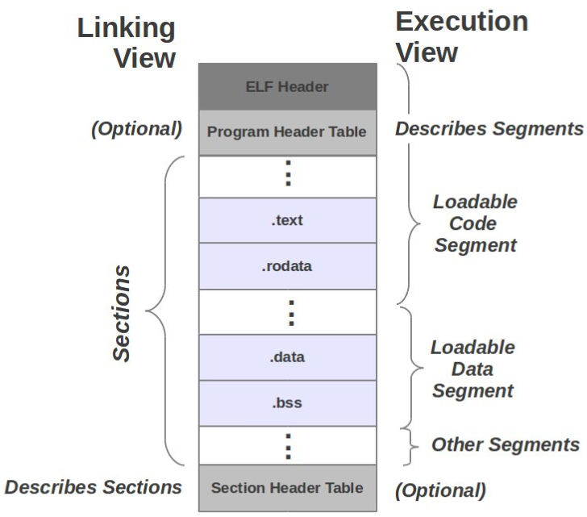
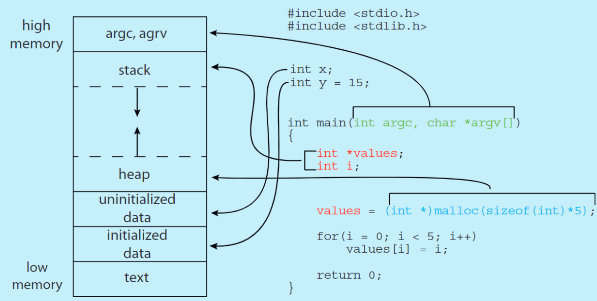
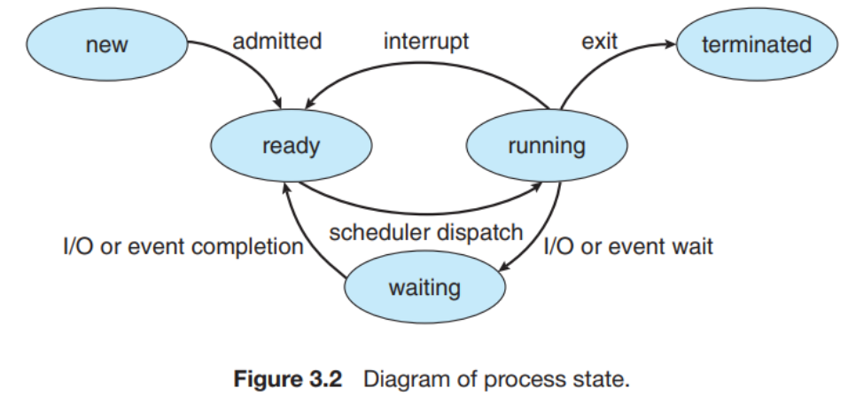
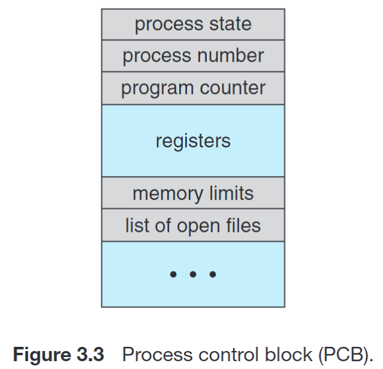
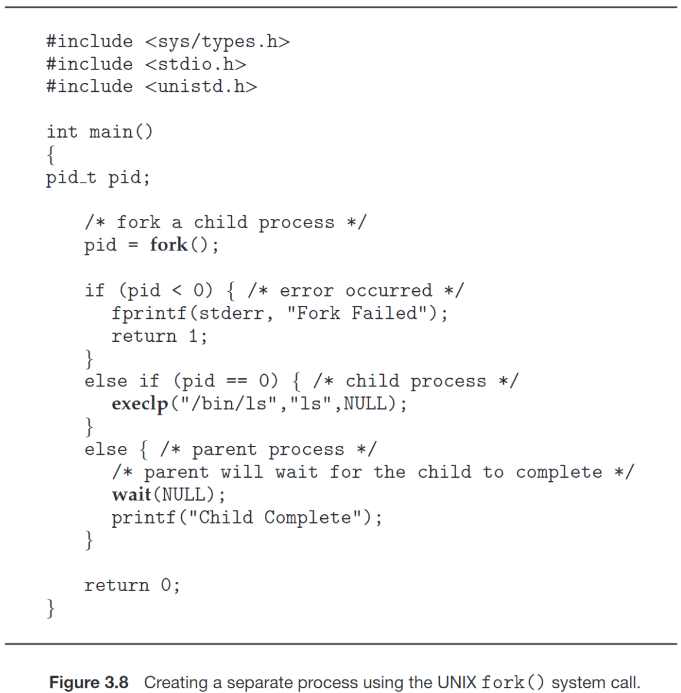
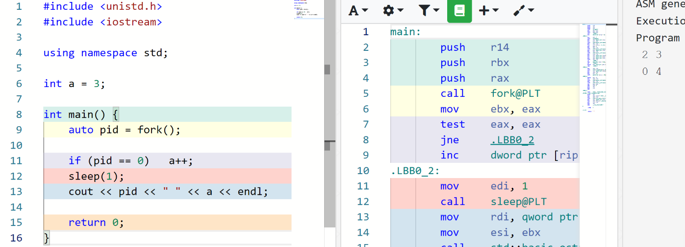
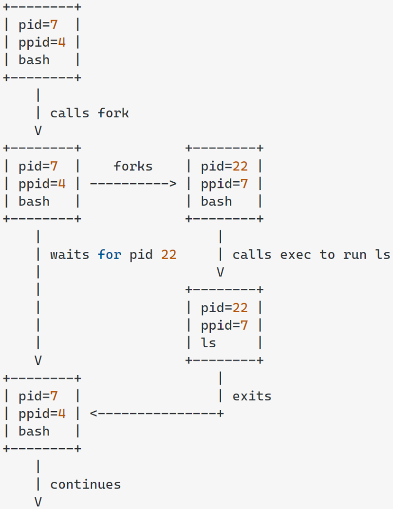
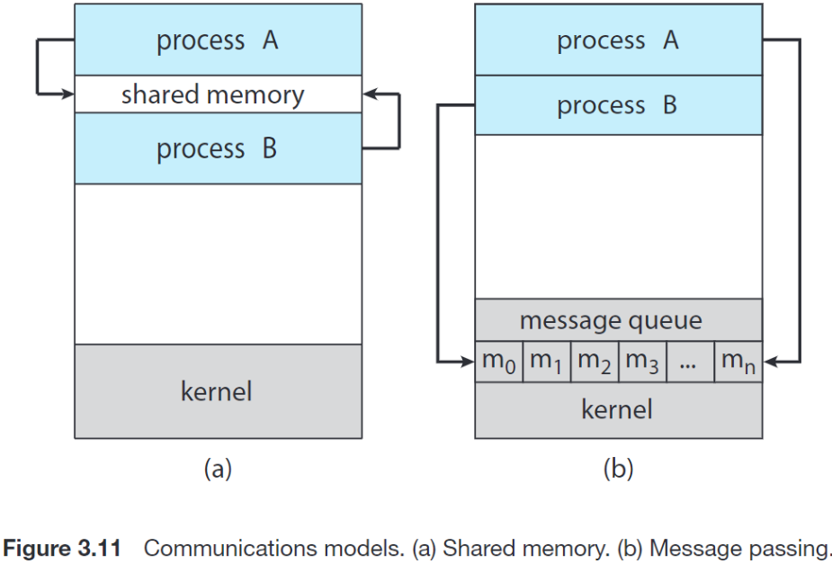

# 3 Processes | 进程

## 3.1 进程是啥

**进程 (Process)** 是被加载到内存中、正在运行的程序。多个进程可能对应同一个程序。一个正在运行的 OS 中会有多个进程。进程是程序的一次执行过程，是操作系统分配资源的基本单位。

!!! Tips ""
    由于历史原因，**进程 process** 和 **作业 job** 这两个概念可以认为是等同的。

### 3.1.1 进程的组成

一个进程包括：

- **code** or **text** 
    - 即程序代码，加载到内存前以 executable file 的形式存储在 disk 中
- **program counter** 
    - PC，指向下一个要运行的指令
- content of the processer's **registers** 
    - 在进程之间切换时，需要保存寄存器的值以便下次回到该进程时继续运行
- **run time stack** 
    - 在 ICS 和汇编语言中学习过相关内容。其中的条目称为 activation records (stack frames)
    - 由用户代码操控（编译时完成关于栈的相关调用），在调用函数时暂时存储一些数据，如 local variables, return address, return values, state of registers, parameters 等
- **data section** 
    - global variables
- **heap** 
    - dynamically allocated memory

{width=200}

??? Info "ELF (Executable and Linkable Format)"
    
{width=400}

    .data: 初始化了的静态变量
    
    .bss: block starting symbol，未初始化的静态变量。ELF 里只会存这个段的长度，加载到内存时会占用对应大小的空间，初值为 0

    
{width=500}

### 3.1.2 进程的状态

进程在执行 (execute) 时会改变状态 (state)：

{width=400}

一个处理器上，只有一个进程可以 running，更多的进程可能处于 ready 或 waiting 状态。

### 3.1.3 进程控制块

操作系统用一个 **Process Control Block (PCB, a.k.a. task control block)** 表示进程，每个进程有且仅有一个 PCB。

PCB 包含许多当前进程的相关信息，如：

   - **Process state** 
   - **Program counter** 
   - **CPU registers** ，存储所有进程相关的寄存器的值
   - **CPU scheduling information** ，properities, scheduling queue pointers, etc.
   - **Memory-management information** 
   - **Accounting information** ，CPU 使用时间、时间期限、记账数据等
   - **I/O status information** ，分配给进程的 I/O 设备列表、打开文件列表等

{width=200}

不同的系统可能有不同的 PCB。Linux 中的进程用结构体 `task_struct` 存储。

## 3.2 进程的创建

大多数操作系统通过一个唯一的 **进程标识符 (process indentifier, pid)** 来识别一个进程。一个进程在运行时可以创建新的进程，则它成为父进程，新建进程称为子进程；父进程的 pid 称为子进程的 **ppid (parent's pid)** 。这样进程会成为一个 **进程树 (process tree)**：

{width=400}

当子进程被创建时，它会需要一定的资源（CPU 时间、内存、文件、I/O 设备等）来完成任务。它可以从操作系统那里直接获取资源，也可以从父进程那里继承（共享）一些资源。建立子进程时，父进程也可以向子进程传递一些初始化数据，例如父进程创建一个显示图片的子进程时，可以将该图片的路径或文件名等传递给子进程。

UNIX 系统中可以使用系统调用 `fork()` 来创建一个新进程。这个新进程是父进程的一份拷贝，它们只有 pid 和 ppid 不同，另外子进程当前内存使用记录为 0，除此以外全部相同。 `fork()` 对父进程返回该子进程的 pid，而对子进程返回 0。

{width=400}

??? info "`fork()` 如何对父进程和子进程返回不同的值？"

    一种实现方式是，在进入 `fork()` 时存下当前的 pid，在建立新进程后（此时存下子进程的 pid），父进程和子进程都将分别完成 `fork()` 剩余代码的执行。在进行返回时， `fork()` 检查当前的 pid 与前面存下的是否一致，如果一致则说明当前是父进程，返回子进程的 pid；不一致则说明是子进程，返回 0。

也就是说，当进程创建新进程时，父进程可以

- 继续运行（和子进程并发执行，即同时或者交替运行），或者
- 等待子进程运行完后再运行

子进程的地址空间有可能

- 使用父进程的一份拷贝，或者
- 加载另一个新的程序

??? question "为什么要拷贝一份呢？"

    考虑这样的代码：https://godbolt.org/z/78a8sTKhP
    
    
{width=600}

    
    子进程虽然和父进程跑的是一样的代码，但是不应当使用同一份数据。

聪明的小朋友可能会问了，上面这种代码，child 将当前地址空间拷贝一份岂不是很浪费吗？因为根本没有用到。确实如此，因此部分 UNIX 的实现引入了 copy-on-write 机制，将地址空间的复制推迟到任何一个进程需要写入的时候再进行。

UNIX 对启动新进程的逻辑是简单的。fork 的意义就是制造当前进程的一个副本，而 exec 的意义是用一个新的程序替代当前的进程[^1]。

{width=300}

!!! info ""
    系统调用 `getpid()` 和 `getppid()` 可以分别获取进程的 pid 和 ppid。

[^1]: https://stackoverflow.com/questions/1653340/differences-between-fork-and-exec/1653415#1653415
    

## 3.3 进程的终止

系统调用 `exit()` 会使得进程终止。C 语言 main 函数返回时也会隐式地调用 `exit()`。除此之外，进程也会由于一些信号、异常等终止。

前一节中的代码中展示了 `wait()` 的系统调用，它使得当前进程进入 waiting 状态，并在任一子进程终止，或被信号停止，或被信号恢复时进入 ready 状态，同时返回发生该事件的子进程的 pid。

当一个进程终止时，它进入 terminated 状态，它的资源被操作系统回收。但是，操作系统仍然会保存一些信息（例如 PID，结束状态，资源使用情况等[^2]），因为父进程有可能会需要调用 `wait()` 来获取其一些信息。当子进程已经终止，但父进程在忙，还没有调用 `wait()`，我们称这样的子进程为 **僵尸进程 (zombie processes)**，因为前述信息仍然占据了进程表中的一项；如果表满了，就不能创建新的进程了。

[^2]: https://man7.org/linux/man-pages/man2/waitpid.2.html#NOTES

当子进程没有结束，或者终止了但父进程没有调用 `wait()` 的情况下，父进程就结束了，子进程就会成为 **孤儿进程 (orphan processes)**。一些操作系统会将孤儿进程一同终止掉，但是 UNIX 的做法是让 init 进程收养它们，即 init 进程成为其父进程。init 进程会定期调用 `wait()`，从而收集孤儿进程的退出状态，并释放进程表条目。

??? info "守护进程"

    所以，如果我们想创建一个 **守护进程 (daemon**，在后台运行的、生存期长的进程，例如 host 一项服务等 **)**，我们可以 fork 两次，让 grandchild 执行对应任务，而 child 直接终止，这样 grandchild 就会成为孤儿从而被 init 收养。

## 3.4 进程间通信

**进程间通信 (IPC, InterProcess Communication)** 是为了在进程的资源相互隔离的情况下，让不同的进程能相互访问资源从而协调工作。

​主要有两种方式：**共享内存 (shared memory)** 和 **消息传递 (message passing)**。

{width=400}

- **信号量 (semaphores)** 本意用来线程间同步，但是可以通过 sem_open() 系统调用来建立和维护进程间的信号量；这样的信号量属于 OS 资源，它会在相关进程结束后由 OS 释放[^3][^4]。
- **共享内存** 的实现是，两个进程各自有一块虚拟内存，映射到同一块物理内存。共享内存也需要信号量等同步手段保护。
- **​共享文件**。
- **​管道 (pipe)**。管道的实现其实也是文件，创建管道时操作系统会返回两端的文件描述符；逻辑上实现的是一个半双工的信道。
- **​消息队列 (message queue)**。为什么需要消息队列呢？共享文件显然很慢，而共享内存比较难适用信息大小不等、信息读一次就失效等场景，且共享内存需要同步手段。消息队列可以解决这些问题。
    - 消息队列，其实就是操作系统维护的一个一个的链表，进程可以新建或者连接到一个消息队列，并写入消息，或读取第一条满足一定条件的消息[^5][^6]。
- **​Socket**。TCP / UDP，适用于双方不一定在同一个计算机上的情况。

[^3]: https://www.man7.org/linux/man-pages/man3/sem_open.3.html
[^4]: https://stackoverflow.com/questions/65390563/does-sem-open-allocate-memory
[^5]: https://www.tutorialspoint.com/inter_process_communication/inter_process_communication_message_queues.htm
[^6]: http://www.science.unitn.it/~fiorella/guidelinux/tlk/node57.html