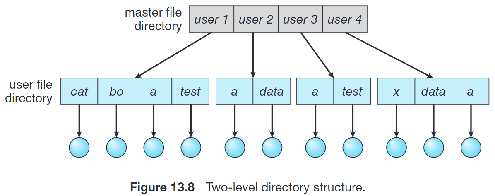
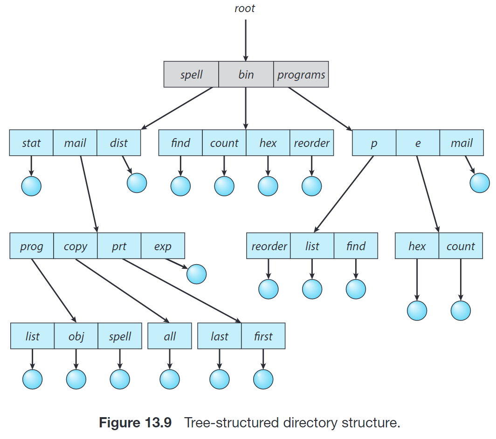
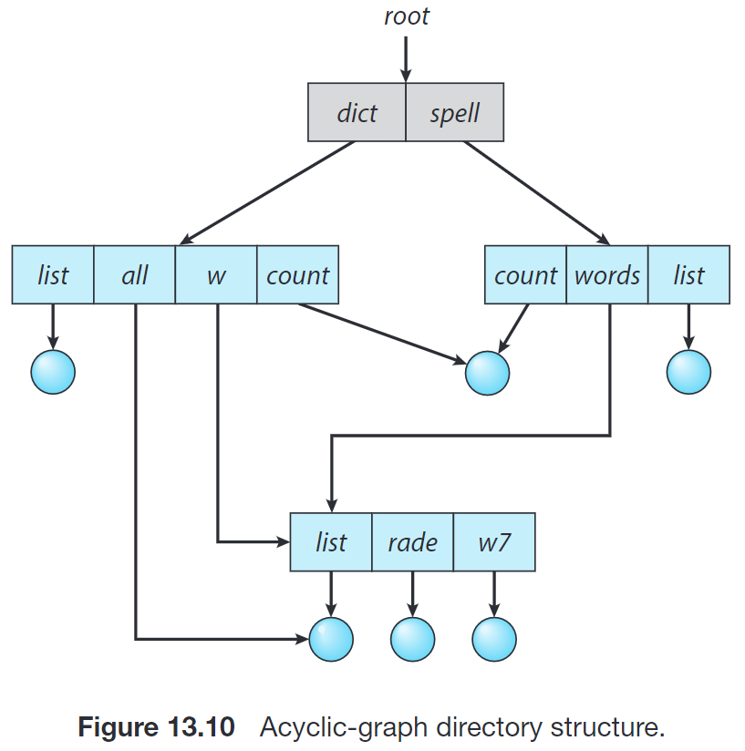
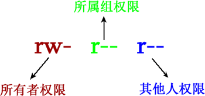

# 13 File System Interface | 文件系统接口

在 V 存储管理 中，我们讨论了大容量存储和 I/O；这一部分中，我们讨论如何使用这些存储。

在本章中，我们主要讨论文件系统提供的功能；在下一章中，我们具体讨论文件系统的实现。

**文件系统 (file system)** 提供了 disk 的抽象，给用户提供存储的逻辑视图。文件系统由两个部分组成：**文件 (file)** 的集合，每个文件存储一些数据，是存储的逻辑单位；以及 **目录结构 (directory structure)**，用于组织系统内的文件并提供相关信息，例如提供权限信息以实现一些保护。

## 13.1 Files | 文件

文件由操作系统映射到物理存储设备上；在 Unix 中就是一块连续的字节。由于前述存储设备通常是非易失性的，因此文件内容在断电后也能保持。

文件是用户和程序用来存储和获取信息的途径。从用户角度来看，文件是逻辑外存的最小分配单元；也就是说，数据只有通过文件才能写到外存。

文件有不同的类型，例如数据文件、可执行文件等。数据文件又可能是 numeric, alphabetic, alphanumeric, binary 的。

### 13.1.1 文件属性

不同的操作系统可能会保存不同的文件属性 (attributes)，但是通常包括：

- **Name**。这是唯一的以 human-readable 形式保存的信息。
- **Identifier**。一个在当前文件系统中唯一的 tag（通常为 number），文件系统用它来标识文件。
- **Type**。一些文件系统支持不同的文件类型。
- **Location**。标识文件在哪个设备的哪个位置。
- **Size**。当前文件大小，也可能包含文件允许的最大大小。
- **Protection**。Access-control information。
- **Timestamp**。保存创建时间、上次修改时间、上次使用时间等。
- **User indentification**。创建者、上次修改者、上次访问者等。

一些文件系统还支持 **extended file attribute**，例如 file checksum。

这些信息是前述 目录结构 (directory structure) 的一部分。

### 13.1.2 文件操作

操作系统可以提供相关的系统调用来完成一些基本的文件操作，例如：

- **Create**。在 FS 中为文件找到空间，然后在 directory 中创建条目。
- **Read / Write**。维护一个 **current-file-position pointer** 表示当前读写的位置，在对应位置上做读写操作（从磁盘读到内存或者相反）。
- **Repositioning within a file (a.k.a. Seek)**。将 current-file-position pointer 的位置重新定位到给定值，例如文件开头或结尾。
- **Delete**。在 directory 中找到对应条目，释放文件空间，删除对应条目。
- **Truncate**。清空文件内容，但保留文件属性。

#### 文件打开

**Open**。返回一个 handler 用来执行其他操作。

可能会把文件放在 **打开文件表 (open-file table)** 中以便索引，直到 **Close**。

可能允许一个文件被打开多次，因此在打开文件表中可以维护一个 **file-open count**。

#### 文件锁

一些 FS 也会提供 **文件锁 (file lock)** 来协调文件访问，例如允许一个进程锁定文件来避免其他文件访问它。

文件锁类似于第 7 节中讨论的 reader-writer lock。有的 FS 提供两种锁：**共享锁 (shared lock)** 类似于 reader lock，**独占锁 (exclusive lock)** 类似于 writer lock。有的 FS 只提供独占锁。

同时，文件锁也有两种可能的机制，由操作系统决定。一种是 **强制锁定 (mandatory lock)**，即一旦进程获取了独占锁，操作系统就阻止任何其他进程访问对应文件，即操作系统本身确保了完整性；另一种是 **建议锁定 (advisory lock)**，即进程可以自己得知锁的状态然后决定要不要坚持访问。Windows 使用前者，而 UNIX 使用后者。

也应当采取措施，来确保不会出现死锁。

### 13.1.3 文件类型

文件有不同的类型。操作系统可以选择是否需要识别不同的文件类型。

识别不同文件类型的方式之一是 **文件扩展名 (file extension)**；例如规定只有扩展名是 `.com`, `.exe`, `.sh` 的文件才能执行。

另外，也可以通过在文件开始部分放一些 magic number 来表明文件类型；但是由于不是所有文件都有 magic number，因此系统不能只基于这种方式判断文件的类型。

也可以采用的一种方式是，操作系统不试图识别文件的类型；当用户尝试运行一个文本文件，或者试图用文本编辑器打开一个二进制文件时，会照常按照预期的编码方式解析；但操作系统以及打开这个文件的应用程序本身的安全设计使得这样的操作不会带来太坏的后果。

UNIX 允许文件扩展名的提示，但是扩展名主要是帮助用户来确定内容类型；操作系统本身并不强制文件扩展名，也并不依赖这些扩展名。应用程序的开发者可以选择是否忽略文件扩展名。

### 13.1.4 文件结构

文件可以有不同的结构，由操作系统或者用户程序定义。

最简单的是 **无结构 (no structure)** 文件，它只是 a stream of bytes or words。例如 UNIX operating system defines all files to be simply
streams of bytes。

另外也有 **simple record structure** 文件，以 record 为单位，每个 record 可以是定长或者变长的，例如数据库。

还有 **complex structures** 文件。例如 Microsoft Word 文档。

## 13.2 Access Methods | 访问方式

我们讨论有哪些访问文件信息的方式。

最简单也最常见的访问方式是 **顺序访问 (sequential access)**。就像磁带那样，逐字节或者逐 record 地访问。

另一种方法是 **直接访问 (direct access)** 或称 **相对访问 (relative access)** 或称 **随机访问 (random access)**。即支持以几乎相同的时间访问任意位置。

在直接访问的方法之上，还有可能提供索引，即先在索引中得知所需访问的内容在哪里，然后去访问。也有可能使用多层索引表。

为了防止索引表过大，也可能引入 **索引顺序访问 (Indexed Sequential-Access)**，即像字典那样确定所需访问的内容在哪一块，再在对应块中顺序寻找。

## 13.3 Directory Structure | 目录结构

如我们之前所说，directory 中包含了文件的很多信息；directory structure 应当实现新建、删除、查找、遍历、列出目录中的文件等基本操作。同时，设计也应当兼顾效率、便于使用、便于按一些属性聚合等要求。

### 13.3.1 单级目录

最简单的目录结构是 **single-level directory**，即将所有文件都包含在同一目录中：

{width=300}

这种实现方式的问题是，当文件数量增加时，并没有有效的方法来查找或者给文件分组（例如找出所有的 Java 程序）。

同时，由于所有文件位于同一目录下，因此它们的名称必须是唯一的。在有多个用户时，这种需求是不太合理的。

### 13.3.2 两级目录

**Two-level directory** 为每个用户创建自己的 **用户文件目录 (User File Directory, UFD)**；这些 UFD 聚合成为 **主文件目录 (Master File Directory, MFD)**，当用户登录时，操作系统从 MFD 中找到用户的 UFD。

这种实现方式一定程度上减少了文件数量多的问题，同时不同用户也可以分别创建同名的文件了。但是分组仍然没有支持。

{width=300}

用户 1 访问自己的文件，可以直接通过 `test` 的方式访问；为了访问其他用户的文件，需要通过 `user2/data` 的方式访问。这样的实现方法其实是把二级目录视作一棵高度为 2 的树。

### 13.3.3 树形目录

**Tree-Structured Directories** 是上面方案的自然推广。在这种实现方案中，目录本身也被放在父目录的一个条目中；每个条目有一个 bit 来表示这个条目表示的是一个文件还是一个子目录。目录也被认为是一种特殊的文件。

{width=400}

在正常使用时，每个进程有一个 **当前目录 (current directory)**；当用户指定一个文件名时，就在当前目录中寻找。用户也可以通过系统调用 `change_directory()` 来更改当前目录。

如果所需目录不在当前目录，那么用户就必须提供一个 **路径名 (path name)**，表示在这棵树上如何走可以找到所需的文件。路径名分为两种：

- **绝对路径名 (absolute path name)**，表示从根开始到指定文件的路径，例如 `/bin/count`, `programs/p/list`；
- **相对路径名 (relative path name)**，表示从当前目录开始的路径。

当删除一个目录时，一种设计思路是不允许删除非空的目录；另一种是，删除目录下的所有文件（包括子目录）。

### 13.3.4 无环图目录

**Acyclic Graph Directories** 在上面的方案的基础上支持了目录共享子目录或者文件：

{width=300}

一种实现方式是，引入一个名为 **链接 (link)** 的新的目录条目类型，表示另一个文件或者子目录的指针。在遍历目录树时，操作系统忽略链接以维护系统的无环结构。

这个指针的实现方式之一是用链接文件来记录指向文件的绝对或相对路径，这种方式称为 **符号链接 (symbolic link)** 或者 **软链接 (soft link)**。当访问这种文件时，操作系统通过该路径名来 resolve 链接，从而定位真实文件。

这种方式存在的一个问题是，如果删除一个被某个 soft link 所引用的文件，则会留下 **dangling pointer**，即那些 link 现在指向并不存在的文件。UNIX 和 Windows 采用的方式是，当真实文件被删除时，并不试图处理这些 link；用户在试图访问这些 link 时会发现真实文件已经被删除。

另一种实现方式是复制被引用文件的所有信息，放在当前目录中。由于这里的「信息」中也包含文件存储在外存中的哪个部分，因此事实上这个新的条目和被引用的条目指向的是同一个文件。这种方式称为 **硬链接 (hard link)**。这个链接和原文件本身相同且相等，因此可能没有办法区分它们。这种实现的主要问题是，在修改文件时要维护一致性，即需要在所有包含这个文件的目录中更新对应的信息。

这种实现给每个文件引入了一个 **引用计数 (reference counter)**；在每个文件被创建一个新的硬链接时，该计数 +1；而删除一个硬链接或原文件本身时，该计数 -1。当计数为 0 时，文件可以删除。

UNIX 同时支持上述两种链接。为了维护无环图结构，hard link 不允许引用目录，而 soft link 可以。

### 13.3.5 通用图目录

**General Graph Directory** 允许目录中有环。这会使得遍历图的算法更加复杂，因为需要避免重复遍历一些部分。同时也会给确定何时可以删除某个文件或者目录带来麻烦，因为可能存在的相互引用或者自我引用会使得在没有可能引用一个目录或文件时引用计数也不为 0。

为了解决这种问题，通常需要使用 **垃圾回收 (garbage collection)** 方案来确定哪些文件可以删除。这是非常费时的。

## 13.4 FS Mounting | 文件系统挂载

Directory Structure 可以构建在多个 volume 上，这些 volume 必须先 **挂载 (mount)** 到文件系统的某个位置，这个位置称为 **挂载点 (mount point)**。

例如，下面右图展示了左图的 volume 被挂载到 `/users` 下的结果：

{width=300}

## 13.5 Protection

文件的所有者或者创建者应该有权限决定哪些用户有权限做哪些事情。

给每个文件和目录维护一个 **Access Control List (ACL)**，指定每个用户及其允许的访问类型。为了精简 ACL，可以将用户分为不同的类型。

UNIX 将用户分为了三类（owner, group, others)，并将文件访问也分为了三类 (read, write, execute)：

{width=300}

??? info "root 的权限"
    当一个文件的 read 或 write bit not set 时，root 用户仍然能够读或写它。

    当一个目录的 execute bit 对于一个用户所在的分类 not set 时，该用户不能进入该目录；但是 root 用户可以。

    但是，如果一个文件对三类用户的 execute bit 均 not set 时，这个文件被认为不是可执行的，因此 root 用户也不能执行这个文件。[^1]

    [^1] https://unix.stackexchange.com/questions/43263/why-cant-root-execute-when-executable-bits-are-not-set