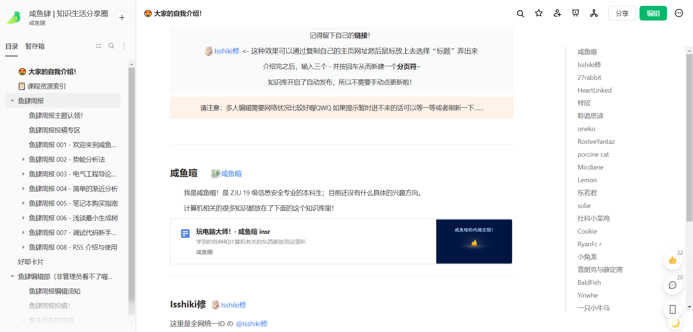
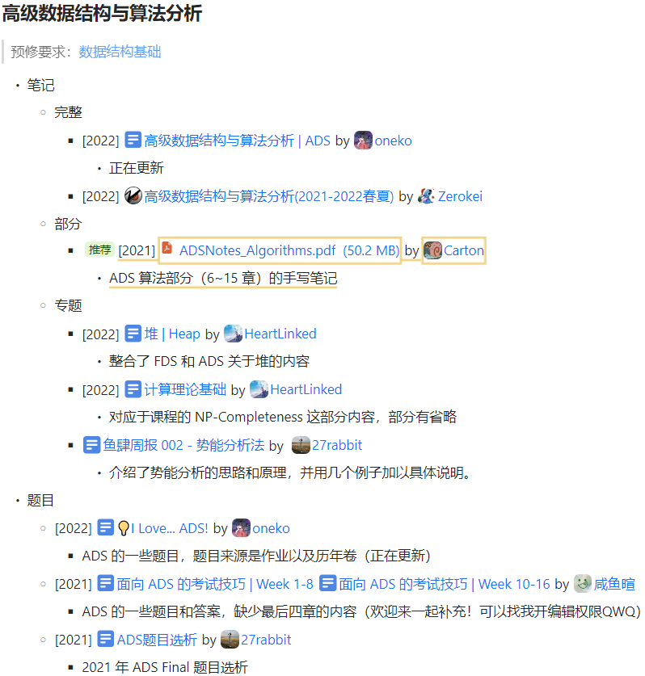
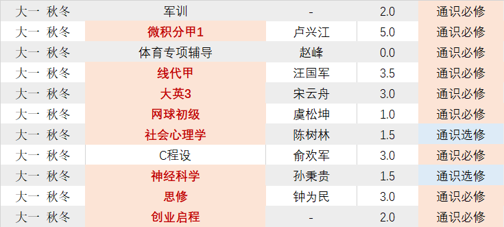
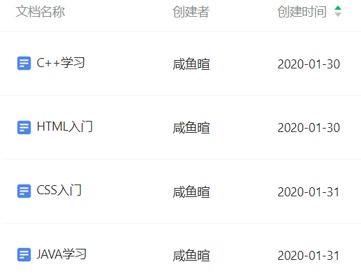
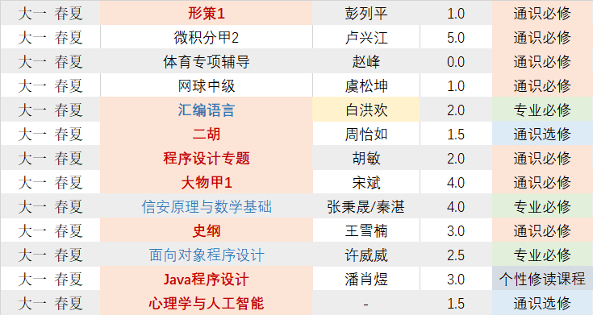
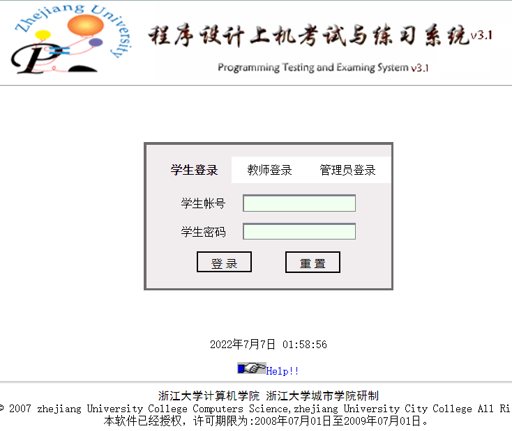
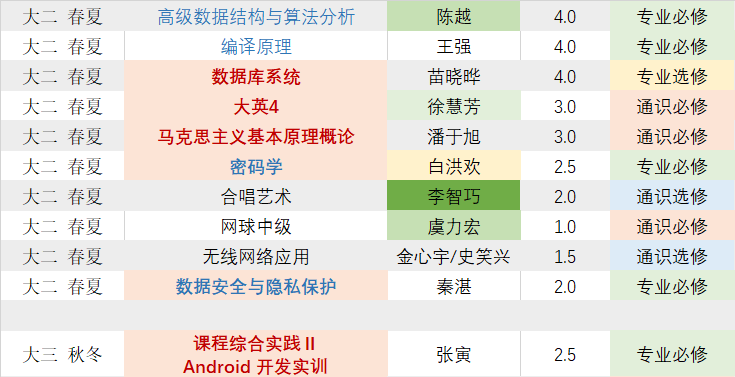

## 回顾在信安的三年

!!! abstract
    俺叫咸鱼暄！ZJU 19 级信息安全本科生！

    写这篇总结，最核心的目标是给自己看😋 同时，我也希望能提供一点点这样的功能：

    - 让有兴趣的同学了解信息安全专业学什么（课程名标注 ▲ 的是信安专属课程~），并提供一些可以参考的资料
    - 分享我认为我们的信息安全专业的利弊，供需要选专业的同学参考
    - 分享我认为目前计算机相关本科教学的一些问题，以及我想做的努力（打打广告——）

    本文总字数不到一万字，我也不知道要看多久。

---

> “都说条条大路通罗马，可是我不想去罗马。”

---

2022 年 7 月 5 日凌晨，最后一门专业必修课的成绩出来了，~~我可以去合圣遗物了~~  我在信息安全专业主要的三年大概就结束了🤔说起来，这三年比较迷茫，没有像很多人那样去进个实验室或者搞个科研之类的。但是无论如何，还是值得回顾一下的啦！
回顾的同时，也想简单~~锐评~~介绍一下一些课程；难免会带一些个人的偏见🤧万一有人会看的话图一乐就好啦QWQ 如果能够让后来的小朋友大概看看信安到底是什么，也算是有点用处啦~（不过其实主要还是写给自己看的😘）

另外，这里也有我选过的所有课程和对应的老师，如果希望了解某门课也欢迎来问qwq

## 把总结写到前面吧

### 关于信息安全专业

在大一我怀着迷茫进入了信息安全专业，在大二的时候我对这个专业产生了种种负面评价和情绪，但是在大三我又体会到了这个专业的优势。

在信息安全专业，最难过的一点就是  **保研有时过于困难** （在大三上结束的时候，我的均绩是 4.50，但是只能排在 20%，大概就是保研名额的最后一名；但是如果在计科，大概能排在 13%）——我觉得这大概是一个随机导致的事件：由于信息安全专业的人太少，出现厉害同学的频率就不是那么符合期望了；而计科那边人很多，几位神仙不会太影响最后的保研绩点。而且，出于众所周知的原因，信安专业选择出国的同学比例应该比计科少不少。在计科那边排名靠前的同学选择出国就会为后面的同学让出保研名额；而信安这边一方面出国同学少，另一方面由于前述的原因，选择出国的同学并不都会付出大量精力来把 GPA 弄到 4.5+，因此似乎也并不能够额外留出名额。

同时，由于大三下学期有活活 5 门专业必修课，因此  **大三下学期很难出去实习** ，这对于希望实习或者就业的同学来说可能也会带来困扰。

在大二和大三开始，我甚至会根据上述两点 ~~劝退~~ 告诫想要选择信息安全专业的同学；但是经过大三一年，我突然发现了信安的美好！相较于计院很多传统课程存在的 大本钟下送快递 上面开摆下面寄 的悲惨状况，信息安全专业引入的新课程大多比较  **舒适、高质量和现代化**  ——主要是因为老师都比较年轻，更加热情负责，愿意和同学们讨论；课程也大多不像计院经典课程那样有老本可以啃；助教配备也比较丰富和专业。虽然小白老师的汇编语言和密码学在大一大二完全摧毁了我对信息安全的兴趣，但是大三的几门安全课让我重建了对安全的理解和一点点爱好！
另外根据我的观察，如果只是以通过为目标，信安相关的课程比传统计算机课程似乎更容易通过，同时能够学到更多的内容。不过，诸如软件安全、系统安全这样的课程，确实需要一定的思考、交流和“灵光一现”，个人认为难度和含金量也会比传统计算机课程高一些。

另外值得提及的一点是  **培养方案的变化** 。从 18 级到 19 级，培养方案变得更不像计科，课程有了一番更新，模块课也全部变成了信息安全的形状；从 19 级到 20 级，计算机系统 I ~ III 横空出世，让人非常羡慕🥵。21 级开始似乎就没有内容上的变化了。大概也可以认为，经过这几代小白鼠的尝试😋培养方案大概能够稳定下来了，而这些课程的质量似乎也比传统计算机课程的大多数教学班高不少😜

### 这三年学习中让我感到难过的地方，以及想做的努力

> 预警：这部分有广告🤫

总结来说，大部分的课我是喜欢啃书、看 PPT 自学而不是听课的，所以在节省了一些时间的同时也错过了很多有趣的知识。这也是我认为自己不怎么卷也不是怎么摆的原因——除了真正有兴趣的内容之外，学的其实都比较少qwq

这几年中，让我最迷茫的是：大家都在告诉我可以去做 SRTP、可以早点进实验室。但是，至今没有人给我讲过具体的研究有哪些 **方向** （比如从来没有人告诉过我可以去研究 NLP 或者编程语言或者什么其他的东西），这个方向在干什么、应该学什么、怎么学（不然我们如何判断这个方向适不适合自己呢？）；但是我认为这些是大一或者大二的时候就理应被告知的东西（不然我们如何选择 SRTP、实验室和毕设的方向呢？）。

同时，由于众所周知的原因，C 小程、大程这种基础课以及传统计算机课程的大部分教学班的 **教学质量相当有待提高** 。小角龙学长 (@Zhang-Each) 在去年也分享过一些 [对软工本科教学的建议](https://www.cc98.org/topic/5215387)，其中也涵盖了前述的大多数课程；虽然以数据库系统为例的部分课程有所改善，但是大多数课程仍然“非常遗憾”。所以，事实上，我认为这些课程的遗憾现状相当程度上来自于制度和部分老师，而 **这是我们难以动摇的** 。

我认为，上述问题能够划归到如下几类：

1. 部分课程内容和/或考核范围、方式不合理（点名 C 小程）
1. 部分教学班基础编程能力培养不到位（再点名 C 小程）
1. 部分课程的 PPT 内容水平以及部分教学班配备的 PPT 朗读专员水平有待提高
1. 部分课程的实验设置过于古色古香
1. 关于科研的课外引导紧缺

根据刚才对遗憾的讨论，这里第 1 点很难改善，但是后面四类似乎都有改善的方法。

关于第 4 点，[CS 自学指南](https://csdiy.wiki/)、 [名校公开课程评价网](https://conanhujinming.github.io/comments-for-awesome-courses/)等公开课选择指南提供了不错的解决方案！学这些课程能够加强对相应课程的学习，并且可以接触国内外先进的实验设计，而且似乎还能为建立增光添彩（不过我因为懒几乎没学过😔）。但是，这仍然不完全能够解决第 3 点——除非你是真正的强者，只追求知识不管绩点！

关于第 3 点，在大二开始，我希望通过在 [玩电脑大师！· 咸鱼暄 insr](https://www.yuque.com/xianyuxuan/coding?view=doc_embed)  **记笔记并共享** 的方式来帮助大家学习部分课程，似乎也帮到了一些同学😘：

慢慢地，我发现周围愿意在语雀记笔记的同学变得多了起来；但是语雀本身社区属性比较弱，于是在两个月之前，我和 @27rabbitlt 、@IsshikiHugh 一起攒起了 [咸鱼肆 | 知识生活分享圈](https://www.yuque.com/xianyuxuan/saltfish_shop?view=doc_embed) **（欢迎大家加入！）** ，希望通过让大家留下自己的简介和博客地址（不一定是语雀）的方式来 **增强大家的互动和互相学习** ：

为了进一步改善前述第 3 点的问题，大家也在 [📔 课程资源索引](https://www.yuque.com/xianyuxuan/saltfish_shop/course_res_index?view=doc_embed) 分享出了自己 **泛计算机相关课程的笔记链接** ，从而能够增强互相的参考交流。以 ADS 为例（因为这个最多😝）：

（课程资源索引的核心目标是分享用来学习的 **笔记** 而不是文件资料。欢迎有兴趣的前辈分享自己的笔记QWQ！）
不过，课程资源索引目前主要都是课程笔记，而比较稍有之前所说国内外优质公开课的学习笔记。如果能够收集到这些笔记，也许能够提供更大的帮助 QWQ！

同时， [咸鱼肆 | 知识生活分享圈](https://www.yuque.com/xianyuxuan/saltfish_shop?view=doc_embed) 还通过 **周报** 的方式增强互动，分享大家喜闻乐见的 **知识或者科普内容** ：

关于第 2 点，我们希望通过一期专题周报收集一些好资料和解决方案。

而为了解决第 5 点的问题，咸鱼肆尝试在暑假开始收集整理泛计算机相关的 **科研方向和工作岗位方向的列表** 。如果时间和资源允许，在未来还会考虑收集这些方向进一步的 **介绍、学习路径以及学习资料** 。

关于这两个内容， **如果有前辈愿意分享相关心得，也欢迎加入或联系我们** 🤤！

---

> 下面就是按照时间的回顾和总结啦！

## 大一上  我来到了信息安全专业

### 主修专业确认

主修专业确认来得太过匆忙，当我们对专业几乎一无所知的时候就不得不做出选择。好在，高中时我就已经确信了自己对编程的兴趣，也就划定了最初的范围：计科 / 软工 / 信安。
其实在确认专业的时候，我准备了两份材料，分别是计科和信安的；没选择软工是因为学费贵。最终我选择了信安，是因为害怕在计科激烈的竞争中被刷掉。

### 最初的印象

来到信安后，班里的大家也就成为了网友。由于专业人比较少，只有二十来个，所以群里的氛围似乎也比计科那边要密切一些。我好像一直都是群里最大的水怪——也不知道有没有给人带来过困扰 QWQ

这也是我对信安最初的印象——大家都很好玩，也没有像室友的计科班群那样死气沉沉 (x) 不过当时没有意识到的是，这也许只是个体差异🤒就像之后更多的“个体差异”带来的困扰一样。

### 第一个学期，有点迷茫

大一上学期没上什么有价值的课，选的课很少、没有人一起学也没有人带，导致有一点点摆烂。课也不怎么去，到最后作业都不怎么交了，线代期末前夜在还有两章没看的情况下竟然能够安然睡去😪这个学期也喜提大学生涯至今最低的均绩。

#### C 小程

这门课……我申请了免听，但是它的评价和期末考试仍然奇怪得紧。这样的一门课程，成绩构成大头竟然不是写程序，理论题竟然包含那么多无意义的背诵——我觉得可以采取的一个方式是，在读程题以外的部分允许大家使用 IDE 来找到一些答案，就像真正的编程时那样。

我不禁想问，高中那位不是特别会讲课的竞赛老师三天能让我们掌握的基本编程能力，为什么在浙大这样高材生云集的地方有时仍然变得难以企及呢？也许是因为，以类似语文英语应试那样的态度去教授，让大家对着黑板去背、去记一个工具的使用说明，而不是盯着或者至少告诫大家去练习、去使用这个工具而不是去使用它背诵它——我觉得问题就在最开始双方的过度信任，缺乏最初的监督和引导，然后变得畏惧，预设学会这些“很困难”，问题积少成多，就像我当初学物理和微积分那样。

> 修勾 (@IsshikiHugh) 打算在 [咸鱼肆 | 知识生活分享圈](https://www.yuque.com/xianyuxuan/saltfish_shop?view=doc_embed) 总结一些给入门同学的经验，也许能够解决这里的一些问题，改善一些现象。文档仍在筹备中，有兴趣的话可以分享一些自己的心得🥰

## 大一下  疫情在家

### 无聊到自学，入坑了语雀

在那个寒假，疫情开始了，大家也都没有去学校。我（当时因为没有入坑酒馆战棋和原神所以）不太爱玩游戏，在家的时光便格外无聊。事实证明，当人无聊到一定程度的时候，学习真的可以是一件快乐的事。（但是学习微积分不是，因为当时尝试学习微积分失败了。）

当时跟着菜鸟教程简单学习了一下，也第一次接触了语雀，开始了电子笔记之旅。

说起笔记，它只是我自己的一个习惯——对我而言，学习的动力来源于兴趣和成就感；而写出一个完整的文档或者笔记则是非常重要的成就感来源，在初中和高中的时候我就喜欢做这样的事。如果有人愿意看我的笔记那就更好啦——虽然我有时会冠冕堂皇地说这是为了帮助我自己查漏补缺，客观上也确实起到了这样的作用，但是实际上更多是为了满足我那点小小的成就感和虚荣心罢了。

### 这个学期真的选了好多课！

选了课之后最意外的事情是——申请补选了 **Java 程序设计** 和许威威老师的 **面向对象程序设计** （因为寒假大概在菜鸟教程学了一遍了），竟然都给我过了🤧学分一下子来到了 30.5 分。这个学期面对微积分、大物、小白老师的 **汇编语言** 、 **C 大程** 、 **信息安全原理与数学基础** 、Java、oop 的多重轰炸下，心态也偶尔会爆炸。幸好是在家，不需要去教室假装听课，节省了很多通勤时间和逢场作戏的精力，可以把除了打游戏、睡觉、水群和品尝家乡美食以外的时间更多地放在学习上，成绩也渐渐有了起色。

#### Java 程序设计

这门课是外专业的计算机类通识课程，选来本来是想刷刷分，但是被理论考试题爆杀😑在这门课程中我第一次折服于我们课程的古色古香！因为已经结课，现在已经进不去这个系统了，但是这个系统真的是古老到披上个斗篷就能给白雪公主送苹果的程度🙄

不必说那只能看到得分不能看到哪道题错了的作业和模拟考试系统，也不必说和 C 小程以及 Python 一样的刁钻理论题，更不必说甚至要用 word 交的编程作业……这门课让我再一次回顾 C 小程看到的情景，甚至更甚。

#### 面向对象程序设计

很庆幸在大一下把这门课上了，不然大二上就只能被 ljj 先生摧残了。这门课似乎不同的学期难度差别很大，不同的老师的作业和大作业也不太一样，不知道是为什么。许威威老师事少给分好，还蛮不错的。

在学这门课的时候，我啃完了《C++ 编程思想》的第一卷。这本书算是众多黑皮书里翻译的还算不错的了，也不是很厚。从中我对 C++ 面向对象有了初步的理解，把笔记记在了 [1 C++面向对象](https://www.yuque.com/xianyuxuan/coding/cpp-oop?view=doc_embed)。不过在后来的学习和面试中发现学到的还是太浅了，一直想进一步深入学习一下但是还一直在拖延🙃我真的是拖延症重度患者……

#### 汇编语言

这门课是小白老师开给图灵班和信息安全的必修课，和隔壁的那个通识课不完全一样。但是疫情线上上课，小白老师就录了一份，两个班都放这一份！要是我我也这样🤣

小白老师删回放确实带来了不小的困扰，但是困的也不是特别扰，毕竟他就算不删我也不会看的😜我一直喜欢通过阅读而不是听课来学习。

我个人不太喜欢小白老师，一方面因为删回放确实比较特立独行，另一方面教学的内容有点复古和过于追求细枝末节。我理想的汇编语言课程应该是像 **计算机系统概论** 那样用一个非常简单的指令集讲清楚汇编语言的基本思想，类似 8086 这样的实例可以作为了解内容或者作业内容，放到考试里的话至少给个 cheat sheet。个人认为闭卷去考一些指令的作用甚至是`int 3`的机器码这种题目，就像 C 小程的一些理论题一样确实没什么价值。如果要为软保打基础那不如直接放到软保里。这样课时也可以大幅度缩短——确实不太理解有一些一天就能学完的课程为什么要拖到一整个学期来上。

说实话，十分庆幸这门课由于疫情原因放到了开学后才考试，因为我在计算机系统概论那门课里才真正学透了汇编。

#### ▲ 信息安全原理与数学基础

我们 2019 级是这门课的第一批小白鼠，这门课被用来代替培养方案中原来的离散数学和概统两门课。这门课和线代一样是那种学了以后不知道干啥用并将长期处于不知道干啥用的课程；不过到了现在，这门课的用处也渐渐显露出来，这门课的笔记 [信息安全原理与数学基础](https://www.yuque.com/xianyuxuan/coding/crs-csmath?view=doc_embed) 也逐渐成了我最常翻的笔记（线代的用处也渐渐显露出来，所以我因为不会线代把机器学习弃修了🤣）。

张秉晟老师真的很帅🤩蛮喜欢他讲课的，虽然说实话也没听多少；但是 PPT 做的很细致，便于学习和阅读。秦湛老师上课稍微有一点点困😉后半个学期那会儿刚好是午后，我仍然记得当时在家里上着他的课点个外卖吃完睡过去时的阳光（对不起我错了我磕一个）。最后考试是比较水的，给分也蛮好的。

#### C 大程

当时上这门课是比较爽的，但是鉴于 C 小程悲惨的教学成果，大多数同学完成大作业有点过于大跃进了；课程中也缺乏基本的引导。不过听说 23 级开始 C 大小程要合并了，就不过多评价了，希望到时候能够改善吧。

顺便，这门课在 2019 年的 project 还比较正常，但是近几年为什么画风变得奇怪了起来……“代码查重”、“简易浏览器”这种内容真的适合做只上过 C 小程的同学们的大作业吗？我不好说。

带了两年朋辈辅学，21年，用六个多小时做了一个小游戏，说实话讲的不是很好，但是尽可能覆盖了这个图形库里能用到的功能：[如何写 C 大程 | 2021 朋辈辅学](https://www.yuque.com/xianyuxuan/coding/cprojt?view=doc_embed)；22 年花了更多的时间去考虑设计的问题，分享了一些如何选题、如何开始、如何设计、具体实现之类的想法，但是都是自己的想法，不知道会不会有帮助：[程序设计专题 2022 朋辈辅学课程内容](https://www.yuque.com/xianyuxuan/coding/c_proj_log?view=doc_embed)。

## 大一短的两门课

短学期，在学长的强力推荐下选了 **计算机系统概论** ，同时和它唯一一个不冲突的课是  **MATLAB 图像处理编程实践初步** ，所以两个都选了。

#### 计算机系统概论

真的是神课！非常到位地把握了一个用来教学的近乎最小的集合，也基本上验证了数逻+计组+汇编这三门课大概 20 个小时就能从 0 基础开始讲的很通透。这门课的老本一直到上计组的时候还可以啃~

我个人是比较喜欢这种教学方式的，从一个类似玩具的架构出发，看懂了这个架构之后再去看 RISC-V 就十分容易了，特别好理解QWQ不像某些课那样，每一个点都事无巨细的讲一遍，大家听了也不知道学了什么，之后要用的时候又忘了，最后也什么都记不住。

不过没有太理解的是 jxh 女士在这门课中发挥的作用（除了黄帕特先生没法在教务系统开课需要挂个名？），不管是沟通、教学还是验收、评分好像都没起到什么正面的作用（即使我不听课，也听到 Patt 先生说了无数次 I've no idea what you are talking about）。

这个课让我体会到了现代的课程的一点味道——有比较丰富的资料和助教资源，虽然 Lab 还并不是自动化批改。如果 Lab 也是自动化批改的话，感觉比某汇编语言课程领先了至少半辈子😇
赞美计算机系统概论！

#### MATLAB 图像处理编程实践初步

算是让自己入门了一个工具，但是这个课基本上收获不是很多，因为原理上的知识讲的不多，也没什么相关的考核。基本上课程就是不那么详细地把某个概念讲一节课——然后在最后告诉大家这个东西用某个函数就能实现！有很认真地做大作业，但是可能能力有限，也可能是报告写得太实诚了，结果分数也不是很满意。

## 大二上  终于开始学专业课了

#### 数字逻辑设计

这门课的理论部分我不太记得了，但是蔡铭老师讲的真的不错（而且也给调分了🤗）！但是这门课的实验部分实在是奇怪得紧。奇怪的实验报告格式，奇怪的在报告里复制十几页甚至几十页 PPT 内容的优良传统，完全没有后续作用的前几次实验，以及将 Verilog 讲一个学期还能让绝大部分同学都不会的优质讲解……

#### 操作系统

这门课放在大二上稍稍有点困难，但是困的也不是那么难，大部分恐惧来自于心理。十分感谢当时队友的 carry，教改后的操作系统实验确实非常有价值；申士讲的课也真的非常有水平！

当时由于听不太懂没完全好好听，下个学期打算带带操作系统的朋辈辅学，到时候一定要听一遍申士的课再去讲！届时也会在 [操作系统 | Operating Systems](https://www.yuque.com/xianyuxuan/coding/os?view=doc_embed) 更新笔记，不过现在还非常不完整~

#### 数据结构基础

这门课还好，唯一想评价的就是：若干老师由于自己都没搞清楚评分标准克扣 bonus，在事前提醒、事后咨询后仍然给出并坚持给出错误的评分，确实十分不尊重部分同学们一学期来做 hard mode 的劳动成果。所以我经常给同学们推荐，有 cyll 上课的课尽可能选她的，因为她是不多见的聪慧、明智、正直、 **能够沟通** 的老师之一。

笔记记在了 [数据结构基础 | FDS](https://www.yuque.com/xianyuxuan/coding/pkskoq?view=doc_embed)，不是特别完整qwq

#### 面向信息技术的沟通技巧

这门课似乎从 22 级开始改成了选修的“技术沟通”。我十分喜欢这门课，课程内容本身非常轻松，也给我了非常大的帮助，同时也让我意识到了自己在沟通方面的很多问题。想比于其他专业知识来说，这一课程给我的影响应当更加深远。

这门课程的核心问题应该是工作量比较大，不过听说在后续学年有所改善。如果改成了选修仍然工作量大的话，大不了就听一听，不去选🤪

## 大二下&短  综合难度最大的学期

#### ▲ 数据安全与隐私保护

emm 说实话，因为没期末考试，所以没听课，我也不知道他讲了啥🤪

#### ▲ 密码学

这门课也是小白老师的，我觉得这门课程的考核方式和范围仍然不太妥当。我完全理解学习密码学应当对一些基本的加密算法有一定的理解，我也可以理解平时作业去实现某种加密方式。但是我仍然不认同小白老师的考核方式——我讲过的、放到 word 里的，你就要背下来；不认同考试里让人背诵默写加密方式、一些数据细节，甚至是 OpenSSL 的 API。正如某位老师所说的那样：“就跟着 Enigma 走？那都不用数学。”

#### 编译原理

这门课程……很烂。首先分享一下笔记：[编译原理 | Compiler Principle](https://www.yuque.com/xianyuxuan/coding/compiler?view=doc_embed)

这门课使用的课本甚至是早已失传的古书，我们只能使用扫描不良的英文电子书和错漏百出的中文电子书，而实体书已经绝版，泯然于江湖；PPT 也是祖传的，内容比较陈旧。部分老师所配备的部分助教甚至自己都没学过编译原理，确实非常令人惊讶。

这门课绝大多数精力集中在编译器的前端。但是在我去面试编译相关的一些实习岗位时却被告知——编译器的前端已经比较成型，而最终影响编译出程序性能的内容都在后端；这恰好是被课程省略的内容。同样地，大多数人的编译器大作业也不约而同地使用了 Lex + Yacc + LLVM 这一套内容，同质化相当严重，用处也非常有限。

## 大三上  怎么没课上呢？

由于大二上把操作系统上了，大三上的必修课就剩一门计网了，剩下能选的专业课只有密码学进阶……

#### 程序设计方法学 / 编程语言原理

这门课真的非常非常好（虽然事情有点多）！！非常敬佩翁恺老师知识的丰富和融会贯通，从中也学到了很多很多知识，这应该算是我在浙大第一门全都听了一遍的课！有机会一定要把翁恺老师别的专业课也都听一遍QWQ

笔记记了，但是今年课程要大改，内容完全不一样了，所以笔记没有参考价值了。

#### 计算机网络

这门课花了很长时间，也去带了朋辈辅学；这门课的笔记 [计算机网络 | Computer Network](https://www.yuque.com/xianyuxuan/coding/network?view=doc_embed) 也成为了我至今所有笔记中最长的一篇，有快三万个字QWQ。这个课本身能学到一些东西，但是大多数也没什么用；考试的话……懂的都懂

#### ▲ 密码学进阶

这门课讨论了可证明安全、安全多方计算、零知识证明、加密数据库、私密化信息检索、隐私保护求交集、Oblivious RAM、联邦学习等内容。张秉晟老师讲的部分真的非常有意思；刘健老师讲的部分稍微有点太前沿了，但是听懂的部分也有很大收获！

个人认为论文给分过低了，以及期末考试设置有点不太合理（不太对得起课程讲的这么多内容）；但是课程本身非常值得一听。这门课也算是一门全都听了一遍的课程！这个课真的比密码学高到不知道哪里去了！

笔记记在了 [密码学进阶 | Advanced Cryptology](https://www.yuque.com/xianyuxuan/coding/advcrypto?view=doc_embed)，不过有一些地方是手写的QWQ 是补天笔记，不一定适合拿来自学。

## 大三下  安全学期！

这个学期的课程感觉都相当高难度，因此也没有敢选额外的课。

这个学期的课也基本没怎么听课，网安、无线与物联网两门课基本就是啃PPT，计组就是啃书，剩下两门课……反正没期末考试🤣

#### ▲ 网络安全原理与实践  

这门课的部分内容需要预修计算机网络。探讨了诸如 DDoS 攻击、安全路由、匿名通信、互联网安全（SQL 注入、跨站脚本攻击等）、Email 安全、攻击溯源、网络保护等话题。

这门课的实验部分很有趣，理论部分的话由于内容比较多感觉稍微有一点浅，有些地方也没有讲的很深入，但是也非常有意思。英文授课本身带来了比较大的不便，但是鉴于国际化的需求也可以理解。凯哥非常友善，这门课总体来说感觉也比较不错。

笔记记在 [网络安全原理与实践 | Network Security](https://www.yuque.com/xianyuxuan/coding/netsec?view=doc_embed)，并不是讲解性的，不一定适宜用来自学QWQ；少数一些被省略了。

#### 计算机组成 

这个课说实话在学过计算机系统概论和操作系统之后感觉没有什么营养了😥虽然更深层次地去理解了一些设计(比如流水线)，但是大部分思考是和计算机系统概论的数据通路、汇编以及操作系统的虚拟内存一样的。相比来说还是比较羡慕新信安的计算机系统1-3(虽然其实我也不知道他讲了啥)，也许那个课可以更少地去学那些重复的知识。

这门课记了比较详细的笔记：[计算机组成 | Computer Organization](https://www.yuque.com/xianyuxuan/coding/co?view=doc_embed)。

#### ▲ 软件安全

这个课需要掌握至少一门汇编语言。没太听课，但是作业和期末主要包括了 Buffer Overflow, Return-Oriented Programming, Format-String-Bug 这些漏洞利用方式，以及静态和动态程序分析的内容。实验报告记录在 [软件安全 | Software Security](https://www.yuque.com/xianyuxuan/coding/softwsec?view=doc_embed)。

这个课给分真的好！平时作业和期末作业也比较有挑战性，实验指导也详略得当，在保证基本不太会被(由于没听课导致的)知识性问题以及不知道有什么函数可以用的问题打扰，做作业可以专心去思考解决方式；通常来说解决方式也是多种多样的，大家经常能找到不同的方式解题。这个课让我许久没动的脑袋悄悄活跃了一点。(亲测这个课完全不需要听课也能过)

#### ▲ 系统安全

申士真的懂得好多，我哭死😭可惜确实对那些话题不太感兴趣……所以没怎么好好听课😥虽然每节课都去了，偶尔听的一些内容也感觉质量很高；万一我打算改行了再回来听听😋三次实验里，第一次实验搞 log4j 那个漏洞我觉得设计的不太好，配环境工作量很大，但是实际内容又没多少；后面两次 ROP 和 JOP 的内核攻防倒是很有趣，而且学到很多！最后的 project 还是蛮有意思的，听说后面要改成长学期课就会更好一些，毕竟近乎盲选题的话也会带来不小的困扰 (还好我选题选的水😜)。

#### ▲ 无线与物联网安全基础

通过这个课，我的评价是，如果真的想让人学到点内容，期末考试确实是一个不错的手段(虽然很折磨人)。这门课的理论部分是纯期末速成的，虽说营养价值不高，但是还是对无线网络和物联网以及各种安全问题有了一个极其粗浅的了解。个人感觉理论部分最大的问题在于详略不得当，一方面详细到 WPA2 的四次握手都在干什么，另一方面很多地方粗略到不知道讲了啥。实验部分更是离谱，第一次实验是几乎没人做出实验效果的玩传感器；后面两次实验内容都是加密解密这种用接口的，要做的事情就是查一下粘上去，没什么技术含量；思考题问“密钥保存在哪里”这种思考不出来的问题，也就是查查搜索引擎。虽然这种思考题本身也起到了让人学到东西的效果，但是由于详略过于不得当，能收获的内容着实有限。

笔记记在 [无线与物联网安全基础](https://www.yuque.com/xianyuxuan/coding/wireless_iot?view=doc_embed)，其实就是复习 PPT 摘录……不一定适合拿来学。

## 后记

很遗憾的是，虽然大三下优秀的课程和老师让我对信安黑转粉，但是我仍然没有从中找到什么特别感兴趣的方向。大学前三年最触动我的课程仍然是编译原理和翁恺老师的程序设计方法学，所以我也决定尝试学一学编程语言相关的内容，做一做相关的毕设。

在信安的这三年，比较后悔的是没有早点看一看有哪些可以发展的方向，因而也没能更早地尝试和选择，只能在大三结束毕设选导选题时赶鸭子上架；同时也没有学好基础课程，仍然需要额外花时间回来补。但是庆幸的是，信安的班级氛围还是很融洽的，也认识了很多不错的朋友；大多数信安课也让我体会到了优秀课程的感觉——随着后浪推前浪，计院其他课程说不定也能变得配得上浙大的名气以及 A+ 这个评价。