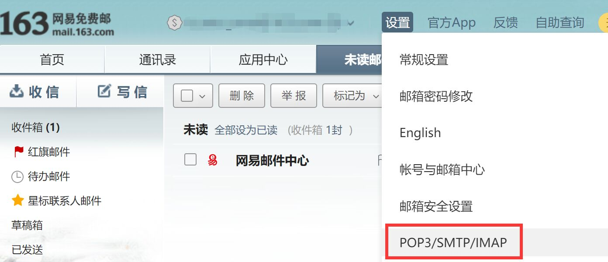
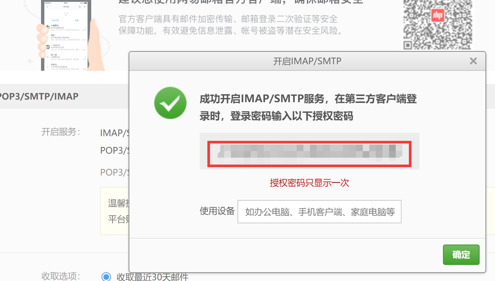

# ZJUAutoScoreQuery
浙江大学本科教务网自动查分脚本	 _by XuanInsr_ 在这里：[https://github.com/smd1121/ZJUAutoScoreQuery](https://github.com/smd1121/ZJUAutoScoreQuery)

参考了 [ZJU-Clock-In 自动打卡脚本](https://github.com/furry-potato-maker/ZJU-Clock-In)，部分代码直接取自其中。参考的其他代码附后。

## 一些说明
本脚本仅为个人学习 GitHub Action 和爬虫的试验作品，不适合传播；本脚本设计的查询频率是 10 分钟每次，并不会对服务器造成明显压力。 由于我此前并没有学过 CI 和 Python 和爬虫，因此很多地方写的比较愚蠢或包含错误；敬请批评指正😝。 由于我不会！所以有的时候运行的很慢或者失败，我并不能解释原因QAQ 如果有修改意见敬请赐教！

### 关于数据隐私
本脚本代码完全公开，使用到的教务网账号、密码、GitHub Token 以及收件邮箱均在 GitHub Actions Secrets 中加密保存，并不会通过 fork 传递，也不会被作者或者其他人得知。 为了对比分数更新，代码必然需求以某种方式保存上次查询的结果；我们将其直接保存在仓库中，但是保存的仅有选课课号的哈希值列表，并不包含绩点等信息，因此基本可以认为因为此方式除了泄露了选课数目（和可能的少数选课内容）以外没有泄露其他更多信息。 代码运行的过程中会访问到用户的所有选课内容和绩点信息，但是这些内容并不会保存在或者发送到用户所属以外的任何地方。 我们通过发送邮件的方式提醒成绩更新，而我们目前能想到的唯一办法是在代码中固定一个发送的邮箱（正因如此，fork 之后会收到一条邮件说有安全风险😥）。这引入了两方面问题：

- 我们可以查看发送出邮件的全部列表，而默认的提醒中包含课程名称、学分、成绩和绩点；从用户的角度而言，我们无法向用户证明我们不会查看这些邮件。因此，用户可以选择使用以下三种方法之一避免隐私泄露： 
   1. 使用不会泄露你的身份信息的电子邮箱地址；
   2. 更改代码 `sendMsg` 函数中的 `host`, `sender`, `key` 字段，从而用你自己的邮箱发送这些信息；
   3. 更改代码 `main` 函数中的 `newRecord` 字段内容，从而让邮件只发送部分信息。但请注意：请勿将该字段直接清空，否则代码可能不会识别出更新。
- 发件邮箱的用户名和 key 都在代码中写出，因此其他人也可以通过该邮箱发送内容（但是不能看到发件列表）。因此请大家注意 **该邮箱发送的其他任何类型信息都请忽略**。

如果有更好的方法请教教我 QWQ 没做过相关的东西确实比较难办😪

## 使用方法

### 1 Fork 这个仓库

请删除其中原有的 log.txt，否则代码会将其当做你的上一次结果进行比对。

### 2 生成一个 GitHub Token
在 [Personal access tokens (github.com)](https://github.com/settings/tokens) 中 Generate 一个 new token，这是保存上次查询结果的需要： 
请注意这个 token 的有效期，在有效期结束后记得重新弄一个（当然也可以永久生效）！Select scopes 只需要勾选框住的部分即可QWQ

### 3 配置一个发件邮箱
SMTP 是发送电子邮件的协议，代码需要发送信箱的授权密码从而进行发件。 请找一个邮箱，然后配置其自动发送功能。以 136 邮箱为例： 
开启 IMAP/SMTP 或者 POP3/SMTP 服务，记录下这个授权密码。 

然后，找到使用的邮箱的 SMTP 服务器地址（百度查 `**邮箱 SMTP 服务器` 也可以）： 

QQ 邮箱的话也是类似的操作，在 设置 - 账户 中开启后记住授权密码，并找到 SMTP 服务器信息即可： 

### 4 设置 Actions Secrets
在你 fork 出的仓库的 Setting - Secrets - Actions 中新建 secret： 
总共需要如下 7 个 Secret（名字需要完全相同），分别表示：

- `ACCOUNT` 和 `PASSWORD`：你的学号和统一身份认证密码
- `TOKEN`：第 2 步配置的 GitHub Token
- `MAILFROM` , `KEY` 和 `HOST`：第 3 步配置的发件邮箱地址、授权密码和对应邮箱的 SMTP 服务器
- `MAILTO`：收件邮箱地址，可以和之前那个一样

### 5 Enable Actions
点到这里来！首先这里会让你 Enable 这个 Repo 的 Workflow： 
然后还需要点到左边 Workflows 下面的 ScoreQuery，点进去以后再 Enable 一遍： 

### 6 给 Action 赋予读写权限
（感谢 @Xuer04 发现该问题！） 在 Settings - Actions - General 中： 
翻到下面，找到下面的 Workflow permissions，选中 Read and write permissions，然后保存： 

### 7 好啦！
点击你自己仓库的 star（取消然后重新点也可以）就会触发一次操作。每 10 分钟也会自动进行一次查询。你可以在 Actions 中查看是否成功： 

### References
除了文首参考的 [ZJU-Clock-In 自动打卡脚本](https://github.com/furry-potato-maker/ZJU-Clock-In) 以外，本工作的代码还部分参考自以下资料：

- [https://stackoverflow.com/questions/51657000/how-to-convert-an-html-table-into-a-python-dictionary](https://stackoverflow.com/questions/51657000/how-to-convert-an-html-table-into-a-python-dictionary)
- [https://github.community/t/how-to-make-a-workflow-file-to-save-the-output-as-a-file-to-my-github-repo/18352/2](https://github.community/t/how-to-make-a-workflow-file-to-save-the-output-as-a-file-to-my-github-repo/18352/2)
- [https://stackoverflow.com/questions/27522626/hash-function-in-python-3-3-returns-different-results-between-sessions](https://stackoverflow.com/questions/27522626/hash-function-in-python-3-3-returns-different-results-between-sessions)

## 

